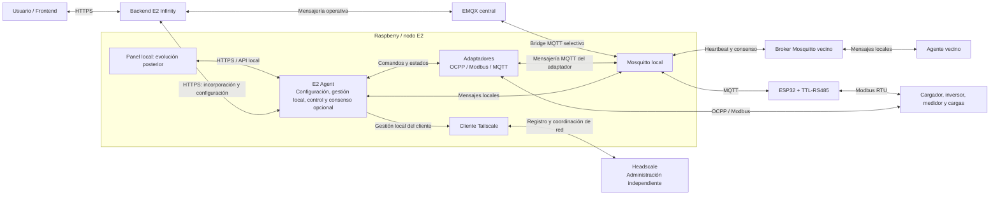

# Mapa general de comunicaciones

Esta vista describe plataforma, funcionamiento local y coordinación distribuida. Se revisará en el corte 1 del plan 0.3.0.

**Propuesta previa pendiente de revisión.** El [plan de trabajo](../plan-trabajo-flujos.md) organiza la revisión individual; sus filas enlazan los documentos disponibles. Los [flujos detallados](../flujos/README.md) se incorporarán progresivamente. Las conexiones del mapa son conceptuales y se revisarán en sus secuencias; la configuración inicial será manual mediante archivos.

El [acuerdo de 2.3 — Conexiones MQTT](../flujos/2.3-conexion-mqtt.md) documenta los recorridos del agente, el bridge selectivo con EMQX y los brokers vecinos. El bridge central forma parte del diseño objetivo y está pendiente de implementación en el código revisado.

El [acuerdo de 2.4 — Configuración local](../flujos/2.4-configuracion-local.md) describe edición manual, comprobación previa y aplicación mediante reinicio controlado del agente. Sus informes locales distinguen aplicación y conectividad.

El [borrador de 2.5 — Configuración remota](../flujos/2.5-configuracion-remota.md) propone consultar por HTTPS una configuración central y aplicar los cambios mediante el procedimiento local. Queda pendiente de validación.

La [vista histórica editable del primer corte en Draw.io](../diagramas/README.md) separa los recorridos de incorporación, MQTT y configuración en tres pestañas. Conserva su numeración anterior y dispone de una equivalencia con los cortes actuales.

El funcionamiento interno y el recorrido hasta el usuario se amplían en el [mapa de flujos](../flujos/README.md). La gestión local dispone de su propia secuencia de decisión, validación, ejecución y medición; el consenso entrega propuestas a esa misma validación cuando corresponde. El panel local representa una evolución; la configuración inicial utiliza archivos y herramientas locales.

## Responsabilidades

| Componente | Responsabilidad principal | No debe hacer |
|---|---|---|
| Backend E2 Infinity | Usuarios, organizaciones, instalaciones, configuración, referencias autorizadas, históricos y auditoría | Accionar directamente un dispositivo sin validación local |
| Headscale | Coordinar identidad y direccionamiento de la red privada | Calcular consignas o participar en el consenso energético |
| EMQX | Transportar mensajería central | Tomar decisiones energéticas |
| Mosquitto local | Intercambiar mensajes del nodo, vecinos y bridge | Sustituir la lógica del E2 Agent |
| E2 Agent | Supervisar equipos, decidir y controlar localmente, registrar resultados y participar en el consenso cuando esté habilitado | Exceder límites o reservas locales |
| ESP32 | Adquirir datos y actuar como pasarela de campo | Resolver la coordinación global |

## Canales

| Canal | Uso |
|---|---|
| HTTPS | Aprovisionamiento, asociación, configuración administrativa y consulta |
| MQTT | Eventos, telemetría, disponibilidad, coordinación y resultados |
| Tailscale/Headscale | Transporte privado y descubrimiento entre nodos autorizados |
| OCPP | Integración con cargadores |
| Modbus | Medidores, inversores y otros equipos de campo |
