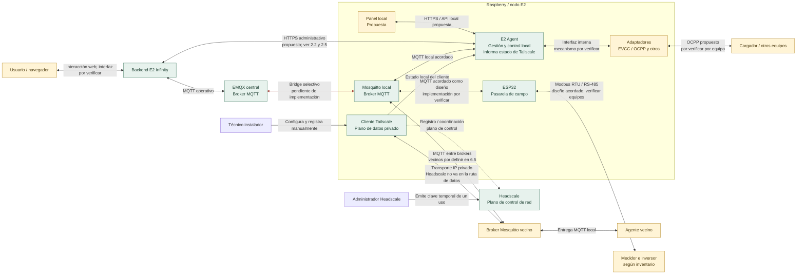

# Mapa general de comunicaciones

Esta vista resume las interfaces y sentidos de comunicación acordados documentalmente en 1.3 (versión 0.3.4). Separa aplicación, interacciones internas y transporte; no constituye evidencia de implementación.

El [recorrido general 1.4](../definiciones-flujos.md#flow-1-4) conecta el ciclo local independiente, la configuración administrativa por HTTPS, la meta energética común por MQTT a participantes seleccionados, la coordinación entre vecinos y los retornos hacia la plataforma y el consenso. El bridge Mosquitto–EMQX permanece pendiente de implementación.

**Estado del mapa:** diseño documental validado en sus responsabilidades y direcciones generales. Las etiquetas «propuesta», «pendiente de implementación» y «por verificar» indican que no se afirma implementación donde no existe evidencia. El [plan de trabajo](../plan-trabajo-flujos.md) mantiene los estados y las [definiciones detalladas](../definiciones-flujos.md) las decisiones por subfase. La configuración inicial será manual mediante archivos.

El [acuerdo de 2.3 — Conexiones MQTT](../definiciones-flujos.md#flow-2-3) documenta los recorridos del agente, el bridge selectivo con EMQX y los brokers vecinos. El bridge central forma parte del diseño objetivo y está pendiente de implementación en el código revisado.

El [acuerdo de 2.4 — Configuración local](../definiciones-flujos.md#flow-2-4) describe edición manual, comprobación previa y aplicación mediante reinicio controlado del agente. Sus informes locales distinguen aplicación y conectividad.

El [acuerdo de 2.5 — Configuración remota](../definiciones-flujos.md#flow-2-5) establece consulta HTTPS periódica: el agente valida y aplica preferencias energéticas en el siguiente punto seguro, sin reinicio; las propuestas técnicas siguen la aplicación local de 2.4. El recorrido aún no está implementado de extremo a extremo.

El [acuerdo de 3.1 — Inventario y capacidades](../definiciones-flujos.md#flow-3-1) distingue equipos físicos de pasarelas y capacidades declaradas de comprobadas. El [acuerdo de 3.2 — Interfaces con los equipos](../definiciones-flujos.md#flow-3-2) establece las rutas objetivo de cargador, medidor, inversor, BESS y cargas controlables; el ejemplo A/B/C sigue siendo tentativo y las capacidades requieren comprobación física.

El [acuerdo de 3.3 — Lecturas locales](../definiciones-flujos.md#flow-3-3) añade procedencia, tiempos de medición y recepción, normalización de unidades y evaluación de calidad por función antes de usar un dato para control. No fija todavía frecuencias ni umbrales de vigencia.

El [acuerdo de 3.4 — Heartbeat y salud de servicios](../definiciones-flujos.md#flow-3-4) separa presencia del nodo, salud de componentes y funciones disponibles. Plataforma y vecinos pueden observar rutas distintas; perder un heartbeat no demuestra que la Raspberry esté apagada.

El [acuerdo de 3.5 — Alarmas locales](../definiciones-flujos.md#flow-3-5) completa el corte de supervisión: el agente conserva diagnóstico y alarmas localmente, informa a la plataforma cuando puede y cierra cada condición tras comprobar la recuperación. Los vecinos solo reciben cambios de participación relevantes.

El [acuerdo de 4.1 — Objetivos y preferencias locales](../definiciones-flujos.md#flow-4-1) inicia la gestión energética autónoma: el técnico fija límites, el usuario selecciona objetivos y preferencias más conservadoras, y el agente solo ofrece a la coordinación la flexibilidad que reste tras proteger esas condiciones.

La [vista histórica editable del primer corte en Draw.io](../diagramas/README.md) separa los recorridos de incorporación, MQTT y configuración en tres pestañas. Conserva su numeración anterior y dispone de una equivalencia con los cortes actuales.

**Leyenda:** verde = responsabilidad/interfaz acordada documentalmente como diseño; amarillo = propuesta o detalle pendiente de verificación; rojo se reserva para una conexión explícitamente pendiente de implementación (el bridge Mosquitto–EMQX). Los estilos de nodos son orientativos; el estado preciso de cada conexión está escrito en su etiqueta y en la matriz de [1.3](../definiciones-flujos.md#flow-1-3). La conexión Tailscale–Headscale representa control/registro, no el tránsito de los mensajes MQTT entre vecinos.

El funcionamiento interno y el recorrido hasta el usuario se amplían en el [mapa de flujos](../definiciones-flujos.md). La gestión local dispone de su propia secuencia de decisión, validación, ejecución y medición; el consenso entrega propuestas a esa misma validación cuando corresponde. El panel local representa una evolución; la configuración inicial utiliza archivos y herramientas locales.

## Responsabilidades

| Componente | Responsabilidad principal | No debe hacer |
|---|---|---|
| Backend E2 Infinity | Usuarios, organizaciones, instalaciones, configuración, referencias autorizadas, históricos y auditoría | Accionar directamente un dispositivo sin validación local |
| Headscale | Coordinar identidad y direccionamiento de la red privada | Calcular consignas o participar en el consenso energético |
| EMQX | Transportar mensajería central | Tomar decisiones energéticas |
| Mosquitto local | Intercambiar mensajes del nodo, vecinos y bridge | Sustituir la lógica del E2 Agent |
| E2 Agent | Supervisar equipos, decidir y controlar localmente, registrar resultados y participar en el consenso cuando esté habilitado | Exceder límites o reservas locales |
| ESP32 | Adquirir datos y actuar como pasarela de campo | Resolver la coordinación global |

## Canales

| Canal | Uso |
|---|---|
| HTTPS | Aprovisionamiento, asociación, configuración administrativa y consulta |
| MQTT | Eventos, telemetría, disponibilidad, coordinación y resultados |
| Tailscale/Headscale | Transporte privado y descubrimiento entre nodos autorizados |
| OCPP | Integración con cargadores |
| Modbus | Medidores, inversores y otros equipos de campo |
