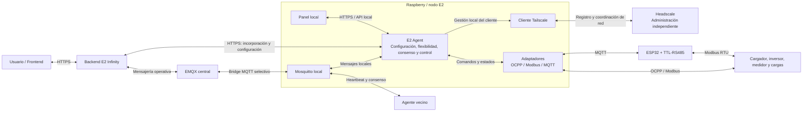

# Mapa general de comunicaciones

Esta vista separa infraestructura de transporte, lógica energética y control físico.

## Responsabilidades

| Componente | Responsabilidad principal | No debe hacer |
|---|---|---|
| Backend E2 Infinity | Usuarios, organizaciones, instalaciones, configuración, referencias autorizadas, históricos y auditoría | Accionar directamente un dispositivo sin validación local |
| Headscale | Coordinar identidad y direccionamiento de la red privada | Calcular consignas o participar en el consenso energético |
| EMQX | Transportar mensajería central | Tomar decisiones energéticas |
| Mosquitto local | Intercambiar mensajes del nodo, vecinos y bridge | Sustituir la lógica del E2 Agent |
| E2 Agent | Calcular flexibilidad, participar en el consenso y aplicar control local | Exceder límites o reservas locales |
| ESP32 | Adquirir datos y actuar como pasarela de campo | Resolver la coordinación global |

## Canales

| Canal | Uso |
|---|---|
| HTTPS | Aprovisionamiento, asociación, configuración administrativa y consulta |
| MQTT | Eventos, telemetría, disponibilidad, coordinación y resultados |
| Tailscale/Headscale | Transporte privado y descubrimiento entre nodos autorizados |
| OCPP | Integración con cargadores |
| Modbus | Medidores, inversores y otros equipos de campo |

