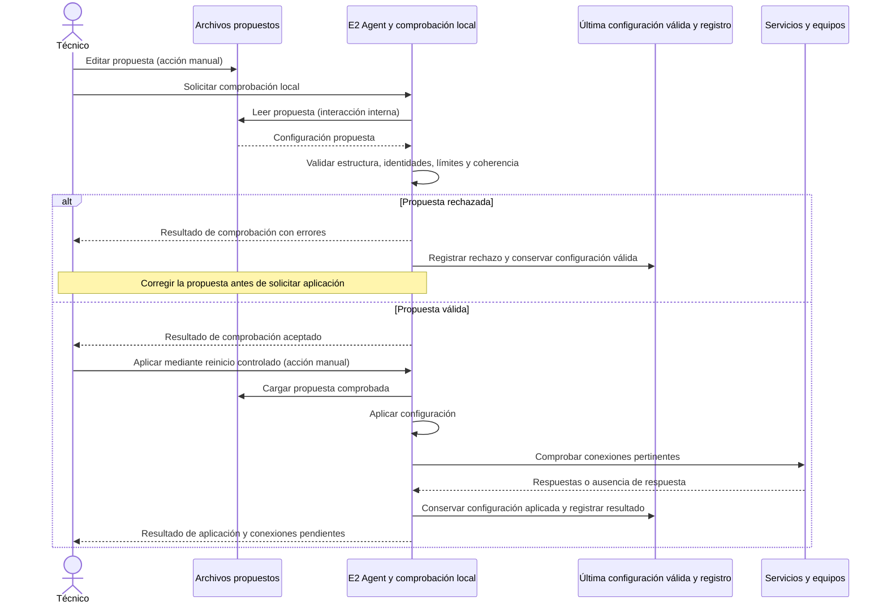
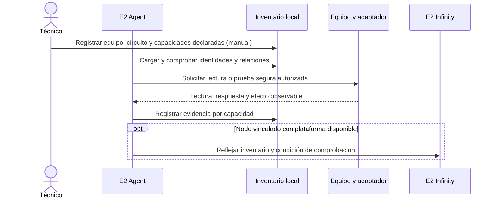
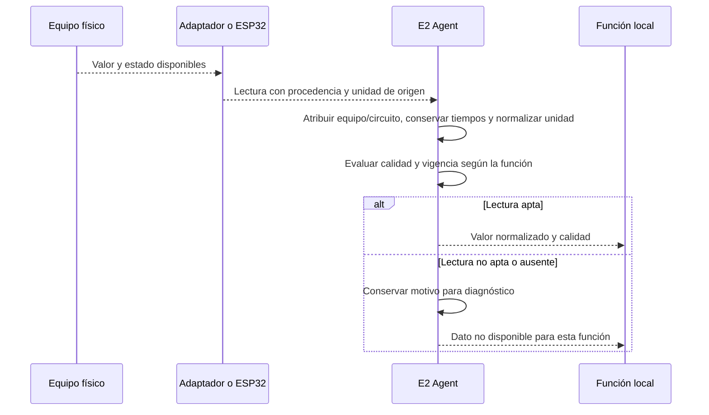
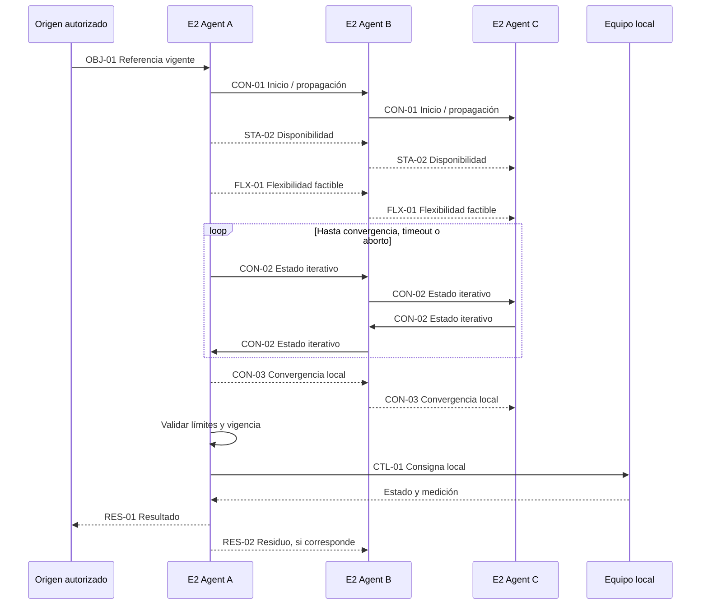

# Definiciones de flujos — E2 Infinity

Versión documental **0.3.11 — 4 de octubre de 2026**.

Este es el documento maestro para conversar y registrar las definiciones de las **46 subfases en 8 cortes**. El [plan de trabajo](plan-trabajo-flujos.md) conserva el seguimiento único de estados y dependencias y enlaza cada subfase a esta sección.

Se incorporan las definiciones detalladas de MQTT y configuración, más el antecedente conceptual del consenso. Lo propuesto, lo acordado y lo pendiente se identifican de forma explícita. Una propuesta en este documento no queda validada hasta recibir confirmación expresa; la definición documental tampoco implica implementación o ensayo físico.

En cada subfase se registrarán el escenario y propósito, los actores y responsabilidades, qué recibe y envía cada actor, el sentido y canal, las confirmaciones y respuestas, los errores y la recuperación, los acuerdos y los pendientes. Se distinguen acciones manuales, interacciones internas y mensajes entre servicios. Cada mensaje individual tiene emisor y receptor; un flujo bidireccional puede incluir varios mensajes y no exige respuesta a cada publicación.

Los tópicos, identificadores y esquemas JSON mantienen sus documentos de catálogo y su condición actual. Este documento no define nuevos endpoints ni contratos.

## Contenido

### Corte 1 — Arquitectura y mapa completo de interacciones

- [1.1 — Actores y responsabilidades](#flow-1-1)
- [1.2 — Identificación y pertenencia](#flow-1-2)
- [1.3 — Interfaces y sentidos de comunicación](#flow-1-3)
- [1.4 — Recorridos generales](#flow-1-4)

### Corte 2 — Incorporación, configuración y arranque

- [2.1 — Registro de red privada](#flow-2-1)
- [2.2 — Vinculación con E2 Infinity](#flow-2-2)
- [2.3 — Conexiones MQTT](#flow-2-3)
- [2.4 — Configuración local](#flow-2-4)
- [2.5 — Configuración remota](#flow-2-5)
- [2.6 — Coherencia de configuraciones](#flow-2-6)
- [2.7 — Arranque del nodo](#flow-2-7)

### Corte 3 — Equipos, mediciones y supervisión local

- [3.1 — Inventario y capacidades](#flow-3-1)
- [3.2 — Interfaces con los equipos](#flow-3-2)
- [3.3 — Lecturas locales](#flow-3-3)
- [3.4 — Heartbeat y salud de servicios](#flow-3-4)
- [3.5 — Alarmas locales](#flow-3-5)

### Corte 4 — Gestión energética y ejecución local

- [4.1 — Objetivos y preferencias locales](#flow-4-1)
- [4.2 — Tarifas y datos económicos](#flow-4-2)
- [4.3 — Ciclo de decisión local](#flow-4-3)
- [4.4 — Prioridades y validación](#flow-4-4)
- [4.5 — Orden y confirmación del equipo](#flow-4-5)
- [4.6 — Resultado medido y corrección local](#flow-4-6)
- [4.7 — Registro de decisiones](#flow-4-7)

### Corte 5 — Plataforma, información visible e intercambios con el nodo

- [5.1 — Funciones y permisos del usuario](#flow-5-1)
- [5.2 — Telemetría hacia E2 Infinity](#flow-5-2)
- [5.3 — Información que muestra la plataforma](#flow-5-3)
- [5.4 — Información enviada al nodo](#flow-5-4)
- [5.5 — Resultados visibles](#flow-5-5)
- [5.6 — Históricos y consultas](#flow-5-6)

### Corte 6 — Preparación de la participación distribuida

- [6.1 — Participación del usuario](#flow-6-1)
- [6.2 — Disponibilidad energética](#flow-6-2)
- [6.3 — Referencias energéticas](#flow-6-3)
- [6.4 — Flexibilidad y valoración de la contribución](#flow-6-4)
- [6.5 — Vecinos y grupo eléctrico](#flow-6-5)

### Corte 7 — Consenso y coordinación entre vecinos

- [7.1 — Activación y continuidad](#flow-7-1)
- [7.2 — Intercambio iterativo](#flow-7-2)
- [7.3 — Validez de información](#flow-7-3)
- [7.4 — Convergencia](#flow-7-4)
- [7.5 — Falta de convergencia](#flow-7-5)
- [7.6 — Entrega y realimentación](#flow-7-6)

### Corte 8 — Fallos, recuperación y revisión completa

- [8.1 — Pérdida de servicios externos](#flow-8-1)
- [8.2 — Pérdida de vecinos](#flow-8-2)
- [8.3 — Fallos internos y de equipos](#flow-8-3)
- [8.4 — Reinicio y recuperación](#flow-8-4)
- [8.5 — Sincronización pendiente](#flow-8-5)
- [8.6 — Revisión de punta a punta](#flow-8-6)

## Corte 1 — Arquitectura y mapa completo de interacciones

<a id="flow-1-1"></a>

### 1.1 — Actores y responsabilidades

**Alcance:** Usuario, técnico, plataforma, agente, servicios de comunicación y equipos.

**Estado documental: Validado.** Matriz acordada en conversación el **2026-10-03**. La validación es documental; no acredita implementación ni ensayo.

En esta subfase se distinguen los roles humanos y las responsabilidades de los componentes. Usuario y técnico son actores distintos. El E2 Agent gestiona las decisiones y actuaciones locales; el consenso es una función adicional. La definición del origen y la distribución de la referencia del consenso queda pendiente para 6.3 y 7.1.

| Actor o componente | Responsabilidad propuesta | Recibe, procesa y envía |
|---|---|---|
| Usuario de la instalación | Define preferencias energéticas y consulta el funcionamiento del sistema. | Envía preferencias o solicitudes por E2 Infinity; recibe mediciones, estados y resultados. |
| Técnico instalador | Prepara el hardware, configura inicialmente archivos y diagnostica el nodo. | Envía configuraciones manuales y solicitudes de diagnóstico local; recibe resultados de comprobación y conectividad. |
| Administrador de infraestructura | Administra centralmente el servicio Headscale y su infraestructura, separado de la lógica energética de E2 Infinity. | Gestiona despliegue, configuración y operación de Headscale. Los procedimientos de acceso y coordinación con instaladores quedan fuera de 1.1. |
| Interfaz de E2 Infinity | Presenta la información al usuario y permite registrar solicitudes autorizadas. | Recibe acciones del usuario y muestra respuestas y datos procesados por la plataforma. No actúa directamente sobre los equipos. |
| Backend de E2 Infinity | Gestiona identidades y permisos, guarda configuraciones y procesa información recibida de los nodos. | Recibe solicitudes, telemetría y resultados; envía configuraciones autorizadas e información operativa. Su papel en el origen y distribución de la referencia global queda pendiente para 6.3/7.1. |
| E2 Agent en la Raspberry | Gestiona decisiones locales, valida propuestas, ejecuta mediante interfaces de equipos y registra resultados; participa en el consenso cuando corresponde. | Recibe configuración, mediciones y propuestas de coordinación; envía telemetría, estados, resultados y mensajes a vecinos cuando participa. |
| Mosquitto local y EMQX central | Transportan publicaciones MQTT autorizadas; Mosquitto atiende intercambios del nodo y EMQX los centrales. | Reciben y encaminan publicaciones según sus suscripciones y permisos; no toman decisiones energéticas. |
| Cliente Tailscale y Headscale | Proporcionan y coordinan la conectividad de la red privada. | Mantienen el transporte y registro de red; no administran la lógica energética. Headscale es administrado por el administrador de infraestructura. |
| Agentes de nodos vecinos | Intercambian disponibilidad y variables del consenso cuando participan. | Cada agente procesa su información y mantiene la responsabilidad sobre sus decisiones y acciones locales. |
| Adaptadores y ESP32 | Conectan el E2 Agent con los protocolos de equipos; la ESP32 puede actuar como pasarela de campo. | Transmiten lecturas, órdenes y respuestas según las interfaces que se definan en 3.2. |
| Equipos físicos | Miden o actúan según sus capacidades e interfaces. | Entregan mediciones y estados; reciben órdenes compatibles. La confirmación y el efecto medido se comprobarán por separado. |

**Acuerdos registrados en conversación (2026-10-03):** usuario y técnico son actores distintos; un administrador de infraestructura administra Headscale centralmente; el backend gestiona identidades, permisos, configuración y datos mientras el E2 Agent mantiene las decisiones y la ejecución local; Headscale/Tailscale proveen conectividad y Mosquitto/EMQX transportan MQTT, sin tomar decisiones energéticas; adaptadores y ESP32 intermedian con los equipos, que miden o actúan.

**Fuera de 1.1:** los permisos detallados de usuario se definirán en 5.1; el origen y distribución de la referencia global del consenso se definirán en 6.3/7.1; los detalles de interfaces y actuación se desarrollarán en 3.2/4.5.

<a id="flow-1-2"></a>

### 1.2 — Identificación y pertenencia

**Estado documental: Validado.** Modelo de identidad y pertenencia acordado explícitamente el **2026-10-03**. Esta validación documental no acredita la asociación física ni la implementación.

#### Entidades y asociaciones

| Entidad | Identidad y fuente oficial | Asociación acordada |
|---|---|---|
| Organización | Registro administrado en E2 Infinity. | Contiene las instalaciones que se le asocian. Los permisos para crear y administrar organizaciones se precisan en 5.1. |
| Instalación | Registro precreado en E2 Infinity. | Pertenece a una organización. El técnico selecciona la instalación existente al incorporar el nodo. |
| Grupo eléctrico | Registro precreado en E2 Infinity, definido según información eléctrica del proyecto. | Puede reunir nodos de varias instalaciones conectadas al mismo transformador o punto de conexión común. Cada nodo mantiene un grupo activo. |
| Nodo | E2 Infinity asigna un `node_id` estable para el nodo lógico. | Cada nodo se asocia a una instalación y a un grupo eléctrico activo. Si se reemplaza la Raspberry, el `node_id` puede conservarse tras autorizar el nuevo equipo. |
| Equipo | El E2 Agent mantiene el inventario local y un `device_id` único dentro del nodo. | El par conceptual `node_id` + `device_id` distingue el equipo. Su inventario y capacidades se detallan en 3.1. |

Un usuario autorizado registra previamente organizaciones, instalaciones y grupos en E2 Infinity. Durante la incorporación, el técnico selecciona la instalación y el grupo eléctrico correspondientes; la plataforma valida la asociación contra esos registros. La asignación central de identificadores es conceptual: aquí no se fijan su formato, campos ni mensajes de alta.

La identidad de red Tailscale/Headscale es distinta del `node_id` de E2 Infinity. Estar conectado a la red privada no significa que el nodo esté incorporado o autorizado en la plataforma. Los pasos de alta y validación se desarrollan en 2.2; el registro de la red privada, en 2.1.

La pertenencia a un grupo eléctrico no significa que todos sus nodos sean vecinos directos ni que exista una malla completa. La lista y topología de comunicación entre vecinos se define en 6.5.

**Pendientes fuera de 1.2:** formato y representación técnica de los identificadores, flujo de mensajes y procedimiento de alta en 2.2; permisos de administración de registros en 5.1; definición de vecinos en 6.5. La asociación registrada debe contrastarse con la información eléctrica; esta definición no constituye una verificación física en terreno.

<a id="flow-1-3"></a>

### 1.3 — Interfaces y sentidos de comunicación

**Alcance:** **Interfaces y sentidos de comunicación:** Emisor, receptor, canal y recorridos unidireccionales o bidireccionales.

**Estado documental: Validado.** Matriz general de interfaces acordada explícitamente el **2026-10-03**, tras revisión del mapa. La validación es documental y no acredita que cada enlace esté implementado u operativo.

#### Matriz acordada de interfaces

| Interfaz o recorrido | Origen → destino y sentido resumido | Canal o tipo de interacción | Estado documental y límite |
|---|---|---|---|
| Usuario ↔ plataforma E2 Infinity | Usuario → plataforma: consultas, preferencias y solicitudes autorizadas. Plataforma → usuario: información y resultados disponibles. | Interacción de usuario con la plataforma; transporte web sujeto al diseño de E2 Infinity. | **Por verificar** en la implementación de plataforma; permisos detallados en 5.1. No se fija aquí una interfaz frontend/API concreta. |
| Técnico → configuración local del nodo | Técnico → nodo: edición y comprobación de archivos/configuración. | Acción manual; no es un mensaje de red. | **Acordado documentalmente** como modalidad inicial; el procedimiento se desarrolla en 2.4. |
| Backend E2 Infinity ↔ E2 Agent | Plataforma → agente: incorporación y configuración administrativa. Agente → plataforma: solicitudes, estado o resultado administrativo cuando corresponda. | HTTPS administrativo. | **Propuesta/acordado documentalmente** como interfaz objetivo; flujo de alta y configuración en 2.2 y 2.5. Endpoints y campos no definidos. |
| Backend E2 Infinity ↔ EMQX central | Backend publica o recibe información operativa autorizada a través del broker. | MQTT de aplicación. | **Acordado documentalmente** como arquitectura; detalles de telemetría y resultados en 5.2/5.5. |
| EMQX central ↔ Mosquitto local | Mensajes MQTT seleccionados entre plataforma y nodo, en los sentidos habilitados por las reglas del bridge. | Bridge MQTT sobre transporte de red. | **Pendiente de implementación** según la revisión del código registrada en 2.3; no se afirma operación actual. |
| E2 Agent ↔ Mosquitto local | Agente publica y consume mensajes locales según su rol y sus suscripciones. | MQTT local; mensajes de aplicación sobre TCP/IP local. | **Acordado documentalmente** en 2.3; tópicos y payloads conservan su condición documental actual. |
| Mosquitto local ↔ brokers/agentes vecinos | Publicaciones autorizadas para disponibilidad y coordinación entre agentes participantes. | MQTT entre brokers, transportado por la red privada Tailscale. | **Acordado documentalmente** como recorrido objetivo; topología y conjunto de vecinos se resuelven en 6.5; operación física **por verificar**. |
| Cliente Tailscale ↔ Headscale | Cliente solicita registro/coordinación de la red privada; Headscale entrega/controla la información de coordinación correspondiente. | Plano de control de la red privada. | **Acordado documentalmente** como separación de responsabilidades; alta concreta en 2.1 y estado operativo **por verificar**. Headscale no transporta consignas energéticas ni decide el consenso. |
| Cliente Tailscale ↔ cliente Tailscale | Los clientes transportan tráfico IP privado entre nodos autorizados; MQTT de vecinos puede circular por esta red. | Plano de datos de la red privada. | **Acordado documentalmente** como diseño; conectividad efectiva **por verificar**. Headscale coordina, pero no es el broker MQTT ni necesariamente el camino de los datos. |
| Técnico → cliente Tailscale | El técnico configura manualmente el endpoint Headscale y ejecuta el alta inicial del cliente con una clave temporal de un solo uso. | Acción local manual; la clave se entrega fuera del repositorio y no es un mensaje de aplicación E2 Infinity. | **Acordado documentalmente** en 2.1. |
| Cliente Tailscale → E2 Agent | El estado local del servicio llega al agente para que lo informe; el agente no configura el endpoint ni ejecuta el alta inicial. | Interacción local de supervisión; el mecanismo y destino del reporte se definen en 3.4/5.2. | **Acordado documentalmente** en 2.1; la ruta de reporte queda pendiente. |
| Navegador local ↔ panel local ↔ E2 Agent | Técnico/usuario local accede al panel; el panel consulta o solicita operaciones administrativas al agente. | HTTPS / API local prevista. | **Propuesta** de evolución; el panel no se considera implementado y la configuración inicial es manual. Detalles en 2.4 y permisos en 5.1. |
| E2 Agent ↔ adaptadores | El agente entrega solicitudes y recibe datos/estados mediante módulos locales. | Llamadas o interfaz interna del software; mecanismo concreto no fijado. | **Propuesta / por verificar**; delimitar en 3.2 y 4.5. No confundir una llamada interna con tráfico MQTT. |
| Adaptador EVCC ↔ cargador | Adaptador y cargador intercambian datos y operaciones compatibles. | OCPP. | **Propuesta de interfaz objetivo; por verificar** para el equipo e integración concretos. Detalles en 3.2. |
| Mosquitto local ↔ ESP32 | Mensajes de lectura/estado y solicitudes compatibles en la interfaz acordada para la pasarela. | MQTT local entre Raspberry y ESP32. | **Acordado documentalmente** como diseño; implementación y mensajes concretos **por verificar** en 3.2. |
| ESP32 ↔ medidor/inversor | Lecturas y operaciones que admita cada dispositivo conectado. | Modbus RTU sobre RS-485/TTL-RS485. | **Acordado documentalmente** como interfaz objetivo; registros, equipos y ensayo **por verificar** en 3.2. |
| Adaptadores ↔ otros equipos | Lecturas, consignas y estados compatibles con los dispositivos correspondientes. | OCPP, Modbus u otra interfaz según inventario. | **Por verificar** por equipo en 3.2; no se presume que todo equipo use todos los protocolos. |

#### Cómo leer los sentidos y las capas

- **Acción manual:** una persona edita archivos, ingresa parámetros o ejecuta una comprobación. No se dibuja como mensaje de red.
- **Interacción interna:** llamada entre módulos dentro del agente o gestión local de un servicio; no implica un protocolo externo.
- **Mensaje de aplicación:** información dirigida de un emisor identificado a uno o más receptores a través de MQTT, HTTPS/OCPP u otra interfaz acordada.
- **Transporte:** TCP/IP local, red privada Tailscale o medio físico RS-485; transporta la interacción, pero no define su significado energético.

Una flecha bidireccional en el mapa resume que la interfaz admite intercambios en ambos sentidos. No significa que cada mensaje publicado requiera respuesta, ni reemplaza la definición individual de emisor, destinatario, disparador y respuesta necesaria.

**Pendientes asignados:** el alta e intercambio administrativo se concreta en 2.2/2.5; interfaces y capacidades reales de equipos en 3.2; topología y vecinos en 6.5; mensajes de supervisión, telemetría y operación en sus subfases respectivas. El bridge Mosquitto–EMQX sigue pendiente de implementación según 2.3. No se fijan endpoints, tópicos, campos ni esquemas nuevos en esta matriz.

**Precisión acordada el 2026-10-04 en 2.1:** el alta inicial de Tailscale es manual por el técnico; el E2 Agent solo informa el estado local. Esto sustituye la propuesta previa de que el agente administrara el alta.

**Referencia de validación:** confirmación explícita del usuario «Sí, validar 1.3» en conversación del **2026-10-03**.

<a id="flow-1-4"></a>

### 1.4 — Recorridos generales

**Alcance:** **Recorridos generales:** Configuración, supervisión, gestión local, coordinación y resultados hasta el usuario.

**Estado documental: Validado.** Recorrido general acordado explícitamente el **2026-10-03**. Esta definición conecta los flujos de otras subfases; no aprueba sus mensajes detallados ni acredita implementación.

#### Recorridos de punta a punta

| Recorrido | Secuencia general | Detalle asignado |
|---|---|---|
| Preparación del nodo | El técnico prepara la configuración y el agente inicia sus servicios; se habilitan las conexiones de red privada, plataforma y mensajería necesarias. | Alta en 2.1–2.3; configuración local/remota en 2.4–2.6; arranque en 2.7. |
| Gestión local continua | Lecturas y configuración vigente → decisión local respetando preferencias y límites → solicitud al adaptador/equipo → comprobación del efecto con mediciones → registro del resultado. | Medición en 3.3; decisión y validación en 4.3–4.4; actuación y resultado en 4.5–4.7. Puede operar sin nube ni consenso. |
| Intercambio con la plataforma | Configuración administrativa por HTTPS; meta energética común y resultados por MQTT mediante EMQX. La meta llega a los nodos seleccionados; el estado y resultado medido vuelven a E2 Infinity para consulta del usuario. | Incorporación/configuración en 2.2 y 2.5; bridge en 2.3; permisos y visualización en 5.1–5.6. El bridge Mosquitto–EMQX sigue **pendiente de implementación**. |
| Coordinación distribuida | La meta común recibida habilita la participación de nodos seleccionados. Sus agentes intercambian variables con vecinos mediante MQTT sobre la red privada; cada agente valida localmente la propuesta antes de ejecutarla. | Participación y recursos en el corte 6; consenso y realimentación en 7.1–7.6. No todos los nodos activos son necesariamente destinatarios ni vecinos directos. |
| Retorno y seguimiento | Cada nodo envía su resultado medido a E2 Infinity y devuelve al proceso distribuido la realimentación/residuo que requiera la coordinación; la plataforma presenta la información disponible al usuario. | Contenido de telemetría/visualización en 5.2–5.6; retorno al consenso en 7.6. |

La configuración administrativa y la meta operativa son recorridos distintos: HTTPS no transporta la consigna energética de operación. E2 Infinity publica una meta común para los participantes seleccionados; no calcula ni asigna a cada Raspberry una acción individual. La contribución del nodo se coordina con sus vecinos y la ejecución queda sujeta a validación local.

#### Secuencia general

```mermaid
sequenceDiagram
    actor T as Técnico
    actor U as Usuario
    participant A as E2 Agent / Raspberry
    participant API as Backend E2 Infinity
    participant X as EMQX central
    participant M as Mosquitto local
    participant V as Vecinos participantes
    participant D as Adaptador y equipos

    T->>A: Preparar configuración local (acción manual)
    A->>A: Iniciar servicios y cargar configuración válida
    Note over A,API: Registro de red privada y alta/configuración de plataforma son recorridos administrativos separados (2.1–2.5)
    API->>A: Configuración administrativa por HTTPS (diseño objetivo)
    Note over A,D: El ciclo local es continuo e independiente de nube y consenso
    par Gestión local, siempre según disponibilidad del nodo
        loop Operación local
            D-->>A: Lecturas y estado del equipo
            A->>A: Decidir con configuración, preferencias y límites
            A->>D: Solicitar acción local validada
            D-->>A: Estado/medición para comprobar el efecto
            A->>A: Registrar decisión y resultado
        end
    and Coordinación opcional ante una meta común
        API->>X: Publicar meta energética para participantes seleccionados
        X-->>M: Entregar por MQTT mediante bridge (pendiente de implementación)
        M-->>A: Entregar meta al agente suscrito
        loop Coordinación entre participantes
            A->>M: Publicar variable del consenso
            M->>V: Enviar a vecinos autorizados por MQTT sobre red privada
            V-->>M: Publicar información de retorno requerida
            M-->>A: Entregar mensajes de vecinos
        end
        A->>A: Validar localmente la propuesta del consenso
        A->>D: Ejecutar solo si pasa validación local
        D-->>A: Lectura/resultado medido
        A->>M: Publicar resultado operativo hacia plataforma
        M->>X: Replicar por bridge (pendiente de implementación)
        X->>API: Entregar el resultado a E2 Infinity
        A->>M: Publicar realimentación/residuo requerido
        M->>V: Devolver realimentación al proceso distribuido
    end
    API-->>U: Mostrar telemetría, estado y resultado disponibles
    alt Pérdida de plataforma
        Note over A,D: Continúa la gestión local con la configuración válida; el tratamiento de mensajes pendientes se define en corte 8
    else Pérdida de vecino
        Note over A,V: El ciclo local se mantiene; continuidad del consenso se define en 7.5 y 8.2
    end
```

**Límites de esta vista:** la secuencia es conceptual. No fija mensajes, campos, tópicos, endpoints, frecuencia, criterios de selección, convergencia ni política de recuperación. La comunicación real de la meta y los resultados entre EMQX y Mosquitto local depende del bridge pendiente. La topología de vecinos se define en 6.5; una pérdida de vecino no implica por sí sola pérdida de operación local.

**Referencia de validación:** confirmación explícita del usuario «siii» en conversación del **2026-10-03**.


## Corte 2 — Incorporación, configuración y arranque

<a id="flow-2-1"></a>

### 2.1 — Registro de red privada

**Alcance:** **Registro de red privada:** Cliente Tailscale y Headscale.

**Estado documental: Validado.** Flujo acordado explícitamente el **2026-10-04**. La validación no certifica conexión efectiva de una Raspberry.

#### Propósito y participantes

Registrar manualmente el cliente Tailscale de una Raspberry en la instancia Headscale administrada por separado, y comprobar el registro y el alcance privado como resultados distintos. Esta identidad de red no incorpora ni autoriza por sí sola el nodo en E2 Infinity; ese flujo es 2.2.

| Actor o componente | Responsabilidad en este flujo |
|---|---|
| Administrador de infraestructura | Genera una clave temporal, de un solo uso y destinada a una Raspberry; la entrega al técnico fuera del repositorio. Administra Headscale centralmente. |
| Técnico | Configura manualmente el cliente Tailscale en la Raspberry, indica el servidor Headscale y ejecuta el alta. Conserva la clave fuera de archivos versionados. |
| Cliente Tailscale | Solicita el registro al plano de control Headscale y, una vez inscrito, proporciona conectividad privada de datos entre clientes autorizados. |
| Headscale | Valida la clave y registra el cliente; coordina la información de la red privada. No procesa mensajes energéticos ni controla equipos. |
| E2 Agent | Informa el estado local del cliente; no administra la configuración inicial ni realiza el registro. El destino y transporte del reporte se definirán en 3.4/5.2. |
| Par autorizado | Se utiliza para comprobar el alcance de la red de datos una vez que el cliente está registrado. |

#### Secuencia acordada

1. El administrador de Headscale crea una clave de registro temporal de un solo uso para la Raspberry que se incorporará y la entrega al técnico por un canal externo seguro. No se registra la clave ni su valor en documentación, logs compartidos o control de versiones; la duración exacta de vigencia no se fija aquí.
2. El técnico, actuando localmente en la Raspberry, configura el cliente Tailscale con la dirección de la instancia Headscale y la clave recibida, y solicita el alta. Esta acción manual no es una llamada de E2 Infinity.
3. El cliente Tailscale envía la solicitud de registro a Headscale. Si la clave es válida y no fue utilizada, Headscale acepta el alta; el cliente conserva su nueva identidad de red y dirección privada.
4. Se comprueba el registro en Headscale y el estado local del cliente por separado de la conectividad con pares. El E2 Agent informa su estado local, sin administrar el alta.
5. El técnico prueba por separado la conectividad hacia al menos un cliente/par autorizado. El flujo no presupone comunicación total entre todos los nodos ni define su topología, que corresponde a 6.5.

```mermaid
sequenceDiagram
    actor Admin as Administrador Headscale
    actor Tech as Técnico
    participant HS as Headscale
    participant TS as Cliente Tailscale / Raspberry
    participant Agent as E2 Agent
    participant Peer as Par autorizado

    Admin->>HS: Generar clave temporal de un solo uso
    HS-->>Admin: Clave para una Raspberry
    Admin-->>Tech: Entregar clave por canal externo seguro
    Note over Admin,Tech: No guardar la clave en el repositorio
    Tech->>TS: Configurar servidor y solicitar alta manualmente
    TS->>HS: Solicitud de registro con la clave
    alt Clave válida y no utilizada
        HS-->>TS: Registro aceptado e identidad/dirección privada
        TS-->>Agent: Estado local del servicio
        Note over Agent: El agente informa estado; no gestiona el alta
        Tech->>HS: Comprobar que el cliente quedó registrado
        Tech->>Peer: Probar conectividad privada por separado
        alt Par alcanzable
            Peer-->>Tech: Prueba de conectividad completada
        else Sin alcance al par
            Note over TS,Peer: Cliente registrado; conectividad aún no verificada
        end
    else Clave inválida, vencida o ya utilizada
        HS-->>TS: Registro rechazado
        Tech->>Admin: Solicitar una clave nueva
    end
    opt Headscale queda inaccesible después del alta
        Note over HS,Peer: No inferir caída de enlaces entre pares; comprobar el plano de datos (VAL-16)
    end
```

#### Resultados, fallos y límites

| Condición | Resultado y tratamiento acordado |
|---|---|
| Clave inválida, vencida o previamente consumida | El registro se rechaza; el técnico solicita al administrador una clave nueva. No se reutiliza la misma clave. |
| Headscale inaccesible durante el alta inicial | La Raspberry no queda registrada; se reintenta el proceso cuando el servicio esté disponible y con una clave vigente. |
| Registro aceptado, pero el par no es alcanzable | Se conserva el resultado «registrado» y se informa por separado que la conectividad no se verificó. No se marca la red de datos como comprobada. |
| Headscale inaccesible luego del registro | No se asume automáticamente que se perdió conectividad ya establecida entre pares; su continuidad se comprueba en el escenario VAL-16 y en el corte 8. |

Una falla del alta de red no equivale a una asociación fallida en E2 Infinity. La relación entre `node_id` y la identidad Tailscale sigue siendo independiente conforme a 1.2; el alta/autorización de plataforma queda en 2.2. La topología y los permisos de comunicación entre vecinos se definen en 6.5. El reporte continuo de salud del agente queda para 3.4/5.2. No se fijan aquí comandos, direcciones, duración concreta de la clave ni formato de mensaje.

**Referencia de validación:** confirmación explícita del usuario «Sí, validar 2.1 con este flujo» el **2026-10-04**.

<a id="flow-2-2"></a>

### 2.2 — Vinculación con E2 Infinity

**Alcance:** **Vinculación con E2 Infinity:** Incorporación, asociación y autorización del nodo.

**Estado documental: Validado.** Flujo acordado el **2026-10-04** mediante la confirmación «me gusta tu propuesta». La validación es documental; no acredita que el alta, los permisos o el reemplazo estén implementados.

#### 1. Propósito y escenario concreto

Vincular una Raspberry con un nodo lógico precreado en E2 Infinity, de forma que la plataforma reconozca su instalación y grupo eléctrico. La persona autorizada podrá consultar el nodo y, cuando lleguen datos, sus dispositivos y mediciones. La identidad del cliente Tailscale registrada en 2.1 es independiente de esta autorización.

#### 2. Participantes y responsabilidades

| Participante | Responsabilidad en 2.2 |
|---|---|
| Técnico autorizado | Selecciona en E2 Infinity la instalación y el grupo preexistentes, precrea el nodo lógico, recibe una vez su credencial técnica y la configura manualmente en la Raspberry. |
| Backend E2 Infinity | Valida la asociación, asigna el `node_id`, vincula y renueva la credencial propia del nodo, autentica al E2 Agent y registra el resultado del alta. |
| E2 Agent | Usa su `node_id` y credencial técnica para solicitar la vinculación por HTTPS; conserva el resultado localmente y lo informa al técnico. |
| Persona titular de la instalación | Accede con su cuenta humana a los nodos y datos de su instalación y solicita cambios de preferencias energéticas permitidos. |
| Otras personas autorizadas | Acceden mediante cuentas humanas propias, dentro de los permisos otorgados sobre la instalación. |

El nodo se asocia a la **instalación**, y las personas acceden por su autorización sobre esa instalación. La credencial técnica identifica al nodo ante la API; no permite iniciar sesión como persona. Los permisos precisos de cada rol se definirán en [5.1](#flow-5-1), las preferencias energéticas en [4.1](#flow-4-1) y su recorrido remoto en [2.5](#flow-2-5).

#### 3. Condiciones previas y resultado esperado

La organización, la instalación y el grupo eléctrico ya existen en E2 Infinity conforme a 1.2. La instalación cuenta con una persona titular; puede autorizarse a otras personas. El técnico tiene permiso para incorporar el nodo y selecciona la instalación y el grupo **antes del alta física** de la Raspberry. La configuración inicial en el equipo es manual, según [2.4](#flow-2-4).

El resultado esperado es un `node_id` estable, asociado por la plataforma a una instalación y un grupo activo, y una Raspberry autenticada con una credencial exclusiva para ese nodo. El nodo puede mostrarse a las personas autorizadas una vez vinculado; las mediciones aparecen cuando se reciban mediante el flujo de telemetría de [5.2](#flow-5-2). La vinculación no demuestra todavía conectividad MQTT ni disponibilidad de equipos.

#### 4. Secuencia de incorporación y reemplazo

| Paso | Tipo | Origen | Destino | Acción o intercambio | Resultado esperado |
|---|---|---|---|---|---|
| 1 | Acción humana en plataforma | Técnico autorizado | E2 Infinity | Seleccionar instalación y grupo existentes y precrear el nodo lógico | La plataforma valida la asociación y asigna `node_id` |
| 2 | Acción en plataforma | E2 Infinity | Técnico autorizado | Generar y entregar una sola vez la credencial vinculada al `node_id` | El técnico recibe la credencial sin incorporarla al repositorio |
| 3 | Acción manual local | Técnico autorizado | Raspberry | Configurar `node_id` y credencial del nodo para el E2 Agent | Identidad local preparada para solicitar el alta |
| 4 | Mensaje entre servicios | E2 Agent | API E2 Infinity | Solicitar vinculación autenticada mediante HTTPS | La plataforma comprueba credencial, nodo y asociación vigente |
| 5 | Respuesta entre servicios | API E2 Infinity | E2 Agent | Confirmar la vinculación o indicar rechazo | El agente y el técnico pueden distinguir éxito de error |
| 6 | Consulta humana | Persona autorizada | E2 Infinity | Consultar la instalación y el nodo asociado | Nodo visible según permiso; mediciones solo si existen datos recibidos |

En un **reemplazo de Raspberry**, el técnico autorizado conserva el nodo lógico, su `node_id`, la instalación, el grupo y el historial. La plataforma revoca la credencial anterior, emite una nueva para el equipo sustituto y exige comprobar de nuevo la vinculación. El equipo anterior deja de estar autorizado con la credencial revocada. La recuperación operativa completa tras el cambio corresponde a [8.4](#flow-8-4).

```mermaid
sequenceDiagram
    actor Tech as Técnico autorizado
    participant API as E2 Infinity
    participant Agent as E2 Agent / Raspberry
    actor User as Persona autorizada

    Tech->>API: Seleccionar instalación y grupo; precrear nodo
    API-->>Tech: node_id y credencial técnica (entrega única)
    Tech->>Agent: Configurar node_id y credencial manualmente
    Agent->>API: Solicitar vinculación autenticada por HTTPS
    alt Identidad y asociación válidas
        API-->>Agent: Vinculación aceptada
        User->>API: Consultar instalación y nodo
        API-->>User: Nodo visible; datos disponibles si se recibieron
    else Credencial, nodo o asociación inválidos
        API-->>Agent: Vinculación rechazada con motivo
    end
```

#### 5. Información intercambiada y respuesta

La solicitud de alta debe permitir identificar al nodo lógico y autenticar su credencial técnica; E2 Infinity resuelve la instalación y el grupo desde su registro autorizado. La respuesta distingue aceptación de rechazo y permite registrar el resultado. No se define aquí la representación de campos, la forma de la credencial, un endpoint ni un esquema. La entrega manual de la credencial y la selección hecha por el técnico no son mensajes entre el agente y la API.

La cuenta humana de cada persona autorizada se usa para consultar o solicitar cambios de su instalación. La plataforma comprobará sus permisos sobre esa instalación y sus nodos; la credencial técnica del agente no concede acceso al panel de usuario. La visibilidad concreta de equipos, valores y estados se desarrolla en [5.3](#flow-5-3).

#### 6. Rechazos y recuperación

| Condición | Tratamiento acordado |
|---|---|
| `node_id` inexistente, credencial incorrecta o revocada | Rechazar la vinculación e informar el motivo al técnico; revisar la precreación y emitir una credencial nueva cuando corresponda. |
| Instalación o grupo no válidos para el nodo precreado | No aceptar una asociación declarada solo por la Raspberry; el técnico corrige el registro autorizado en E2 Infinity antes de repetir el alta. |
| API E2 Infinity inaccesible durante el alta | Dejar la vinculación sin confirmar y reintentar cuando vuelva el servicio; no presentar el nodo como autenticado por ese intento. |
| Raspberry reemplazada | Revocar la credencial anterior, entregar otra al técnico, configurarla en el sustituto y comprobar de nuevo su vinculación con el mismo `node_id`. |
| Nodo vinculado sin telemetría | Mostrarlo sin atribuirle mediciones actuales; la recepción y antigüedad de datos se tratan en 5.2/5.3. |

#### 7. Acuerdos, límites y comprobación posterior

Quedan acordados el preaprovisionamiento central antes del alta física, la credencial exclusiva por nodo generada y entregada una vez, la configuración manual inicial, la asociación del nodo con instalación y grupo, el acceso de una cuenta titular y otras autorizadas, y el reemplazo con `node_id` estable y credencial renovada. La identidad de red de 2.1 y la conexión MQTT de 2.3 se comprueban por separado.

Las reglas detalladas para otorgar acceso a otras personas y modificar preferencias quedan en 5.1/4.1/2.5; el almacenamiento y presentación de telemetría en 5.2/5.3/5.6; el procedimiento de recuperación posterior al reemplazo en 8.4. Los formatos, endpoints y credenciales concretas no se fijan en esta subfase. No se guardan valores reales de credenciales en este repositorio.

**Referencia de validación:** el usuario aceptó expresamente las tres propuestas de emisión de credencial, acceso por instalación y reemplazo de Raspberry con «me gusta tu propuesta» el **2026-10-04**.

<a id="flow-2-3"></a>

### 2.3 — Conexiones MQTT

**Alcance:** **Conexiones MQTT:** Agente–Mosquitto, bridge con EMQX y brokers vecinos.


- Numeración anterior: **1.5**; renumerado a **2.3** en la versión documental 0.3.0. Se conserva el alcance y la referencia del acuerdo original.
- Estado documental: **Validado**.
- Dependencias: identificación (1.2), vinculación con E2 Infinity (2.2) y conectividad privada para los vecinos (2.1).
- Fecha y referencia del acuerdo: **2026-09-27**, confirmación explícita del usuario «lo valido» después de revisar la propuesta de 1.5 (actual 2.3).
- Evidencia de implementación o ensayo: inspección de las copias locales del código; no se realizaron pruebas de servicios desplegados en esta revisión.

#### 1. Propósito y escenario concreto

Describir los recorridos MQTT de una Raspberry configurada manualmente y comprobar conexión, entrega de mensajes y procesamiento por separado.

Este acuerdo define responsabilidades y recorridos. Los tópicos definitivos, payloads, QoS, retain, expiración y mecanismos de confirmación de aplicación se revisarán al desarrollar cada flujo específico.

#### 2. Participantes y responsabilidades

| Participante | Recibe | Procesa o decide | Envía |
|---|---|---|---|
| Técnico | Parámetros de instalación y permisos | Configura clientes y bridges manualmente; ejecuta comprobaciones | Configuración y pruebas |
| E2 Agent | Mensajes suscritos del broker local | Procesa información, valida decisiones y registra resultados | Publicaciones al Mosquitto local |
| Mosquitto local | Publicaciones de clientes, vecinos y bridge central | Distribuye según suscripciones y permisos; replica lo autorizado | Mensajes locales y publicaciones por bridges |
| EMQX central | Publicaciones de backend y nodos | Distribuye según suscripciones y permisos | Mensajes hacia backend y nodos autorizados |
| Backend E2 Infinity | Telemetría y resultados recibidos por EMQX | Procesa información de plataforma y genera mensajes autorizados | Publicaciones a EMQX |
| Brokers y agentes vecinos | Mensajes de coordinación permitidos | Cada broker distribuye; cada agente procesa su información | Disponibilidad y variables de coordinación |
| Equipos MQTT locales | Solicitudes compatibles con su integración | Procesan operaciones propias de cada equipo | Lecturas y respuestas al broker local |

##### Recorridos acordados

| Recorrido | Función |
|---|---|
| E2 Agent ↔ Mosquitto local | Mensajería del agente dentro del nodo |
| Mosquitto local ↔ EMQX central ↔ backend | Bridge selectivo para la comunicación con la plataforma |
| Mosquitto local ↔ brokers de vecinos ↔ agentes vecinos | Disponibilidad y coordinación sobre la red privada |
| Equipos MQTT ↔ Mosquitto local | Mensajería de equipos; sus secuencias se detallarán en el corte 3 |

Los clientes Tailscale proporcionan el transporte privado entre Raspberry. Headscale coordina esa red; no procesa las publicaciones MQTT. La selección de vecinos se revisará en 6.5.

#### 3. Condiciones previas y resultado esperado

- Identidad y asociación del nodo configuradas.
- Brokers y clientes disponibles, con direcciones y credenciales configuradas manualmente.
- Permisos de publicación y suscripción preparados para cada recorrido.
- Red privada disponible para comprobar intercambios entre vecinos.

Cada nodo tendrá credenciales MQTT propias en EMQX, independientes de su cuenta de acceso a la API. Los accesos locales y entre vecinos tendrán sus permisos correspondientes; el mecanismo concreto se detallará en su revisión. Cada cliente o bridge tendrá un identificador de conexión que evite interferencias con otros clientes.

Resultado esperado: comprobar por separado que el broker admite la conexión, que la publicación llega al destinatario suscrito y, cuando corresponda, que la aplicación la procesa y responde.

#### 4. Secuencia de intercambios

| Paso | Tipo | Origen | Destino | Acción o intercambio | Resultado esperado |
|---|---|---|---|---|---|
| 1 | Manual | Técnico | Configuración de servicios | Introducir accesos, identificadores, suscripciones y reglas de bridge | Configuración preparada |
| 2 | Entre servicios | E2 Agent | Mosquitto local | Conectar y suscribirse a los mensajes necesarios | Conexión y suscripciones aceptadas o rechazo informado |
| 3 | Entre servicios | Bridge local | EMQX | Conectar con las credenciales MQTT del nodo y establecer rutas autorizadas | Tramo central disponible |
| 4 | Entre servicios | Broker iniciador | Broker vecino | Establecer el bridge autorizado por la red privada | Tramo entre vecinos disponible |
| 5 | Manual y entre servicios | Técnico y aplicaciones de comprobación | Recorridos configurados | Publicar y comprobar recepción en ambos sentidos | Evidencia por recorrido |
| 6 | Interna / entre servicios | Aplicación receptora | Registro local o emisor | Procesar el mensaje; responder si el flujo lo requiere | Procesamiento comprobable |

En los bridges, una conexión iniciada por un broker puede transportar publicaciones en ambos sentidos según sus reglas. El acuerdo no exige dos conexiones duplicadas para cada par.

```mermaid
sequenceDiagram
    actor T as Técnico
    participant A as E2 Agent
    participant L as Mosquitto local
    participant C as EMQX central
    participant B as Backend E2 Infinity
    participant V as Broker vecino
    participant N as Agente vecino

    Note over T,N: Diseño objetivo; configuración y comprobaciones manuales
    T->>T: Editar archivos y preparar permisos (acción manual)
    A->>L: Conectar y suscribirse
    L-->>A: Resultado de conexión y suscripciones
    L->>C: Conectar bridge selectivo
    C-->>L: Resultado de conexión
    Note over B,C: El backend también mantiene su cliente y suscripciones
    L->>V: Establecer bridge autorizado (iniciador según configuración)
    V-->>L: Resultado de conexión
    Note over T,N: Comprobar cada sentido de publicación autorizado
    A->>L: Publicación de comprobación hacia plataforma
    L->>C: Replicar únicamente el mensaje permitido
    C->>B: Entregar a la suscripción correspondiente
    B->>B: Comprobar procesamiento (interacción interna)
    B->>C: Publicación de comprobación hacia nodo
    C->>L: Entregar por el bridge autorizado
    L->>A: Entregar al agente suscrito
    A->>A: Comprobar procesamiento (interacción interna)
    A->>L: Publicación de comprobación hacia vecino
    L->>V: Replicar el mensaje autorizado
    V->>N: Entregar al agente vecino
    N->>V: Publicación de comprobación de retorno
    V->>L: Replicar el mensaje autorizado
    L->>A: Entregar al agente local
```

El diagrama no fija nuevos IDs ni payloads de pruebas. Los IDs de aplicación se añadirán al acordar cada mensaje del catálogo; los intercambios de conexión y suscripción corresponden al protocolo MQTT.

#### 5. Mensajes necesarios y contenido mínimo

El [catálogo común](mensajes/catalogo-mensajes.md) conserva sus propuestas. Este punto no aprueba sus estructuras.

| Familia por revisar | Destinatario conceptual | Definición posterior |
|---|---|---|
| Telemetría, resultados y alarmas | Plataforma según permisos | Cortes 3 y 5 |
| Configuración operativa o referencias autorizadas | Nodo o participantes correspondientes | 2.5 y 6.3; revisar canal según propósito |
| Heartbeat y disponibilidad | Plataforma o vecinos según su función | 3.4 y 6.2 |
| Variables iterativas del consenso | Agentes vecinos autorizados | Corte 7 |

El bridge central transportará únicamente las familias autorizadas. No se exige replicar todas las variables iterativas del consenso hacia la nube. La lista exacta de tópicos se cerrará con los flujos correspondientes. Los bridges entre vecinos deben evitar reexportar indiscriminadamente mensajes recibidos y crear bucles de replicación.

#### 6. Confirmaciones, errores y recuperación

| Situación | Comprobación o resultado esperado |
|---|---|
| Credenciales rechazadas | Informar qué conexión falló; el técnico revisa su acceso |
| Conexión admitida, tópico no autorizado | Distinguir conexión correcta de publicación o suscripción rechazada |
| Bridge central desconectado | Informar pérdida del tramo central; comprobar local y vecinos por separado |
| Vecino inaccesible | Informar qué tramo no permite entregar mensajes; tratamiento energético en 8.2 |
| Aplicación sin respuesta | Distinguir entrega al broker, entrega al cliente y procesamiento de aplicación |

La confirmación del broker no demuestra que el equipo físico haya actuado. Las confirmaciones y resultados de actuación se definirán en 4.5 y 4.6. La recuperación y resincronización completa se revisarán en el corte 8.

#### 7. Acuerdos, pendientes y ejemplos de validación

##### Acuerdos confirmados

- Tres recorridos principales: agente–broker local, bridge local–EMQX y brokers entre vecinos.
- Bridge selectivo con EMQX como diseño objetivo.
- Credenciales centrales propias por nodo e independientes del acceso API.
- Configuración inicial manual e identificadores de conexión sin interferencias.
- Verificación de conexión, entrega y procesamiento como resultados distintos.

Referencia de aprobación: confirmación «lo valido», 2026-09-27.

##### Estado observado y pendientes

En las copias locales revisadas, `autobridge.py` genera bridges entre Mosquitto de Raspberry. El simulador publica por separado a EMQX y al broker local. No se encontró en ese generador el bridge central Mosquitto–EMQX: queda pendiente de implementación. La selección actual de conexiones tampoco constituye la selección definitiva de vecinos del consenso.

Quedan pendientes los tópicos concretos, payloads, permisos detallados, QoS, retain, expiración y respuestas de aplicación. Los JSON Schema siguen siendo borradores.

##### Ejemplos de comprobación futura

- Operación normal: publicación de prueba y recepción en ambos sentidos de cada recorrido autorizado.
- Credencial incorrecta: rechazo identificable sin confundirlo con una falla de red.
- Permiso incorrecto: detectar que una conexión admitida no permite el intercambio esperado.
- Pérdida de EMQX: distinguir tramo central caído de la conectividad local y entre vecinos.

Estos ejemplos son criterios de prueba propuestos; no se ejecutaron contra infraestructura real en esta revisión. La validación aquí es documental.

<a id="flow-2-4"></a>

### 2.4 — Configuración local

**Alcance:** **Configuración local:** Edición, comprobación, aplicación y resultado.


- Numeración anterior: **1.6**; renumerado a **2.4** en la versión documental 0.3.0. Se conserva el alcance y la referencia del acuerdo original.
- Estado documental: **Validado**.
- Dependencias: actores y responsabilidades (1.1), identificación (1.2) e interfaces (1.3). Las comprobaciones de conexión que correspondan se describen en 2.1–2.3; una conexión central disponible no es condición universal para aplicar configuración local.
- Fecha y referencia del acuerdo: **2026-09-27**, confirmación explícita «me parece bien» después de la propuesta editar → comprobar → reiniciar de forma controlada → aplicar → verificar y registrar.
- Evidencia de implementación o ensayo: revisión del script de instalación y configuración existente; no se implementó ni se ensayó este flujo del E2 Agent.

#### 1. Propósito y escenario concreto

Describir cómo el técnico modifica una configuración local y obtiene un resultado de comprobación antes de activarla. La primera etapa utiliza archivos editados manualmente, herramientas de terminal y registros locales.

Se distinguen la configuración propuesta y la última configuración válida aplicada. La propuesta se comprueba antes del reinicio controlado del E2 Agent. Una propuesta rechazada no sustituye la configuración aplicada.

#### 2. Participantes y responsabilidades

| Participante | Recibe | Procesa o decide | Envía |
|---|---|---|---|
| Técnico | Resultados de comprobación y aplicación | Edita la propuesta, corrige errores y solicita su activación mediante reinicio controlado | Solicitudes locales de comprobación y aplicación |
| E2 Agent y su función de comprobación local | Propuesta de configuración y solicitud del técnico | Lee, valida, aplica, comprueba conexiones y registra el resultado | Informes de comprobación y aplicación |
| Archivos y registro local | Edición manual, configuración aplicada y resultados | Conservan la propuesta y la referencia válida utilizada por el agente | Datos al ser leídos localmente |
| Servicios y equipos configurados | Solicitudes de conexión o comprobación pertinentes | Admiten, rechazan o no responden a las solicitudes | Estados de conexión y respuestas |

Este es un recorrido local. La edición de archivos y el reinicio son acciones manuales; la lectura, validación y conservación son interacciones internas. Las comprobaciones de API, MQTT y equipos pueden originar mensajes entre servicios, descritos en sus flujos correspondientes.

#### 3. Condiciones previas y resultado esperado

- El técnico dispone de los parámetros necesarios y conoce qué configuración desea aplicar.
- El agente puede leer la propuesta y emitir un informe local.
- Si existe una configuración válida aplicada, se conserva como referencia independiente de la propuesta editada.

Resultado esperado: identificar la propuesta evaluada, informar su aceptación o rechazo, identificar la configuración que efectivamente quedó activa y comunicar qué conexiones están disponibles o pendientes.

Los nombres y formatos definitivos de archivos, campos y comandos quedan pendientes de definición. Las configuraciones propias de Mosquitto o Tailscale requieren aplicar los cambios al servicio correspondiente; reiniciar el agente no se considera una aplicación automática de todos esos archivos.

#### 4. Secuencia de intercambios

| Paso | Tipo | Origen | Destino | Acción o intercambio | Resultado esperado |
|---|---|---|---|---|---|
| 1 | Manual | Técnico | Archivos propuestos | Editar parámetros | Cambios preparados, todavía inactivos |
| 2 | Manual / interna | Técnico | Función local de comprobación | Solicitar evaluación de la propuesta | Propuesta identificada y leída |
| 3 | Interna | Comprobación local | Técnico y registro | Evaluar estructura, identidades, campos obligatorios, límites y coherencia | Aceptación o rechazo con errores identificables |
| 4 | Manual | Técnico | E2 Agent | Si la propuesta es válida, solicitar activación mediante reinicio controlado | Comienza la aplicación de la propuesta comprobada |
| 5 | Interna | E2 Agent | Configuración local | Cargar y aplicar la configuración comprobada | Configuración activa identificada |
| 6 | Entre servicios / interna | E2 Agent | Servicios y equipos pertinentes | Comprobar conexiones según los parámetros aplicados | Estados de conexión registrados |
| 7 | Interna / local | E2 Agent | Técnico y registro | Conservar la configuración válida aplicada y emitir resultado | Aplicación y conectividad informadas por separado |



El diagrama representa la función de comprobación y el agente como una responsabilidad local; no fija una interfaz HTTP, comando ni canal MQTT para solicitarla. La comprobación de conexiones no convierte en válido un archivo mal formado.

#### 5. Mensajes necesarios y contenido mínimo

| Interacción | Emisor | Receptor | Medio inicial | Información mínima |
|---|---|---|---|---|
| Solicitud local de comprobación | Técnico | Función de comprobación del agente | Herramienta de terminal | Identificación de la configuración a evaluar |
| Resultado de comprobación | Función de comprobación | Técnico y registro local | Informe local | Identificación de la propuesta, aceptación o rechazo, errores y sus motivos |
| Solicitud de aplicación | Técnico | E2 Agent | Reinicio controlado | Referencia a la configuración comprobada |
| Resultado de aplicación | E2 Agent | Técnico y registro local | Informe local | Configuración efectivamente activa, resultado y conexiones disponibles o pendientes |

Estas interacciones describen información y propósito, no nuevos contratos de red. Los IDs y campos definitivos se conciliarán con el [catálogo común](mensajes/catalogo-mensajes.md). La publicación del resultado hacia la plataforma se definirá en su flujo correspondiente. Los esquemas JSON previos conservan su estado de borrador.

#### 6. Confirmaciones, errores y recuperación

##### Resultados de aplicación acordados

| Resultado | Significado |
|---|---|
| Rechazada | Hay errores de configuración; se informa qué corregir y la propuesta queda sin aplicar |
| Aplicada | La configuración pasó la validación y quedó activa |
| Aplicada con conexiones pendientes | La configuración es válida y activa, pero algún servicio o equipo está temporalmente inaccesible |

Estos son resultados informativos, no la definición de la máquina de estados de control energético.

Si una modificación se rechaza, se conserva la última configuración válida. Si es el primer arranque y no existe configuración válida, el agente permanece disponible para diagnóstico sin habilitar actuaciones energéticas. La capacidad de operación ante conexiones pendientes dependerá de los recursos y reglas locales que se definirán en los bloques correspondientes.

Una comprobación aceptada todavía no confirma aplicación. El informe posterior debe identificar qué configuración quedó activa. Las comprobaciones de conexión se informan por separado de la validez de los parámetros.

#### 7. Acuerdos, pendientes y ejemplos de validación

##### Acuerdos confirmados

- Edición manual y comprobación local previa a la aplicación.
- Activación inicial mediante reinicio controlado del E2 Agent.
- Distinción entre configuración propuesta y última configuración válida aplicada.
- Informe de rechazo con motivos; configuración rechazada sin aplicar.
- Registro de configuración activa y resultado, diferenciando conectividad.

Referencia: confirmación «me parece bien», 2026-09-27.

##### Pendientes para definir con los flujos correspondientes

- Formato y ubicación de archivos y mecanismo exacto de comprobación local.
- Campos y reglas detalladas de coherencia por tipo de equipo y perfil.
- Tratamiento de una edición posterior a la comprobación o una falla durante la aplicación.
- Procedimiento de reinicio cuando exista una actuación energética en curso.
- Publicación del informe hacia la plataforma y relación con cambios remotos en 2.5.

##### Ejemplos de comprobación futura

| Escenario | Resultado esperado |
|---|---|
| Propuesta completa y coherente | Aceptación, aplicación controlada y registro de configuración activa |
| Límite eléctrico negativo | Rechazo con campo y motivo; conservar configuración aplicada |
| Archivo incompleto o ilegible | Informar errores sin activar la propuesta |
| Configuración válida y EMQX inaccesible | Configuración aplicada con conexión central pendiente |
| Primer arranque sin configuración válida | Diagnóstico disponible y actuaciones energéticas sin habilitar |

Los ejemplos son criterios documentales; no se realizaron ensayos físicos ni pruebas del agente en esta revisión.

Este procedimiento conserva la edición manual y el reinicio controlado para **archivos de configuración técnica**. Las preferencias energéticas recibidas desde E2 Infinity siguen el acuerdo posterior de [2.5](#flow-2-5): comprobación local y activación sin reinicio en el siguiente punto seguro.

<a id="flow-2-5"></a>

### 2.5 — Configuración remota

**Alcance:** **Configuración remota:** Propuesta desde la plataforma, recepción, comprobación y aplicación.

- Numeración anterior: **1.7**; renumerado a **2.5** en la versión documental 0.3.0.
- Estado documental: **Validado** el **2026-10-04**; acuerdo de flujo, sin implementación ni ensayo de extremo a extremo.
- Dependencias: vinculación con la API (2.2), responsabilidades de transporte (2.3) y aplicación local de configuración (2.4).
- Antecedente preparado el 2026-09-27; el acuerdo actual sustituye su propuesta de consulta y aplicación manual para **preferencias energéticas**.
- Evidencia de implementación o ensayo: inspección documental de las rutas de configuración del backend; el flujo objetivo no se implementó ni ensayó de extremo a extremo.

#### 1. Propósito y escenario concreto

Describir cómo un usuario o técnico autorizado prepara un cambio en E2 Infinity y cómo el nodo lo obtiene, comprueba y aplica. La configuración solicitada en plataforma y la configuración efectivamente aplicada localmente se distinguen durante todo el recorrido.

El backend conserva las propuestas autorizadas. El E2 Agent las consulta **periódicamente por HTTPS** con la identidad de 2.2, comprueba sus condiciones locales e informa qué quedó realmente activo. La frecuencia concreta se definirá al especificar el intercambio.

Las preferencias energéticas autorizadas —prioridades, horarios, reserva de batería y participación— pueden aplicarse automáticamente, sin reiniciar el agente, en el **siguiente punto seguro de decisión**. Mientras esperan ese punto, la plataforma las muestra como pendientes. Si el cambio afecta una operación en curso, el agente conserva las restricciones locales y no presenta la solicitud como aplicada antes de activarla.

Los cambios técnicos también pueden prepararse en E2 Infinity, pero requieren revisión del técnico y aplicación local conforme a [2.4](#flow-2-4), incluido el reinicio controlado del agente cuando corresponda a los archivos técnicos. La consulta automática de una propuesta técnica no autoriza su aplicación automática.

Guardar una solicitud en la plataforma, recibirla en el nodo, aceptarla tras la comprobación local y dejarla activa son resultados distintos. Una consigna temporal pertenece al recorrido operativo, no a esta configuración persistente.

#### 2. Participantes y responsabilidades

| Participante | Recibe | Procesa o decide | Envía |
|---|---|---|---|
| Persona autorizada | Preferencias disponibles y estado del cambio | Solicita cambios energéticos dentro de sus permisos sobre la instalación | Solicitud a E2 Infinity |
| Técnico autorizado | Propuestas técnicas e informe local | Revisa y aplica manualmente cambios técnicos según 2.4 | Solicitud técnica e intervención local |
| Backend E2 Infinity | Solicitudes y resultados del nodo | Comprueba autorización por instalación, nodo y tipo de parámetro; conserva la propuesta y distingue el estado solicitado del aplicado | Propuestas consultables por HTTPS y resultado visible |
| E2 Agent | Propuestas remotas y configuración local vigente | Consulta periódicamente, comprueba destinatario, versión y límites; aplica preferencias en un punto seguro o mantiene propuestas técnicas pendientes | Resultado de recepción, comprobación y aplicación |
| Registro local | Propuestas, configuración activa y resultados | Conserva trazabilidad y última configuración válida | Información al agente y al técnico |

El recorrido de configuración administrativa utiliza HTTPS. EMQX, Mosquitto y Headscale no intervienen como gestores de esta propuesta. La mensajería operativa mantiene su recorrido MQTT acordado en 2.3.

#### 3. Condiciones previas y resultado esperado

- Nodo vinculado y autenticado ante la API según 2.2 para recibir nuevas propuestas; una pérdida posterior de API no invalida la configuración local activa.
- Configuración local válida y límites técnicos comprobados; el procedimiento de 2.4 está disponible para cambios técnicos.
- Solicitante autorizado a modificar los parámetros correspondientes.
- Propuesta identificable y dirigida a la instalación y nodo correctos.

Resultado esperado: saber qué se guardó en plataforma, qué recibió y comprobó el agente, qué permanece pendiente y qué quedó efectivamente activo, tanto para preferencias automáticas como para propuestas técnicas manuales.

##### Alcance propuesto de cambios

| Tipo de información | Tratamiento propuesto |
|---|---|
| Prioridades, horarios, reserva de batería y participación | Preferencias de la persona autorizada; el agente las comprueba y activa sin reinicio en el siguiente punto seguro. Detalles de valores admisibles en 4.1 y 6.1 |
| Tarifas, perfiles y parámetros de valoración | Origen, vigencia y autoridad por definir en 4.2; esta subfase no habilita todavía su aplicación automática |
| Perfiles de equipos, parámetros de adaptadores y opciones de supervisión | Pueden proponerse desde E2 Infinity por un técnico autorizado; requieren comprobación y aplicación local según 2.4. El inventario exacto queda pendiente |
| Límites físicos de instalación y capacidades de equipos | Son restricciones que el cambio debe respetar, no capacidades que la plataforma pueda aumentar por declaración. Su modificación requiere verificación técnica local |
| Identidad, credenciales, MQTT y red privada | Mantener su cambio bajo revisión técnica manual; una gestión remota posterior necesita un flujo específico de seguridad y recuperación |
| Sistema operativo, actualizaciones y reinicios del equipo completo | Fuera de este flujo de configuración del agente; reiniciar E2 Agent según 2.4 no equivale a reiniciar la Raspberry |
| Ganancias, variables y ley del consenso | Mantener pendientes hasta conciliación con la formulación y validación matemática |

Una referencia energética temporal o una orden de actuación se tratará en su flujo operativo. No se considera automáticamente una modificación persistente de configuración.

Ejemplo: cambiar una reserva de batería en el perfil es una propuesta de configuración persistente. Solicitar una reducción de potencia durante un intervalo es una consigna operativa y sigue otro flujo. En ambos casos deben respetarse las restricciones locales; aceptar una configuración no confirma una actuación física.

##### Comprobación local propuesta

Antes de aceptar una propuesta, el agente debe comprobar:

1. Que está dirigida a su nodo e instalación y procede de la API autenticada.
2. Que los cambios están autorizados para el solicitante y su tipo de parámetro; los permisos detallados se definirán en 5.1.
3. Que la versión de partida permite aplicar cada parámetro sin sustituir silenciosamente un cambio local, según 2.6.
4. Que los valores son compatibles con las capacidades verificadas, límites eléctricos, reservas y condiciones locales.
5. Que una preferencia puede activarse en el siguiente punto seguro sin interrumpir una actuación; una propuesta técnica conserva la intervención de 2.4.

Si un parámetro presenta conflicto local/remoto, permanece con su valor activo y se informa para revisión conforme a [2.6](#flow-2-6). Los cambios independientes pueden continuar tras su propia comprobación. Los campos y reglas numéricas de cada preferencia siguen pendientes de sus subfases energéticas.

#### 4. Secuencia de intercambios

| Paso | Tipo | Origen | Destino | Acción o mensaje | Resultado esperado |
|---|---|---|---|---|---|
| 1 | Interacción humana | Persona o técnico autorizado | E2 Infinity | Solicitar un cambio para su instalación y nodo | Permiso comprobado; propuesta guardada o rechazada |
| 2 | Mensaje entre servicios | E2 Agent | API E2 Infinity | Consultar periódicamente propuestas por HTTPS | Propuesta nueva recibida o ausencia/error informado |
| 3 | Interacción interna | E2 Agent | Registro local | Preparar la propuesta y comparar versión de partida por parámetro | Configuración activa conservada durante la comprobación |
| 4 | Interacción interna | E2 Agent | Control local | Comprobar destinatario, permiso, límites y punto seguro | Preferencia aceptada, rechazada o pendiente; conflictos tratados en 2.6 |
| 5a | Interacción interna | E2 Agent | Decisión local | Activar preferencia válida en el siguiente punto seguro, sin reinicio | Valor activo identificado y registrado |
| 5b | Acción manual | Técnico autorizado | E2 Agent | Revisar y aplicar una propuesta técnica según 2.4 | Resultado de comprobación y configuración técnica activa identificados |
| 6 | Mensaje entre servicios | E2 Agent | API E2 Infinity | Informar recepción, comprobación y resultado efectivo | Plataforma distingue guardado, pendiente, aplicado, rechazo o conflicto |

```mermaid
sequenceDiagram
    actor U as Persona o técnico autorizado
    participant B as API E2 Infinity
    actor T as Técnico local
    participant A as E2 Agent
    participant L as Configuración y registro local

    Note over U,L: Diseño objetivo: preferencias automáticas y propuestas técnicas manuales
    U->>B: Solicitar cambio autorizado (HTTPS)
    B->>B: Comprobar permiso sobre nodo y parámetros; conservar propuesta
    B-->>U: Propuesta guardada o rechazo
    loop Consulta periódica
        A->>B: Consultar propuesta (HTTPS autenticado)
        B-->>A: Propuesta o ausencia/error
    end
    opt Propuesta nueva recibida
        A->>L: Preparar propuesta sin cambiar configuración activa
        A->>A: Comprobar destinatario, versión por parámetro y límites
        alt Preferencia válida
            A->>B: Informar validación y espera de punto seguro
            A->>A: Esperar siguiente punto seguro de decisión
            A->>L: Activar preferencia sin reinicio y registrar resultado
            A->>B: Informar valor aplicado
        else Propuesta técnica válida
            A-->>T: Pendiente de revisión y aplicación local
            A->>B: Informar propuesta técnica pendiente
            T->>A: Aplicar según 2.4 (reinicio controlado)
            A->>L: Registrar configuración técnica activa
            A->>B: Informar resultado efectivo
        else Rechazo o conflicto del parámetro
            A->>L: Conservar valor activo y registrar motivo
            A->>B: Informar rechazo o conflicto
        end
    end
```

El diagrama resume dos vías de aplicación para una propuesta recibida: preferencias sin reinicio y cambios técnicos conforme a 2.4. No define comandos, frecuencia de consulta ni endpoints implementados. Si no llega ninguna propuesta, el agente conserva la configuración activa sin ejecutar la secuencia de comprobación.

#### 5. Mensajes necesarios y contenido mínimo

| Intercambio | Emisor | Receptor | Canal propuesto | Información mínima |
|---|---|---|---|---|
| Solicitud de cambio | Usuario o técnico autorizado | API central | HTTPS | Instalación y nodo destinatario, parámetros propuestos e identificación de la solicitud; referencia de configuración de partida |
| Resultado de guardado | API central | Solicitante | HTTPS | Propuesta guardada o rechazo; no confirmación de aplicación física |
| Consulta periódica de propuesta | E2 Agent | API central | HTTPS | Identidad autorizada del nodo y referencia de configuración activa conocida |
| Entrega de propuesta | API central | E2 Agent | HTTPS | Identificación, revisión, destinatario y parámetros; vigencia si aplica |
| Resultado de comprobación | E2 Agent | Plataforma y, si corresponde, técnico | HTTPS / informe local | Propuesta evaluada; aceptación, rechazo o conflicto por parámetro y motivos |
| Resultado de aplicación | E2 Agent | Plataforma y, si corresponde, técnico | HTTPS / informe local | Parámetros efectivamente activos, momento del resultado y conexiones pendientes |

Los nombres exactos de campos, revisiones, rutas y asociación con `CFG-01`/`CFG-02` se acordarán al revisar el [catálogo](mensajes/catalogo-mensajes.md). Esta entrega no modifica JSON Schema.

#### 6. Confirmaciones, errores y recuperación

- El guardado central solo confirma recepción y conservación de la propuesta; la plataforma la presenta como pendiente hasta recibir evidencia del nodo.
- La recepción y la comprobación local aceptada aún no confirman aplicación. Las preferencias esperan el siguiente punto seguro; las propuestas técnicas esperan la intervención de 2.4.
- El informe posterior identifica qué parámetros quedaron activos. Los cambios independientes pueden avanzar aunque otro parámetro presente conflicto según 2.6.
- Si la API es inaccesible, no se obtiene una nueva propuesta y se conserva la última configuración válida.
- Si hay rechazo de autorización o el destinatario no coincide, se informa el problema y no se aplica la propuesta.
- Los cambios incompatibles con límites físicos o condiciones locales requieren corrección o revisión autorizada.
- Las propuestas antiguas o repetidas no sustituyen valores activos. Un cambio local y remoto del mismo parámetro queda en conflicto visible, sin sobrescritura silenciosa, según 2.6.
- Una pérdida de comunicación al informar el resultado puede dejar a la plataforma sin confirmación; no autoriza a mostrar el cambio como aplicado sin evidencia.

Se informan identificadores y motivos sin exponer credenciales en mensajes ni registros. El agente utiliza su autorización de API, independiente de las credenciales MQTT.

#### 7. Acuerdos, pendientes y ejemplos de validación

##### Acuerdos confirmados

- Configuración inicial de identidad y archivos técnicos manual, conforme a 2.2/2.4.
- Consulta periódica automática de propuestas por HTTPS autenticado.
- Activación automática, sin reinicio y en el siguiente punto seguro, de prioridades, horarios, reserva de batería y participación autorizadas.
- Propuestas técnicas preparadas en la plataforma, con comprobación y aplicación local por el técnico según 2.4.
- Conservación de la última configuración válida.
- Identidad del nodo y acceso API separados del acceso MQTT.
- Plataforma informada por separado del cambio guardado, recibido, comprobado y efectivamente aplicado, o de su rechazo/conflicto.
- Límites físicos, identidad, red y credenciales sujetos a verificación técnica local; el agente no administra el sistema operativo mediante este flujo.
- Separación explícita entre configuración persistente y consignas operativas temporales.

##### Definiciones posteriores

- Valores admisibles y permisos detallados de los parámetros en 4.1/5.1/6.1.
- Frecuencia de consulta, campos exactos de versión y mensajes del catálogo.
- Recuperación de informes pendientes cuando la API no recibe el resultado, en 8.5.
- Referencias energéticas y económicas operativas, conforme a 4.2, 6.3 y a la formulación del algoritmo.

##### Escenarios propuestos

| Escenario | Resultado esperado |
|---|---|
| Preferencia autorizada y coherente | Guardado central, consulta automática, comprobación, aplicación sin reinicio en un punto seguro y resultado informado |
| Propuesta técnica válida sin intervención de aplicación | Configuración técnica actual conservada; propuesta pendiente del técnico |
| Preferencia recibida durante una actuación | Valor activo conservado hasta el siguiente punto seguro; estado pendiente visible |
| Solicitud sin permiso | Rechazo administrativo |
| Configuración para otra instalación | Rechazo local y conservación de configuración válida |
| Cambio incompatible con límites físicos | Informe de rechazo sin actuación |
| Cambio técnico de perfil sin permiso | Rechazo administrativo; no aplicación en el nodo |
| Perfil incompatible con el equipo real | Rechazo local y conservación de configuración válida |
| Propuesta remota basada en una edición anterior del mismo parámetro | Conflicto visible; valor activo conservado para ese parámetro y cambios independientes tratados en 2.6 |
| Consigna temporal enviada como configuración persistente | No tratarla como actualización de configuración; debe utilizar su flujo operativo autorizado |
| API desconectada | Configuración activa conservada e imposibilidad de consulta informada |
| Reporte de aplicación no entregado | Estado central pendiente de confirmación |

##### Estado observado en el código

En la copia local del backend, el router de configuración permite leer y guardar valores por instalación y parámetro, comprobando acceso. No se encontró en ese recorrido la propagación automática a la Raspberry, un protocolo completo de revisiones ni un reporte de aplicación del agente. Guardar un valor en la base de datos no acredita su ejecución en el nodo.

Esta validación es documental. No se ejecutaron pruebas de servicios ni se implementó configuración remota.

**Referencia de validación:** confirmación explícita «Sí, validar 2.5» el **2026-10-04**, tras acordar consulta HTTPS periódica, preferencias automáticas sin reinicio y propuestas técnicas con aplicación local.

##### Referencia histórica de esta revisión (numeración anterior)

2026-09-27: conversación sobre permitir cambios de configuración del nodo desde E2 Infinity y solicitud «entonces trabajemos en 1.7». Se amplió el alcance propuesto; la solicitud de trabajar el punto no constituye validación de este borrador.

<a id="flow-2-6"></a>

### 2.6 — Coherencia de configuraciones

**Alcance:** **Coherencia de configuraciones:** Permisos, versiones y conflictos entre cambios locales y remotos.

**Estado documental: Validado.** Regla de coherencia acordada el **2026-10-04** mediante confirmación «Sí, validar 2.6». No constituye todavía un contrato de versiones implementado.

#### 1. Propósito y escenario concreto

Evitar que una propuesta remota sustituya sin aviso un cambio local más reciente. Cada propuesta debe identificar la configuración de partida; el agente compara los parámetros afectados con los valores y revisiones que tiene activos. El formato y la granularidad técnica de las revisiones se definirán al acordar los mensajes.

Ejemplo: si la reserva de batería se modificó localmente durante una desconexión y otra persona cambió **esa misma reserva** en E2 Infinity, el agente conserva la reserva activa e informa el conflicto. Si la propuesta remota también modifica un horario que no cambió localmente, ese horario puede validarse y aplicarse por separado.

#### 2. Participantes y responsabilidades

| Participante | Recibe y comprueba | Envía o conserva |
|---|---|---|
| E2 Infinity | Solicitudes de personas autorizadas y resultados del agente; vincula cada propuesta con su configuración de partida | Propuesta identificable y estado por parámetro: pendiente, aplicado, rechazado o en conflicto |
| E2 Agent | Propuesta y versión de partida frente a la configuración local activa; permisos y límites vigentes | Aplica cambios independientes y válidos; conserva el valor activo de parámetros en conflicto e informa resultado |
| Técnico o persona autorizada | Valor activo, propuesta y motivo de conflicto según su permiso | Decide explícitamente qué valor solicitar de nuevo; no se presupone que una de las dos fuentes gane |
| Registro local | Configuración activa y referencias de propuestas recibidas | Trazabilidad de cambios, duplicados, conflictos y resoluciones |

#### 3. Condiciones y resultado esperado

La configuración activa local, su referencia y las propuestas remotas deben poder distinguirse. La autorización se comprueba por instalación, nodo y tipo de parámetro; el detalle de roles queda en [5.1](#flow-5-1). Los límites físicos y capacidades locales se validan aun cuando un cambio no presente conflicto de versiones.

El resultado esperado es que cada parámetro tenga un desenlace explícito: aplicado, rechazado por validación o conservado en conflicto. La plataforma no muestra una propuesta como aplicada mientras no haya recibido confirmación del agente.

#### 4. Secuencia de comparación y resolución

1. E2 Infinity guarda una propuesta identificable con la referencia de configuración desde la que se preparó. El agente la obtiene por el flujo de [2.5](#flow-2-5).
2. El agente reconoce propuestas ya procesadas y evita repetir su aplicación. Si una propuesta es antigua, no desplaza el valor activo.
3. Para cada parámetro, compara la referencia de partida con su última modificación local. Los parámetros independientes continúan a la comprobación de permisos, capacidades y límites.
4. Si un mismo parámetro cambió local y remotamente desde la referencia común, el agente conserva el valor activo, registra el conflicto e informa ambos referentes para revisión, sin sobrescribir uno con el otro.
5. Una persona con permiso para ese parámetro resuelve el conflicto mediante una nueva solicitud explícita basada en la configuración actual. El agente vuelve a comprobarla antes de aplicar; las preferencias siguen 2.5 y los cambios técnicos, 2.4.

#### 5. Información intercambiada

La propuesta y el resultado deben poder relacionarse mediante su identidad, nodo destinatario, parámetros afectados y referencia de partida. El resultado indica por parámetro si se aplicó, se rechazó o permanece en conflicto, con motivo y referencia de lo efectivamente activo. Estos son requisitos de información; no fijan nombres de campos, esquema JSON ni endpoint.

#### 6. Errores y recuperación

| Caso | Tratamiento acordado |
|---|---|
| Propuesta repetida o antigua | Reconocerla sin volver a aplicarla ni alterar el valor activo; informar el resultado conocido o su obsolescencia. |
| Cambio concurrente del mismo parámetro | Mantener el valor activo y pedir resolución explícita a una persona autorizada. |
| Cambios sobre parámetros distintos | Validar y aplicar cada uno por separado; un conflicto no bloquea los demás. |
| Cambio independiente que viola un límite técnico local | Rechazar ese parámetro aunque su versión sea coherente; conservar la restricción local. |
| API inaccesible o resultado no entregado | Conservar configuración y registro locales; la sincronización posterior se define en [8.5](#flow-8-5). |

#### 7. Acuerdos y pendientes

Se acuerda comparar la versión de partida, resolver conflictos **por parámetro**, conservar el valor activo cuando ambos lados cambiaron el mismo parámetro y exigir una decisión autorizada para resolverlo. La automatización no utiliza «último cambio gana». Quedan para el catálogo de mensajes los campos de versión e identidad; para 5.1, los permisos exactos; y para 8.5, la entrega diferida de resultados.

**Referencia de validación:** confirmación explícita «Sí, validar 2.6» el **2026-10-04**, después de acordar conservación y revisión de conflictos por parámetro.

<a id="flow-2-7"></a>

### 2.7 — Arranque del nodo

**Alcance:** **Arranque del nodo:** Carga de configuración, comprobación de servicios y habilitación de funciones disponibles.

**Estado documental: Validado.** Arranque por funciones disponibles acordado el **2026-10-04** mediante confirmación «Sí, validar 2.7». La definición no acredita pruebas de arranque en hardware.

#### 1. Propósito y escenario concreto

Tras iniciar la Raspberry, el E2 Agent recupera la última configuración válida, comprueba los recursos que necesita cada función y habilita solo las que puede ejecutar de manera verificable. El arranque local no espera a que estén disponibles la API central o los vecinos.

#### 2. Participantes y responsabilidades

| Participante | Función en el arranque |
|---|---|
| E2 Agent y registro local | Cargan y comprueban la última configuración válida, sus límites y preferencias activas; registran qué funciones quedan disponibles o pendientes. |
| Medidores, adaptadores y equipos | Entregan disponibilidad, lecturas y capacidades necesarias para cada función; el detalle de sus interfaces se define en el corte 3. |
| Mosquitto local y servicios del nodo | Permiten los recorridos que dependan de ellos; su ausencia limita solo las funciones afectadas. |
| API E2 Infinity, EMQX y red privada | Se comprueban separadamente para vinculación, configuración/telemetría y coordinación; sus fallos no invalidan por sí solos la gestión local segura. |
| Técnico | Consulta diagnóstico y corrige una configuración inválida o un recurso faltante; interviene en la primera configuración según 2.4. |

#### 3. Condiciones y resultado esperado

Sin una configuración local válida, se mantiene el diagnóstico y **no se habilitan actuaciones energéticas automáticas**, conforme a [2.4](#flow-2-4). Con configuración válida, una función local requiere los límites, mediciones y equipos de los que depende. Si falta una medición necesaria para respetar un límite eléctrico, esa función permanece deshabilitada; no se sustituye la lectura por un dato antiguo.

Una Raspberry nueva puede habilitar funciones locales verificables **antes de completar su primera vinculación con E2 Infinity**. La consulta de preferencias remotas, el reporte central y la coordinación quedan pendientes de sus respectivas condiciones de autorización y conectividad. La coordinación exige además las condiciones de participación y vecinos que se definirán en 6.5/7.1; este punto no fija quórum ni estados de la máquina de control.

#### 4. Secuencia de arranque

1. Iniciar el agente y cargar la última configuración local válida. Si no existe o no pasa comprobación, ofrecer diagnóstico y dejar las actuaciones automáticas deshabilitadas.
2. Comprobar servicios locales, adaptadores, equipos y mediciones requeridas; registrar disponibilidad y antigüedad de los datos utilizados.
3. Evaluar cada función local frente a sus dependencias y límites. Habilitar las verificables y dejar inactivas las que carezcan de una medición o equipo indispensable.
4. Comprobar por separado vinculación/API, mensajería central y red privada/vecinos. Habilitar configuración remota, reporte y coordinación solo cuando correspondan; mantener la gestión local ya habilitada.
5. Registrar el resultado de las comprobaciones e informar a la plataforma cuando exista un canal autorizado. Los detalles del heartbeat y reporte se definen en 3.4/5.2.

```mermaid
sequenceDiagram
    participant A as E2 Agent
    participant L as Configuración y registro local
    participant E as Medidores y equipos
    participant S as Servicios locales y externos

    A->>L: Cargar última configuración válida
    alt Sin configuración válida
        L-->>A: Configuración ausente o inválida
        Note over A: Diagnóstico disponible; sin actuaciones automáticas
    else Configuración válida
        L-->>A: Límites y preferencias activas
        A->>E: Comprobar mediciones y equipos requeridos
        E-->>A: Disponibilidad y lecturas
        A->>A: Habilitar solo funciones localmente verificables
        A->>S: Comprobar API, broker y vecinos por separado
        S-->>A: Disponibilidad de cada recorrido
        A->>L: Registrar funciones activas y pendientes
    end
```

#### 5. Información y resultados

El agente conserva qué configuración cargó, qué dependencias comprobó, cuáles funciones habilitó y por qué otras quedaron pendientes. El diagnóstico local debe ser consultable aun sin plataforma. Si existe conexión autorizada, el reporte central distingue la disponibilidad del nodo de la disponibilidad de cada función. No se fijan campos, intervalos ni mensajes concretos de heartbeat en este punto.

#### 6. Fallos y recuperación inicial

| Situación | Resultado acordado |
|---|---|
| Sin configuración válida en el primer arranque | Solo diagnóstico; ninguna actuación energética automática. |
| API o EMQX inaccesible | Gestión local verificable disponible; configuración remota y reporte central pendientes según el servicio afectado. |
| Sin primera vinculación E2 Infinity | Operación local segura permitida con configuración y recursos válidos; sin atribuir alta central o acceso remoto. |
| Sin vecinos o red privada | Gestión local disponible; coordinación distribuida pendiente de sus condiciones específicas. |
| Medición indispensable ausente o inválida | Funciones dependientes deshabilitadas; las independientes pueden operar si se comprueban sus propias condiciones. |
| Servicio local o equipo ausente | Funciones que lo requieren pendientes; registrar el diagnóstico y continuar con las funciones independientes. |

La recuperación posterior de un servicio o equipo y el retorno a funciones disponibles se detallarán en [8.4](#flow-8-4); la pérdida de un servicio ya operativo, en 8.1–8.3.

#### 7. Acuerdos y pendientes

Se acuerda cargar la última configuración válida y habilitar funciones por dependencias comprobadas, sin bloqueo global por plataforma o vecinos. La ausencia de una medición indispensable deshabilita las funciones que la requieren. Un nodo nuevo puede operar localmente antes del alta central, con diagnóstico y sin atribuirse autorización de plataforma. El inventario y las mediciones concretas se definirán en 3.1–3.3, y las condiciones del consenso en 6.5/7.1.

**Referencia de validación:** confirmación explícita «Sí, validar 2.7» el **2026-10-04**, tras acordar arranque por recursos disponibles, ausencia de actuación sin configuración válida y operación local previa al alta central.


## Corte 3 — Equipos, mediciones y supervisión local

<a id="flow-3-1"></a>

### 3.1 — Inventario y capacidades

**Alcance:** **Inventario y capacidades:** Equipos existentes y sus capacidades de medición y control.

**Estado documental: Validado.** Acuerdo confirmado el **2026-10-04** mediante «Sí, validar 3.1». Define el inventario objetivo; no certifica instalación ni pruebas funcionales de los equipos del banco.

#### 1. Propósito y escenario concreto

El E2 Agent mantiene un inventario local de los **equipos físicos** asociados a su nodo. Cada equipo se identifica con un `device_id` único dentro del `node_id`, según [1.2](#flow-1-2). Un equipo puede medir y controlar varias variables; no se crean dispositivos ficticios por cada función. Los circuitos o fases indican ubicación y alcance eléctrico, sin sustituir la identidad de los equipos conectados a ellos.

El inventario distingue equipos energéticos —medidor, cargador, inversor, batería y actuador de cargas— de componentes de comunicación como una ESP32. La pasarela se registra y relaciona con los equipos que alcanza, pero su existencia no demuestra capacidad de medición o actuación de esos equipos ni cuenta como recurso energético. Una carga bajo un actuador de circuito solo se considera controlable al nivel que permita ese actuador; no se presume control individual de cada aparato conectado.

#### 2. Participantes y responsabilidades

| Participante | Responsabilidad |
|---|---|
| Técnico autorizado | Registra inicialmente los equipos y relaciones físicas en la configuración local; aporta identificación, ficha o límites nominales y ejecuta pruebas seguras de incorporación. |
| E2 Agent | Mantiene `device_id`, capacidades declaradas y evidencia de capacidades comprobadas; solo habilita usos compatibles con límites y pruebas válidas. |
| Adaptador, ESP32 o pasarela | Expone la interfaz necesaria para consultar o actuar sobre un equipo; el detalle de protocolo y direcciones se define en [3.2](#flow-3-2). |
| Equipo físico y medidor pertinente | Entrega lecturas, acepta o rechaza operaciones compatibles y permite observar el efecto de una actuación. |
| E2 Infinity | Recibe el inventario para mostrarlo a personas autorizadas, diferenciando capacidades declaradas de comprobadas; no convierte una declaración central en capacidad utilizable del nodo. |

#### 3. Información mínima del inventario

| Grupo de información | Qué debe poder describir |
|---|---|
| Identidad | `node_id` y `device_id`, tipo físico, etiqueta local y datos de fabricante/modelo cuando estén confirmados. |
| Ubicación eléctrica | Instalación, circuito o fase, punto de medición y relación con otros equipos cuando corresponda; por ejemplo, batería conectada mediante inversor. |
| Ruta de acceso | Adaptador o pasarela que permite la comunicación y protocolo previsto, sin fijar aquí registros, comandos ni credenciales. |
| Capacidades declaradas | Variables medibles, órdenes posibles, unidades y límites nominales conocidos; distinguir documentación del fabricante de una prueba propia. |
| Capacidades comprobadas | Lectura u orden ensayada, resultado, momento y evidencia local que respalda su uso; identificar qué quedó sin comprobar. |
| Ciclo de vida | Alta, sustitución física, relación con el equipo anterior e historial conservado. |

La **capacidad comprobada** describe lo que se verificó durante incorporación o ensayo. La **disponibilidad actual** puede cambiar después por fallos, mantenimiento, desconexión o condiciones energéticas; se desarrolla en [3.4](#flow-3-4) y [6.2](#flow-6-2). Los valores admisibles detallados, la calidad de cada lectura y la semántica de cada orden corresponden a 3.2–3.3 y al corte 4.

#### 4. Incorporación y comprobación de capacidades

1. El técnico registra manualmente cada equipo físico, su circuito y la relación con su adaptador o pasarela en la configuración local de [2.4](#flow-2-4). Marca sus capacidades como **declaradas**, con fuente y límites conocidos, sin tratarlas todavía como comprobadas.
2. El agente carga el inventario y comprueba que los identificadores sean únicos dentro del nodo y que las relaciones físicas descritas sean coherentes. El técnico contrasta el registro con el montaje real.
3. Una capacidad de **medición** se considera comprobada tras obtener una lectura atribuible al equipo, con unidad y fecha, y registrar el resultado. La calidad, vigencia y frecuencia de las lecturas se detallarán en [3.3](#flow-3-3).
4. Una capacidad de **control** se considera comprobada después de una orden de prueba segura, autorizada por el técnico, y de observar su efecto mediante estado o medición pertinente. La aceptación de la orden por una interfaz, por sí sola, no acredita actuación física.
5. El agente registra por capacidad lo declarado, lo probado y lo que permanece sin prueba. Si el nodo ya está vinculado según [2.2](#flow-2-2), comparte una representación del inventario con E2 Infinity para consulta; el intercambio concreto se definirá en el [corte 5](#flow-5-1).



El diagrama expresa el recorrido objetivo y distingue la edición manual de los mensajes entre componentes. No establece una API, tópico, formato de evidencia ni ensayo ejecutado.

#### 5. Identidad y ejemplo tentativo del banco

Si se reemplaza la Raspberry, el `node_id` y los `device_id` de los equipos físicos que permanecen se conservan. Si se reemplaza un equipo físico, se crea un `device_id` nuevo y se mantiene la referencia histórica al equipo retirado; su sustituto debe comprobar sus capacidades. No se heredan automáticamente las pruebas del equipo anterior.

| Nodo propuesto | Equipos energéticos previstos | Ubicación, medición y control |
|---|---|---|
| A | Inversor Solis, BESS y cargador; actuador de cargas por circuito. | Medidor monofásico por circuito y cargas controlables; la batería y el inversor se registran como equipos físicos relacionados. |
| B | Cargador y actuador de cargas por circuito. | Medidor monofásico por circuito y cargas controlables. |
| C | Actuador o actuadores de cargas por circuito. | Medidor monofásico por circuito y cargas controlables. |

Este cuadro representa la distribución **tentativa** conversada del banco. No confirma modelos, cantidades finales, montaje, registro en plataforma ni capacidades verificadas. CHINT es una alternativa condicionada para la actuación de cargas; el inventario admite otro actuador compatible si esa integración no se habilita. Una ESP32 se incorpora como pasarela donde corresponda, sin atribuirle el control energético que ejecutan los equipos finales.

#### 6. Resultados, errores y límites

| Situación | Tratamiento acordado |
|---|---|
| Capacidad declarada sin prueba | Mantenerla visible como declarada, pero no habilitarla para una decisión que requiere comprobación. |
| Lectura válida en ensayo | Registrar variable, unidad, fecha y evidencia; la vigencia de futuras lecturas se evalúa en 3.3. |
| Orden aceptada sin efecto observado | No marcar la capacidad de control como comprobada; conservar diagnóstico para revisión. |
| Equipo comprobado, temporalmente inaccesible | Conservar la evidencia histórica de capacidad, pero tratar la disponibilidad actual por 3.4/6.2 y las dependencias de arranque por 2.7. |
| Raspberry sustituida, equipos iguales | Conservar `node_id`, `device_id` e historial de los equipos que permanecen. |
| Equipo físico sustituido | Emitir nuevo `device_id`, relacionar el historial anterior y repetir la comprobación de capacidades. |

#### 7. Acuerdos, pendientes y estado observado

Quedan acordados el inventario local por equipo físico, la distinción entre pasarela y recurso energético, las capacidades declaradas frente a las comprobadas, la prueba funcional por capacidad y la conservación de identidades al reemplazar solo la Raspberry. Las interfaces específicas quedan en 3.2, las lecturas en 3.3, la disponibilidad en 3.4/6.2 y la representación para el usuario en 5.3. No se fijan campos de contrato, endpoints ni esquemas nuevos.

**Brecha de implementación observada en las copias locales:** el modelo `Device` del backend admite actualmente `inverter`, `charger` y `battery`, sin tipos de medidor o actuador de cargas ni evidencia por capacidad. El repositorio de Raspberry revisado contiene conectividad y simuladores, pero aún no el E2 Agent con inventario real. Estos hechos describen el código inspeccionado y no acreditan integración física del ejemplo A/B/C.

**Referencia de validación:** confirmación explícita «Sí, validar 3.1» el **2026-10-04**, tras acordar equipo físico como unidad de identidad, prueba por capacidad y ejemplo tentativo A/B/C.

<a id="flow-3-2"></a>

### 3.2 — Interfaces con los equipos

**Alcance:** **Interfaces con los equipos:** EVCC/OCPP, adaptadores, ESP32 y pasarelas.

**Estado documental: Validado.** Acuerdo confirmado el **2026-10-04** al solicitar el cierre de 3.2 después de elegir la gestión inicial de BESS a través de Solis y un adaptador genérico para cargas. Es un diseño objetivo: no certifica implementación ni compatibilidad del hardware real.

#### 1. Propósito y responsabilidades

Esta subfase identifica la ruta de comunicación de los equipos inventariados en [3.1](#flow-3-1), sin atribuirles capacidades todavía no comprobadas. El E2 Agent conserva la decisión energética y la autorización local de cada solicitud. Los controladores, adaptadores y pasarelas traducen intercambios con los equipos; no calculan consignas ni reemplazan la validación del agente.

| Equipo o interfaz | Recorrido objetivo | Lectura y control previstos |
|---|---|---|
| Cargador | E2 Agent ↔ controlador o adaptador EVCC/OCPP **local en la Raspberry del nodo** ↔ cargador por OCPP. | Consultar estados y mediciones disponibles; solicitar operaciones compatibles solo tras comprobarlas con el cargador real. |
| Medidor e inversor | E2 Agent ↔ Mosquitto local/MQTT ↔ ESP32 ↔ TTL–RS-485/Modbus RTU ↔ equipo de campo. La ESP32 es pasarela bidireccional con la Raspberry. | El medidor aporta lecturas; no se le atribuyen órdenes energéticas. El inversor solo recibe órdenes si su interfaz real las admite y la capacidad supera una prueba segura. |
| BESS | Equipo físico inventariado por separado, gestionado **inicialmente a través del inversor Solis** y su ruta de comunicación comprobada. | Lecturas y solicitudes de carga/descarga únicamente en la medida que el inversor y la BESS permitan y se verifiquen. Una interfaz BMS directa se añadirá solo si el hardware la requiere y permite. |
| Cargas controlables | E2 Agent ↔ adaptador genérico de actuación por circuito ↔ actuador físico compatible. | Leer el estado disponible y solicitar conexión/desconexión del circuito. CHINT es una opción condicionada; otra alternativa física validada puede cumplir la misma función. La ruta de campo específica depende del actuador elegido. |

La referencia a **CAN** para la batería en el simulador es un dato del prototipo, no evidencia de una interfaz CAN en la BESS del banco. Tampoco se presume que todos los equipos ofrezcan todas las mediciones u órdenes de la tabla: sus capacidades se comprueban individualmente según [3.1](#flow-3-1).

#### 2. Intercambios y resultados

En cada ruta se distingue la **lectura o estado** recibido, la **solicitud de orden** del agente, la **respuesta de recepción o aceptación** de la interfaz y el **efecto físico observado**. La respuesta positiva del adaptador, pasarela o equipo no equivale por sí sola a una actuación lograda. Hasta comprobar una capacidad de control, el agente no la utiliza para actuar; la secuencia detallada de orden, confirmación y medición queda en [4.5](#flow-4-5) y [4.6](#flow-4-6).

Ante un rechazo, falta de respuesta o pérdida de comunicación, el agente registra e informa el fallo y no atribuye una ejecución que no observó. La calidad y vigencia de las lecturas se desarrollarán en [3.3](#flow-3-3); la salud y alarmas en [3.4](#flow-3-4)–[3.5](#flow-3-5); y la recuperación ante fallos internos o de equipos en [8.3](#flow-8-3). No se fijan aquí tiempos de espera, respuestas concretas, registros Modbus, comandos OCPP, tópicos MQTT ni esquemas.

**Referencia de validación:** el **2026-10-04** se confirmaron el control OCPP local y la ESP32 bidireccional; después se eligieron Solis como ruta inicial de la BESS y un adaptador genérico para las cargas, y se solicitó cerrar documentalmente 3.2.

<a id="flow-3-3"></a>

### 3.3 — Lecturas locales

**Alcance:** **Lecturas locales:** Adquisición, unidades, fecha y calidad de las mediciones.

**Estado documental: Validado.** Acuerdo confirmado el **2026-10-04** mediante «Sí, validar 3.3». Define el tratamiento previsto de las lecturas; no acredita precisión ni operación con equipos reales.

#### 1. Propósito y participantes

Las lecturas siguen el recorrido **equipo físico → adaptador o ESP32 → E2 Agent**, según la interfaz acordada en [3.2](#flow-3-2). El equipo o su pasarela obtiene el valor; el adaptador indica su procedencia, variable y unidad de origen; el agente lo relaciona con el `device_id` y el circuito inventariados en [3.1](#flow-3-1), normaliza la unidad y decide si el dato sirve para una función concreta. Esta comprobación local es independiente del envío de telemetría a E2 Infinity, que se definirá en [5.2](#flow-5-2).

| Información necesaria | Tratamiento acordado |
|---|---|
| Procedencia | Asociar nodo, equipo físico, circuito y ruta de adquisición; no atribuir una lectura a otro equipo por compartir pasarela. |
| Variable, valor y unidad | Identificar qué se midió y en qué unidad llegó. El agente normaliza a una representación local común y conserva la unidad y procedencia originales para diagnóstico. |
| Tiempo de origen | Conservar cuándo se efectuó la medición en el equipo o pasarela, cuando esa hora sea confiable. |
| Tiempo de recepción | Conservar cuándo llegó la lectura a la Raspberry, separado del tiempo de origen, para reconocer retrasos. |
| Calidad y motivo | Registrar si el dato es utilizable para una función, está degradado o es inválido, junto con el motivo cuando no pueda utilizarse. |

#### 2. Adquisición y evaluación local

1. El agente recibe la lectura por el adaptador correspondiente y comprueba que pueda atribuirla a un equipo y variable conocidos. Una entrega de transporte exitosa no garantiza calidad de la medición.
2. Conserva las horas de medición y recepción. Si falta la primera o el reloj de origen no es confiable, mantiene la hora de recepción y marca la calidad como degradada; esa lectura no se usa en funciones que exigen frescura de origen comprobada.
3. Comprueba integridad, unidad interpretable, rango físicamente admisible y antigüedad. Normaliza la unidad sin perder el valor y la procedencia recibidos. La aptitud se evalúa **por función**: una lectura útil para diagnóstico puede no ser suficientemente reciente para proteger un límite o actuar sobre un equipo.
4. Entrega a cada función únicamente las lecturas aptas para sus dependencias. Las incompletas, tardías, fuera de rango o con unidad desconocida se conservan con su motivo para diagnóstico, pero se excluyen de las decisiones que requieren datos válidos.
5. Si no llega una lectura indispensable, el agente registra su ausencia; **ausencia no significa valor cero**. Se deshabilita solo la función que depende de ella, conforme al arranque y habilitación por recursos de [2.7](#flow-2-7).



#### 3. Casos y pendientes de comprobación

| Caso | Resultado documental |
|---|---|
| Llegada tardía | Conservar ambas horas y evaluar la vigencia para cada función; no asumir que recepción reciente significa medición reciente. |
| Reloj de origen ausente o no confiable | Marcar calidad degradada y restringir usos que exigen frescura comprobada. |
| Unidad desconocida o lectura incompleta | Conservar el dato y motivo para diagnóstico; no normalizar por suposición ni utilizarlo en decisiones dependientes. |
| Valor fuera de rango | Registrar el dato y la razón; no emplearlo como medición válida. |
| Medición ausente | Informar ausencia y deshabilitar la función dependiente sin sustituir el valor por cero o por una lectura antigua. |

Las frecuencias de adquisición, rangos verificables y umbrales numéricos de vigencia se establecerán al comprobar equipos y funciones del banco; esta sección no les asigna valores arbitrarios. La salud de adaptadores y pasarelas se tratará en [3.4](#flow-3-4), sus alarmas en [3.5](#flow-3-5) y los resultados visibles en plataforma en el corte 5. No se crean aquí campos de contrato, tópicos, endpoints, APIs ni esquemas.

**Referencia de validación:** el **2026-10-04** se acordaron dos tiempos, restricción ante reloj no confiable, vigencia por función, conservación diagnóstica de lecturas no aptas y normalización de unidades en el agente; el usuario confirmó «Sí, validar 3.3».

<a id="flow-3-4"></a>

### 3.4 — Heartbeat y salud de servicios

**Alcance:** **Heartbeat y salud de servicios:** Presencia del nodo y disponibilidad de sus componentes.

El flujo, sus participantes, mensajes y respuestas se definirán al conversar esta subfase. Registrar aquí los acuerdos, alternativas y preguntas pendientes; consultar su estado en el [índice del plan](plan-trabajo-flujos.md).

<a id="flow-3-5"></a>

### 3.5 — Alarmas locales

**Alcance:** **Alarmas locales:** Detección, registro y comunicación de fallos y recuperación.

El flujo, sus participantes, mensajes y respuestas se definirán al conversar esta subfase. Registrar aquí los acuerdos, alternativas y preguntas pendientes; consultar su estado en el [índice del plan](plan-trabajo-flujos.md).


## Corte 4 — Gestión energética y ejecución local

<a id="flow-4-1"></a>

### 4.1 — Objetivos y preferencias locales

**Alcance:** **Objetivos y preferencias locales:** Prioridades, reservas, horarios y límites.

El flujo, sus participantes, mensajes y respuestas se definirán al conversar esta subfase. Registrar aquí los acuerdos, alternativas y preguntas pendientes; consultar su estado en el [índice del plan](plan-trabajo-flujos.md).

<a id="flow-4-2"></a>

### 4.2 — Tarifas y datos económicos

**Alcance:** **Tarifas y datos económicos:** Origen, recepción, vigencia y uso para la valoración local.

El flujo, sus participantes, mensajes y respuestas se definirán al conversar esta subfase. Registrar aquí los acuerdos, alternativas y preguntas pendientes; consultar su estado en el [índice del plan](plan-trabajo-flujos.md).

<a id="flow-4-3"></a>

### 4.3 — Ciclo de decisión local

**Alcance:** **Ciclo de decisión local:** Mediciones y configuración que alimentan las decisiones energéticas.

El flujo, sus participantes, mensajes y respuestas se definirán al conversar esta subfase. Registrar aquí los acuerdos, alternativas y preguntas pendientes; consultar su estado en el [índice del plan](plan-trabajo-flujos.md).

<a id="flow-4-4"></a>

### 4.4 — Prioridades y validación

**Alcance:** **Prioridades y validación:** Solicitudes concurrentes, aceptación, limitación o rechazo y relación con la máquina de estados.

El flujo, sus participantes, mensajes y respuestas se definirán al conversar esta subfase. Registrar aquí los acuerdos, alternativas y preguntas pendientes; consultar su estado en el [índice del plan](plan-trabajo-flujos.md).

<a id="flow-4-5"></a>

### 4.5 — Orden y confirmación del equipo

**Alcance:** **Orden y confirmación del equipo:** Adaptadores y distinción entre recepción, aceptación y actuación.

El flujo, sus participantes, mensajes y respuestas se definirán al conversar esta subfase. Registrar aquí los acuerdos, alternativas y preguntas pendientes; consultar su estado en el [índice del plan](plan-trabajo-flujos.md).

<a id="flow-4-6"></a>

### 4.6 — Resultado medido y corrección local

**Alcance:** **Resultado medido y corrección local:** Comprobación del efecto y tratamiento de diferencias.

El flujo, sus participantes, mensajes y respuestas se definirán al conversar esta subfase. Registrar aquí los acuerdos, alternativas y preguntas pendientes; consultar su estado en el [índice del plan](plan-trabajo-flujos.md).

<a id="flow-4-7"></a>

### 4.7 — Registro de decisiones

**Alcance:** **Registro de decisiones:** Motivos, configuración utilizada y resultados.

El flujo, sus participantes, mensajes y respuestas se definirán al conversar esta subfase. Registrar aquí los acuerdos, alternativas y preguntas pendientes; consultar su estado en el [índice del plan](plan-trabajo-flujos.md).


## Corte 5 — Plataforma, información visible e intercambios con el nodo

<a id="flow-5-1"></a>

### 5.1 — Funciones y permisos del usuario

**Alcance:** **Funciones y permisos del usuario:** Qué puede consultar, configurar y solicitar desde la plataforma.

El flujo, sus participantes, mensajes y respuestas se definirán al conversar esta subfase. Registrar aquí los acuerdos, alternativas y preguntas pendientes; consultar su estado en el [índice del plan](plan-trabajo-flujos.md).

<a id="flow-5-2"></a>

### 5.2 — Telemetría hacia E2 Infinity

**Alcance:** **Telemetría hacia E2 Infinity:** Datos enviados, destinatarios, condiciones y frecuencia por acordar.

El flujo, sus participantes, mensajes y respuestas se definirán al conversar esta subfase. Registrar aquí los acuerdos, alternativas y preguntas pendientes; consultar su estado en el [índice del plan](plan-trabajo-flujos.md).

<a id="flow-5-3"></a>

### 5.3 — Información que muestra la plataforma

**Alcance:** **Información que muestra la plataforma:** Mediciones, equipos, disponibilidad, calidad y antigüedad de datos.

El flujo, sus participantes, mensajes y respuestas se definirán al conversar esta subfase. Registrar aquí los acuerdos, alternativas y preguntas pendientes; consultar su estado en el [índice del plan](plan-trabajo-flujos.md).

<a id="flow-5-4"></a>

### 5.4 — Información enviada al nodo

**Alcance:** **Información enviada al nodo:** Recorrido de configuraciones y referencias autorizadas; enlazar sus definiciones.

El flujo, sus participantes, mensajes y respuestas se definirán al conversar esta subfase. Registrar aquí los acuerdos, alternativas y preguntas pendientes; consultar su estado en el [índice del plan](plan-trabajo-flujos.md).

<a id="flow-5-5"></a>

### 5.5 — Resultados visibles

**Alcance:** **Resultados visibles:** Configuración solicitada y aplicada, aceptaciones, rechazos, actuaciones y alarmas.

El flujo, sus participantes, mensajes y respuestas se definirán al conversar esta subfase. Registrar aquí los acuerdos, alternativas y preguntas pendientes; consultar su estado en el [índice del plan](plan-trabajo-flujos.md).

<a id="flow-5-6"></a>

### 5.6 — Históricos y consultas

**Alcance:** **Históricos y consultas:** Almacenamiento, consulta, exportación y trazabilidad hasta el usuario.

El flujo, sus participantes, mensajes y respuestas se definirán al conversar esta subfase. Registrar aquí los acuerdos, alternativas y preguntas pendientes; consultar su estado en el [índice del plan](plan-trabajo-flujos.md).


## Corte 6 — Preparación de la participación distribuida

<a id="flow-6-1"></a>

### 6.1 — Participación del usuario

**Alcance:** **Participación del usuario:** Habilitación, restricciones y entrada o salida de la coordinación.

El flujo, sus participantes, mensajes y respuestas se definirán al conversar esta subfase. Registrar aquí los acuerdos, alternativas y preguntas pendientes; consultar su estado en el [índice del plan](plan-trabajo-flujos.md).

<a id="flow-6-2"></a>

### 6.2 — Disponibilidad energética

**Alcance:** **Disponibilidad energética:** Distinguir conectividad de capacidad efectiva para participar.

El flujo, sus participantes, mensajes y respuestas se definirán al conversar esta subfase. Registrar aquí los acuerdos, alternativas y preguntas pendientes; consultar su estado en el [índice del plan](plan-trabajo-flujos.md).

<a id="flow-6-3"></a>

### 6.3 — Referencias energéticas

**Alcance:** **Referencias energéticas:** Origen, destinatarios, vigencia y dependencia de la medición del punto de conexión común.

El flujo, sus participantes, mensajes y respuestas se definirán al conversar esta subfase. Registrar aquí los acuerdos, alternativas y preguntas pendientes; consultar su estado en el [índice del plan](plan-trabajo-flujos.md).

<a id="flow-6-4"></a>

### 6.4 — Flexibilidad y valoración de la contribución

**Alcance:** **Flexibilidad y valoración de la contribución:** Capacidad ofrecida compatible con necesidades locales y formulación matemática.

El flujo, sus participantes, mensajes y respuestas se definirán al conversar esta subfase. Registrar aquí los acuerdos, alternativas y preguntas pendientes; consultar su estado en el [índice del plan](plan-trabajo-flujos.md).

<a id="flow-6-5"></a>

### 6.5 — Vecinos y grupo eléctrico

**Alcance:** **Vecinos y grupo eléctrico:** Pertenencia, relaciones de comunicación y pesos locales cuando corresponda.

El flujo, sus participantes, mensajes y respuestas se definirán al conversar esta subfase. Registrar aquí los acuerdos, alternativas y preguntas pendientes; consultar su estado en el [índice del plan](plan-trabajo-flujos.md).


## Corte 7 — Consenso y coordinación entre vecinos

<a id="flow-7-1"></a>

### 7.1 — Activación y continuidad

**Alcance:** **Activación y continuidad:** Condiciones que inician o mantienen la coordinación.

**Antecedente conceptual; pendiente de revisar con la formulación matemática.** El origen del objetivo, la activación, las variables y la convergencia siguen abiertos. Este recorrido no define la decisión energética local independiente del consenso, que se documenta en el corte 4.


**Antecedente pendiente de revisión individual** conforme al [plan de trabajo](plan-trabajo-flujos.md). La secuencia por eventos ilustrada aquí no fija la activación ni el funcionamiento definitivo: deberán contrastarse con la formulación matemática validada, junto con las variables y la convergencia.

Este flujo no fija todavía la ecuación de actualización ni las ganancias. Su propósito es identificar dependencias y mensajes que deberán conciliarse con la validación matemática offline.



Este antecedente se revisará en el corte 7. La gestión local se documenta en el corte 4 y puede operar sin ejecutar esta secuencia; la entrega y realimentación del consenso hacia ese control se detallarán en 7.6.

#### Precondiciones

- Nodo incorporado y autorizado.
- Configuración local válida.
- Vecinos conocidos y autenticados.
- Equipos disponibles y mediciones recientes.
- Flexibilidad calculada localmente.
- Objetivo o condición de activación vigente.

#### Decisiones pendientes

- Origen exacto del inicio.
- Variable intercambiada en cada iteración.
- Ecuación de actualización y pesos.
- Frecuencia, tolerancia y máximo de iteraciones.
- Confirmación global o criterio puramente distribuido.
- Reacción ante pérdida de vecino.
- Redistribución del residuo después de ejecutar.


<a id="flow-7-2"></a>

### 7.2 — Intercambio iterativo

**Alcance:** **Intercambio iterativo:** Variables y mensajes necesarios entre participantes.

El flujo, sus participantes, mensajes y respuestas se definirán al conversar esta subfase. Registrar aquí los acuerdos, alternativas y preguntas pendientes; consultar su estado en el [índice del plan](plan-trabajo-flujos.md).

<a id="flow-7-3"></a>

### 7.3 — Validez de información

**Alcance:** **Validez de información:** Retrasos, duplicados, ausencias y vigencia.

El flujo, sus participantes, mensajes y respuestas se definirán al conversar esta subfase. Registrar aquí los acuerdos, alternativas y preguntas pendientes; consultar su estado en el [índice del plan](plan-trabajo-flujos.md).

<a id="flow-7-4"></a>

### 7.4 — Convergencia

**Alcance:** **Convergencia:** Información que permite reconocer un resultado utilizable.

El flujo, sus participantes, mensajes y respuestas se definirán al conversar esta subfase. Registrar aquí los acuerdos, alternativas y preguntas pendientes; consultar su estado en el [índice del plan](plan-trabajo-flujos.md).

<a id="flow-7-5"></a>

### 7.5 — Falta de convergencia

**Alcance:** **Falta de convergencia:** Comunicación del problema y continuidad posible.

El flujo, sus participantes, mensajes y respuestas se definirán al conversar esta subfase. Registrar aquí los acuerdos, alternativas y preguntas pendientes; consultar su estado en el [índice del plan](plan-trabajo-flujos.md).

<a id="flow-7-6"></a>

### 7.6 — Entrega y realimentación

**Alcance:** **Entrega y realimentación:** Propuesta al control local, resultado ejecutado y residuo devuelto a la coordinación.

El flujo, sus participantes, mensajes y respuestas se definirán al conversar esta subfase. Registrar aquí los acuerdos, alternativas y preguntas pendientes; consultar su estado en el [índice del plan](plan-trabajo-flujos.md).


## Corte 8 — Fallos, recuperación y revisión completa

<a id="flow-8-1"></a>

### 8.1 — Pérdida de servicios externos

**Alcance:** **Pérdida de servicios externos:** Distinguir fallos de API, EMQX y coordinación de red privada.

El flujo, sus participantes, mensajes y respuestas se definirán al conversar esta subfase. Registrar aquí los acuerdos, alternativas y preguntas pendientes; consultar su estado en el [índice del plan](plan-trabajo-flujos.md).

<a id="flow-8-2"></a>

### 8.2 — Pérdida de vecinos

**Alcance:** **Pérdida de vecinos:** Detección y cambios en la participación.

El flujo, sus participantes, mensajes y respuestas se definirán al conversar esta subfase. Registrar aquí los acuerdos, alternativas y preguntas pendientes; consultar su estado en el [índice del plan](plan-trabajo-flujos.md).

<a id="flow-8-3"></a>

### 8.3 — Fallos internos y de equipos

**Alcance:** **Fallos internos y de equipos:** Agente, broker local, adaptadores, pasarelas y dispositivos.

El flujo, sus participantes, mensajes y respuestas se definirán al conversar esta subfase. Registrar aquí los acuerdos, alternativas y preguntas pendientes; consultar su estado en el [índice del plan](plan-trabajo-flujos.md).

<a id="flow-8-4"></a>

### 8.4 — Reinicio y recuperación

**Alcance:** **Reinicio y recuperación:** Recuperar configuración y comprobar condiciones para volver a operar.

El flujo, sus participantes, mensajes y respuestas se definirán al conversar esta subfase. Registrar aquí los acuerdos, alternativas y preguntas pendientes; consultar su estado en el [índice del plan](plan-trabajo-flujos.md).

<a id="flow-8-5"></a>

### 8.5 — Sincronización pendiente

**Alcance:** **Sincronización pendiente:** Información conservada, reenviada o descartada al reconectar.

El flujo, sus participantes, mensajes y respuestas se definirán al conversar esta subfase. Registrar aquí los acuerdos, alternativas y preguntas pendientes; consultar su estado en el [índice del plan](plan-trabajo-flujos.md).

<a id="flow-8-6"></a>

### 8.6 — Revisión de punta a punta

**Alcance:** **Revisión de punta a punta:** Escenarios completos y detección de mensajes faltantes o responsabilidades ambiguas.

El flujo, sus participantes, mensajes y respuestas se definirán al conversar esta subfase. Registrar aquí los acuerdos, alternativas y preguntas pendientes; consultar su estado en el [índice del plan](plan-trabajo-flujos.md).

## Modelo para documentar cada subfase
<a id="plantilla-comun"></a>

Al conversar una sección, completar los aspectos que correspondan:

- Escenario, propósito y disparador.
- Actores y responsabilidad de cada uno: qué recibe, procesa o decide, y envía.
- Secuencia de acciones manuales, interacciones internas y mensajes entre servicios.
- Para cada mensaje: emisor, receptor, dirección, canal, contenido mínimo y respuesta necesaria.
- Confirmaciones de transporte, procesamiento y ejecución física, cuando correspondan.
- Información que la plataforma presenta al usuario; errores, fallos y recuperación.
- Acuerdos confirmados con fecha, decisiones abiertas y evidencia técnica pendiente.

Cada mensaje individual tiene un emisor y un receptor. Una flecha bidireccional en el mapa de interfaces se detalla como los mensajes de ida y vuelta pertinentes; no implica una respuesta obligatoria a cada publicación. No fijar campos JSON, endpoints, tópicos ni la lógica matemática antes de revisarlos en el punto correspondiente y con su fuente.

La máquina de estados operativa se conserva como componente por definir. «Validado» se registra únicamente en el plan después de la confirmación explícita del usuario; no equivale a implementación o ensayo físico.
