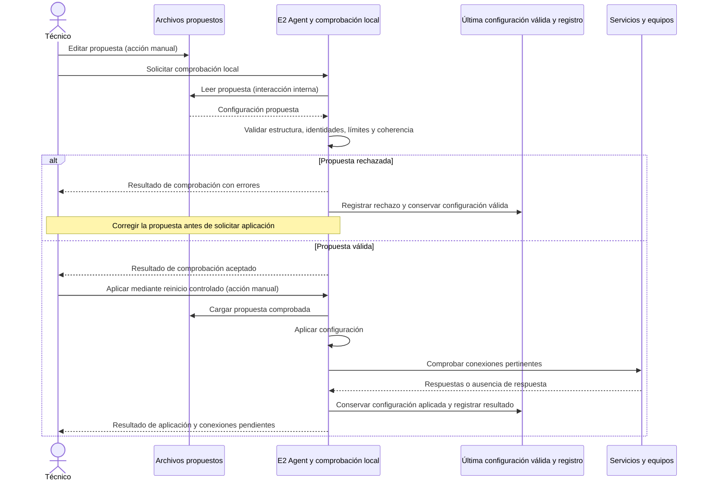
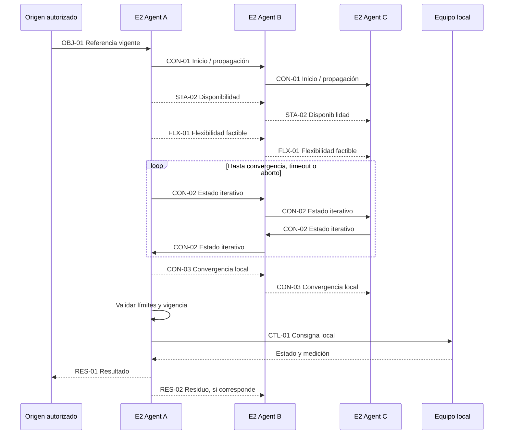

# Definiciones de flujos — E2 Infinity

Versión documental **0.3.3 — 3 de octubre de 2026**.

Este es el documento maestro para conversar y registrar las definiciones de las **46 subfases en 8 cortes**. El [plan de trabajo](plan-trabajo-flujos.md) conserva el seguimiento único de estados y dependencias y enlaza cada subfase a esta sección.

Se incorporan las definiciones detalladas de MQTT y configuración, más el antecedente conceptual del consenso. Lo propuesto, lo acordado y lo pendiente se identifican de forma explícita. Una propuesta en este documento no queda validada hasta recibir confirmación expresa; la definición documental tampoco implica implementación o ensayo físico.

En cada subfase se registrarán el escenario y propósito, los actores y responsabilidades, qué recibe y envía cada actor, el sentido y canal, las confirmaciones y respuestas, los errores y la recuperación, los acuerdos y los pendientes. Se distinguen acciones manuales, interacciones internas y mensajes entre servicios. Cada mensaje individual tiene emisor y receptor; un flujo bidireccional puede incluir varios mensajes y no exige respuesta a cada publicación.

Los tópicos, identificadores y esquemas JSON mantienen sus documentos de catálogo y su condición actual. Este documento no define nuevos endpoints ni contratos.

## Contenido

### Corte 1 — Arquitectura y mapa completo de interacciones

- [1.1 — Actores y responsabilidades](#flow-1-1)
- [1.2 — Identificación y pertenencia](#flow-1-2)
- [1.3 — Interfaces y sentidos de comunicación](#flow-1-3)
- [1.4 — Recorridos generales](#flow-1-4)

### Corte 2 — Incorporación, configuración y arranque

- [2.1 — Registro de red privada](#flow-2-1)
- [2.2 — Vinculación con E2 Infinity](#flow-2-2)
- [2.3 — Conexiones MQTT](#flow-2-3)
- [2.4 — Configuración local](#flow-2-4)
- [2.5 — Configuración remota](#flow-2-5)
- [2.6 — Coherencia de configuraciones](#flow-2-6)
- [2.7 — Arranque del nodo](#flow-2-7)

### Corte 3 — Equipos, mediciones y supervisión local

- [3.1 — Inventario y capacidades](#flow-3-1)
- [3.2 — Interfaces con los equipos](#flow-3-2)
- [3.3 — Lecturas locales](#flow-3-3)
- [3.4 — Heartbeat y salud de servicios](#flow-3-4)
- [3.5 — Alarmas locales](#flow-3-5)

### Corte 4 — Gestión energética y ejecución local

- [4.1 — Objetivos y preferencias locales](#flow-4-1)
- [4.2 — Tarifas y datos económicos](#flow-4-2)
- [4.3 — Ciclo de decisión local](#flow-4-3)
- [4.4 — Prioridades y validación](#flow-4-4)
- [4.5 — Orden y confirmación del equipo](#flow-4-5)
- [4.6 — Resultado medido y corrección local](#flow-4-6)
- [4.7 — Registro de decisiones](#flow-4-7)

### Corte 5 — Plataforma, información visible e intercambios con el nodo

- [5.1 — Funciones y permisos del usuario](#flow-5-1)
- [5.2 — Telemetría hacia E2 Infinity](#flow-5-2)
- [5.3 — Información que muestra la plataforma](#flow-5-3)
- [5.4 — Información enviada al nodo](#flow-5-4)
- [5.5 — Resultados visibles](#flow-5-5)
- [5.6 — Históricos y consultas](#flow-5-6)

### Corte 6 — Preparación de la participación distribuida

- [6.1 — Participación del usuario](#flow-6-1)
- [6.2 — Disponibilidad energética](#flow-6-2)
- [6.3 — Referencias energéticas](#flow-6-3)
- [6.4 — Flexibilidad y valoración de la contribución](#flow-6-4)
- [6.5 — Vecinos y grupo eléctrico](#flow-6-5)

### Corte 7 — Consenso y coordinación entre vecinos

- [7.1 — Activación y continuidad](#flow-7-1)
- [7.2 — Intercambio iterativo](#flow-7-2)
- [7.3 — Validez de información](#flow-7-3)
- [7.4 — Convergencia](#flow-7-4)
- [7.5 — Falta de convergencia](#flow-7-5)
- [7.6 — Entrega y realimentación](#flow-7-6)

### Corte 8 — Fallos, recuperación y revisión completa

- [8.1 — Pérdida de servicios externos](#flow-8-1)
- [8.2 — Pérdida de vecinos](#flow-8-2)
- [8.3 — Fallos internos y de equipos](#flow-8-3)
- [8.4 — Reinicio y recuperación](#flow-8-4)
- [8.5 — Sincronización pendiente](#flow-8-5)
- [8.6 — Revisión de punta a punta](#flow-8-6)

## Corte 1 — Arquitectura y mapa completo de interacciones

<a id="flow-1-1"></a>

### 1.1 — Actores y responsabilidades

**Alcance:** Usuario, técnico, plataforma, agente, servicios de comunicación y equipos.

**Estado documental: Validado.** Matriz acordada en conversación el **2026-10-03**. La validación es documental; no acredita implementación ni ensayo.

En esta subfase se distinguen los roles humanos y las responsabilidades de los componentes. Usuario y técnico son actores distintos. El E2 Agent gestiona las decisiones y actuaciones locales; el consenso es una función adicional. La definición del origen y la distribución de la referencia del consenso queda pendiente para 6.3 y 7.1.

| Actor o componente | Responsabilidad propuesta | Recibe, procesa y envía |
|---|---|---|
| Usuario de la instalación | Define preferencias energéticas y consulta el funcionamiento del sistema. | Envía preferencias o solicitudes por E2 Infinity; recibe mediciones, estados y resultados. |
| Técnico instalador | Prepara el hardware, configura inicialmente archivos y diagnostica el nodo. | Envía configuraciones manuales y solicitudes de diagnóstico local; recibe resultados de comprobación y conectividad. |
| Administrador de infraestructura | Administra centralmente el servicio Headscale y su infraestructura, separado de la lógica energética de E2 Infinity. | Gestiona despliegue, configuración y operación de Headscale. Los procedimientos de acceso y coordinación con instaladores quedan fuera de 1.1. |
| Interfaz de E2 Infinity | Presenta la información al usuario y permite registrar solicitudes autorizadas. | Recibe acciones del usuario y muestra respuestas y datos procesados por la plataforma. No actúa directamente sobre los equipos. |
| Backend de E2 Infinity | Gestiona identidades y permisos, guarda configuraciones y procesa información recibida de los nodos. | Recibe solicitudes, telemetría y resultados; envía configuraciones autorizadas e información operativa. Su papel en el origen y distribución de la referencia global queda pendiente para 6.3/7.1. |
| E2 Agent en la Raspberry | Gestiona decisiones locales, valida propuestas, ejecuta mediante interfaces de equipos y registra resultados; participa en el consenso cuando corresponde. | Recibe configuración, mediciones y propuestas de coordinación; envía telemetría, estados, resultados y mensajes a vecinos cuando participa. |
| Mosquitto local y EMQX central | Transportan publicaciones MQTT autorizadas; Mosquitto atiende intercambios del nodo y EMQX los centrales. | Reciben y encaminan publicaciones según sus suscripciones y permisos; no toman decisiones energéticas. |
| Cliente Tailscale y Headscale | Proporcionan y coordinan la conectividad de la red privada. | Mantienen el transporte y registro de red; no administran la lógica energética. Headscale es administrado por el administrador de infraestructura. |
| Agentes de nodos vecinos | Intercambian disponibilidad y variables del consenso cuando participan. | Cada agente procesa su información y mantiene la responsabilidad sobre sus decisiones y acciones locales. |
| Adaptadores y ESP32 | Conectan el E2 Agent con los protocolos de equipos; la ESP32 puede actuar como pasarela de campo. | Transmiten lecturas, órdenes y respuestas según las interfaces que se definan en 3.2. |
| Equipos físicos | Miden o actúan según sus capacidades e interfaces. | Entregan mediciones y estados; reciben órdenes compatibles. La confirmación y el efecto medido se comprobarán por separado. |

**Acuerdos registrados en conversación (2026-10-03):** usuario y técnico son actores distintos; un administrador de infraestructura administra Headscale centralmente; el backend gestiona identidades, permisos, configuración y datos mientras el E2 Agent mantiene las decisiones y la ejecución local; Headscale/Tailscale proveen conectividad y Mosquitto/EMQX transportan MQTT, sin tomar decisiones energéticas; adaptadores y ESP32 intermedian con los equipos, que miden o actúan.

**Fuera de 1.1:** los permisos detallados de usuario se definirán en 5.1; el origen y distribución de la referencia global del consenso se definirán en 6.3/7.1; los detalles de interfaces y actuación se desarrollarán en 3.2/4.5.

<a id="flow-1-2"></a>

### 1.2 — Identificación y pertenencia

**Estado documental: Validado.** Modelo de identidad y pertenencia acordado explícitamente el **2026-10-03**. Esta validación documental no acredita la asociación física ni la implementación.

#### Entidades y asociaciones

| Entidad | Identidad y fuente oficial | Asociación acordada |
|---|---|---|
| Organización | Registro administrado en E2 Infinity. | Contiene las instalaciones que se le asocian. Los permisos para crear y administrar organizaciones se precisan en 5.1. |
| Instalación | Registro precreado en E2 Infinity. | Pertenece a una organización. El técnico selecciona la instalación existente al incorporar el nodo. |
| Grupo eléctrico | Registro precreado en E2 Infinity, definido según información eléctrica del proyecto. | Puede reunir nodos de varias instalaciones conectadas al mismo transformador o punto de conexión común. Cada nodo mantiene un grupo activo. |
| Nodo | E2 Infinity asigna un `node_id` estable para el nodo lógico. | Cada nodo se asocia a una instalación y a un grupo eléctrico activo. Si se reemplaza la Raspberry, el `node_id` puede conservarse tras autorizar el nuevo equipo. |
| Equipo | El E2 Agent mantiene el inventario local y un `device_id` único dentro del nodo. | El par conceptual `node_id` + `device_id` distingue el equipo. Su inventario y capacidades se detallan en 3.1. |

Un usuario autorizado registra previamente organizaciones, instalaciones y grupos en E2 Infinity. Durante la incorporación, el técnico selecciona la instalación y el grupo eléctrico correspondientes; la plataforma valida la asociación contra esos registros. La asignación central de identificadores es conceptual: aquí no se fijan su formato, campos ni mensajes de alta.

La identidad de red Tailscale/Headscale es distinta del `node_id` de E2 Infinity. Estar conectado a la red privada no significa que el nodo esté incorporado o autorizado en la plataforma. Los pasos de alta y validación se desarrollan en 2.2; el registro de la red privada, en 2.1.

La pertenencia a un grupo eléctrico no significa que todos sus nodos sean vecinos directos ni que exista una malla completa. La lista y topología de comunicación entre vecinos se define en 6.5.

**Pendientes fuera de 1.2:** formato y representación técnica de los identificadores, flujo de mensajes y procedimiento de alta en 2.2; permisos de administración de registros en 5.1; definición de vecinos en 6.5. La asociación registrada debe contrastarse con la información eléctrica; esta definición no constituye una verificación física en terreno.

<a id="flow-1-3"></a>

### 1.3 — Interfaces y sentidos de comunicación

**Alcance:** **Interfaces y sentidos de comunicación:** Emisor, receptor, canal y recorridos unidireccionales o bidireccionales.

El flujo, sus participantes, mensajes y respuestas se definirán al conversar esta subfase. Registrar aquí los acuerdos, alternativas y preguntas pendientes; consultar su estado en el [índice del plan](plan-trabajo-flujos.md).

<a id="flow-1-4"></a>

### 1.4 — Recorridos generales

**Alcance:** **Recorridos generales:** Configuración, supervisión, gestión local, coordinación y resultados hasta el usuario.

El flujo, sus participantes, mensajes y respuestas se definirán al conversar esta subfase. Registrar aquí los acuerdos, alternativas y preguntas pendientes; consultar su estado en el [índice del plan](plan-trabajo-flujos.md).


## Corte 2 — Incorporación, configuración y arranque

<a id="flow-2-1"></a>

### 2.1 — Registro de red privada

**Alcance:** **Registro de red privada:** Cliente Tailscale y Headscale.

El flujo, sus participantes, mensajes y respuestas se definirán al conversar esta subfase. Registrar aquí los acuerdos, alternativas y preguntas pendientes; consultar su estado en el [índice del plan](plan-trabajo-flujos.md).

<a id="flow-2-2"></a>

### 2.2 — Vinculación con E2 Infinity

**Alcance:** **Vinculación con E2 Infinity:** Incorporación, asociación y autorización del nodo.

El flujo, sus participantes, mensajes y respuestas se definirán al conversar esta subfase. Registrar aquí los acuerdos, alternativas y preguntas pendientes; consultar su estado en el [índice del plan](plan-trabajo-flujos.md).

<a id="flow-2-3"></a>

### 2.3 — Conexiones MQTT

**Alcance:** **Conexiones MQTT:** Agente–Mosquitto, bridge con EMQX y brokers vecinos.


- Numeración anterior: **1.5**; renumerado a **2.3** en la versión documental 0.3.0. Se conserva el alcance y la referencia del acuerdo original.
- Estado documental: **Validado**.
- Dependencias: identificación (1.2), vinculación con E2 Infinity (2.2) y conectividad privada para los vecinos (2.1).
- Fecha y referencia del acuerdo: **2026-09-27**, confirmación explícita del usuario «lo valido» después de revisar la propuesta de 1.5 (actual 2.3).
- Evidencia de implementación o ensayo: inspección de las copias locales del código; no se realizaron pruebas de servicios desplegados en esta revisión.

#### 1. Propósito y escenario concreto

Describir los recorridos MQTT de una Raspberry configurada manualmente y comprobar conexión, entrega de mensajes y procesamiento por separado.

Este acuerdo define responsabilidades y recorridos. Los tópicos definitivos, payloads, QoS, retain, expiración y mecanismos de confirmación de aplicación se revisarán al desarrollar cada flujo específico.

#### 2. Participantes y responsabilidades

| Participante | Recibe | Procesa o decide | Envía |
|---|---|---|---|
| Técnico | Parámetros de instalación y permisos | Configura clientes y bridges manualmente; ejecuta comprobaciones | Configuración y pruebas |
| E2 Agent | Mensajes suscritos del broker local | Procesa información, valida decisiones y registra resultados | Publicaciones al Mosquitto local |
| Mosquitto local | Publicaciones de clientes, vecinos y bridge central | Distribuye según suscripciones y permisos; replica lo autorizado | Mensajes locales y publicaciones por bridges |
| EMQX central | Publicaciones de backend y nodos | Distribuye según suscripciones y permisos | Mensajes hacia backend y nodos autorizados |
| Backend E2 Infinity | Telemetría y resultados recibidos por EMQX | Procesa información de plataforma y genera mensajes autorizados | Publicaciones a EMQX |
| Brokers y agentes vecinos | Mensajes de coordinación permitidos | Cada broker distribuye; cada agente procesa su información | Disponibilidad y variables de coordinación |
| Equipos MQTT locales | Solicitudes compatibles con su integración | Procesan operaciones propias de cada equipo | Lecturas y respuestas al broker local |

##### Recorridos acordados

| Recorrido | Función |
|---|---|
| E2 Agent ↔ Mosquitto local | Mensajería del agente dentro del nodo |
| Mosquitto local ↔ EMQX central ↔ backend | Bridge selectivo para la comunicación con la plataforma |
| Mosquitto local ↔ brokers de vecinos ↔ agentes vecinos | Disponibilidad y coordinación sobre la red privada |
| Equipos MQTT ↔ Mosquitto local | Mensajería de equipos; sus secuencias se detallarán en el corte 3 |

Los clientes Tailscale proporcionan el transporte privado entre Raspberry. Headscale coordina esa red; no procesa las publicaciones MQTT. La selección de vecinos se revisará en 6.5.

#### 3. Condiciones previas y resultado esperado

- Identidad y asociación del nodo configuradas.
- Brokers y clientes disponibles, con direcciones y credenciales configuradas manualmente.
- Permisos de publicación y suscripción preparados para cada recorrido.
- Red privada disponible para comprobar intercambios entre vecinos.

Cada nodo tendrá credenciales MQTT propias en EMQX, independientes de su cuenta de acceso a la API. Los accesos locales y entre vecinos tendrán sus permisos correspondientes; el mecanismo concreto se detallará en su revisión. Cada cliente o bridge tendrá un identificador de conexión que evite interferencias con otros clientes.

Resultado esperado: comprobar por separado que el broker admite la conexión, que la publicación llega al destinatario suscrito y, cuando corresponda, que la aplicación la procesa y responde.

#### 4. Secuencia de intercambios

| Paso | Tipo | Origen | Destino | Acción o intercambio | Resultado esperado |
|---|---|---|---|---|---|
| 1 | Manual | Técnico | Configuración de servicios | Introducir accesos, identificadores, suscripciones y reglas de bridge | Configuración preparada |
| 2 | Entre servicios | E2 Agent | Mosquitto local | Conectar y suscribirse a los mensajes necesarios | Conexión y suscripciones aceptadas o rechazo informado |
| 3 | Entre servicios | Bridge local | EMQX | Conectar con las credenciales MQTT del nodo y establecer rutas autorizadas | Tramo central disponible |
| 4 | Entre servicios | Broker iniciador | Broker vecino | Establecer el bridge autorizado por la red privada | Tramo entre vecinos disponible |
| 5 | Manual y entre servicios | Técnico y aplicaciones de comprobación | Recorridos configurados | Publicar y comprobar recepción en ambos sentidos | Evidencia por recorrido |
| 6 | Interna / entre servicios | Aplicación receptora | Registro local o emisor | Procesar el mensaje; responder si el flujo lo requiere | Procesamiento comprobable |

En los bridges, una conexión iniciada por un broker puede transportar publicaciones en ambos sentidos según sus reglas. El acuerdo no exige dos conexiones duplicadas para cada par.

```mermaid
sequenceDiagram
    actor T as Técnico
    participant A as E2 Agent
    participant L as Mosquitto local
    participant C as EMQX central
    participant B as Backend E2 Infinity
    participant V as Broker vecino
    participant N as Agente vecino

    Note over T,N: Diseño objetivo; configuración y comprobaciones manuales
    T->>T: Editar archivos y preparar permisos (acción manual)
    A->>L: Conectar y suscribirse
    L-->>A: Resultado de conexión y suscripciones
    L->>C: Conectar bridge selectivo
    C-->>L: Resultado de conexión
    Note over B,C: El backend también mantiene su cliente y suscripciones
    L->>V: Establecer bridge autorizado (iniciador según configuración)
    V-->>L: Resultado de conexión
    Note over T,N: Comprobar cada sentido de publicación autorizado
    A->>L: Publicación de comprobación hacia plataforma
    L->>C: Replicar únicamente el mensaje permitido
    C->>B: Entregar a la suscripción correspondiente
    B->>B: Comprobar procesamiento (interacción interna)
    B->>C: Publicación de comprobación hacia nodo
    C->>L: Entregar por el bridge autorizado
    L->>A: Entregar al agente suscrito
    A->>A: Comprobar procesamiento (interacción interna)
    A->>L: Publicación de comprobación hacia vecino
    L->>V: Replicar el mensaje autorizado
    V->>N: Entregar al agente vecino
    N->>V: Publicación de comprobación de retorno
    V->>L: Replicar el mensaje autorizado
    L->>A: Entregar al agente local
```

El diagrama no fija nuevos IDs ni payloads de pruebas. Los IDs de aplicación se añadirán al acordar cada mensaje del catálogo; los intercambios de conexión y suscripción corresponden al protocolo MQTT.

#### 5. Mensajes necesarios y contenido mínimo

El [catálogo común](mensajes/catalogo-mensajes.md) conserva sus propuestas. Este punto no aprueba sus estructuras.

| Familia por revisar | Destinatario conceptual | Definición posterior |
|---|---|---|
| Telemetría, resultados y alarmas | Plataforma según permisos | Cortes 3 y 5 |
| Configuración operativa o referencias autorizadas | Nodo o participantes correspondientes | 2.5 y 6.3; revisar canal según propósito |
| Heartbeat y disponibilidad | Plataforma o vecinos según su función | 3.4 y 6.2 |
| Variables iterativas del consenso | Agentes vecinos autorizados | Corte 7 |

El bridge central transportará únicamente las familias autorizadas. No se exige replicar todas las variables iterativas del consenso hacia la nube. La lista exacta de tópicos se cerrará con los flujos correspondientes. Los bridges entre vecinos deben evitar reexportar indiscriminadamente mensajes recibidos y crear bucles de replicación.

#### 6. Confirmaciones, errores y recuperación

| Situación | Comprobación o resultado esperado |
|---|---|
| Credenciales rechazadas | Informar qué conexión falló; el técnico revisa su acceso |
| Conexión admitida, tópico no autorizado | Distinguir conexión correcta de publicación o suscripción rechazada |
| Bridge central desconectado | Informar pérdida del tramo central; comprobar local y vecinos por separado |
| Vecino inaccesible | Informar qué tramo no permite entregar mensajes; tratamiento energético en 8.2 |
| Aplicación sin respuesta | Distinguir entrega al broker, entrega al cliente y procesamiento de aplicación |

La confirmación del broker no demuestra que el equipo físico haya actuado. Las confirmaciones y resultados de actuación se definirán en 4.5 y 4.6. La recuperación y resincronización completa se revisarán en el corte 8.

#### 7. Acuerdos, pendientes y ejemplos de validación

##### Acuerdos confirmados

- Tres recorridos principales: agente–broker local, bridge local–EMQX y brokers entre vecinos.
- Bridge selectivo con EMQX como diseño objetivo.
- Credenciales centrales propias por nodo e independientes del acceso API.
- Configuración inicial manual e identificadores de conexión sin interferencias.
- Verificación de conexión, entrega y procesamiento como resultados distintos.

Referencia de aprobación: confirmación «lo valido», 2026-09-27.

##### Estado observado y pendientes

En las copias locales revisadas, `autobridge.py` genera bridges entre Mosquitto de Raspberry. El simulador publica por separado a EMQX y al broker local. No se encontró en ese generador el bridge central Mosquitto–EMQX: queda pendiente de implementación. La selección actual de conexiones tampoco constituye la selección definitiva de vecinos del consenso.

Quedan pendientes los tópicos concretos, payloads, permisos detallados, QoS, retain, expiración y respuestas de aplicación. Los JSON Schema siguen siendo borradores.

##### Ejemplos de comprobación futura

- Operación normal: publicación de prueba y recepción en ambos sentidos de cada recorrido autorizado.
- Credencial incorrecta: rechazo identificable sin confundirlo con una falla de red.
- Permiso incorrecto: detectar que una conexión admitida no permite el intercambio esperado.
- Pérdida de EMQX: distinguir tramo central caído de la conectividad local y entre vecinos.

Estos ejemplos son criterios de prueba propuestos; no se ejecutaron contra infraestructura real en esta revisión. La validación aquí es documental.

<a id="flow-2-4"></a>

### 2.4 — Configuración local

**Alcance:** **Configuración local:** Edición, comprobación, aplicación y resultado.


- Numeración anterior: **1.6**; renumerado a **2.4** en la versión documental 0.3.0. Se conserva el alcance y la referencia del acuerdo original.
- Estado documental: **Validado**.
- Dependencias: actores y responsabilidades (1.1), identificación (1.2) e interfaces (1.3). Las comprobaciones de conexión que correspondan se describen en 2.1–2.3; una conexión central disponible no es condición universal para aplicar configuración local.
- Fecha y referencia del acuerdo: **2026-09-27**, confirmación explícita «me parece bien» después de la propuesta editar → comprobar → reiniciar de forma controlada → aplicar → verificar y registrar.
- Evidencia de implementación o ensayo: revisión del script de instalación y configuración existente; no se implementó ni se ensayó este flujo del E2 Agent.

#### 1. Propósito y escenario concreto

Describir cómo el técnico modifica una configuración local y obtiene un resultado de comprobación antes de activarla. La primera etapa utiliza archivos editados manualmente, herramientas de terminal y registros locales.

Se distinguen la configuración propuesta y la última configuración válida aplicada. La propuesta se comprueba antes del reinicio controlado del E2 Agent. Una propuesta rechazada no sustituye la configuración aplicada.

#### 2. Participantes y responsabilidades

| Participante | Recibe | Procesa o decide | Envía |
|---|---|---|---|
| Técnico | Resultados de comprobación y aplicación | Edita la propuesta, corrige errores y solicita su activación mediante reinicio controlado | Solicitudes locales de comprobación y aplicación |
| E2 Agent y su función de comprobación local | Propuesta de configuración y solicitud del técnico | Lee, valida, aplica, comprueba conexiones y registra el resultado | Informes de comprobación y aplicación |
| Archivos y registro local | Edición manual, configuración aplicada y resultados | Conservan la propuesta y la referencia válida utilizada por el agente | Datos al ser leídos localmente |
| Servicios y equipos configurados | Solicitudes de conexión o comprobación pertinentes | Admiten, rechazan o no responden a las solicitudes | Estados de conexión y respuestas |

Este es un recorrido local. La edición de archivos y el reinicio son acciones manuales; la lectura, validación y conservación son interacciones internas. Las comprobaciones de API, MQTT y equipos pueden originar mensajes entre servicios, descritos en sus flujos correspondientes.

#### 3. Condiciones previas y resultado esperado

- El técnico dispone de los parámetros necesarios y conoce qué configuración desea aplicar.
- El agente puede leer la propuesta y emitir un informe local.
- Si existe una configuración válida aplicada, se conserva como referencia independiente de la propuesta editada.

Resultado esperado: identificar la propuesta evaluada, informar su aceptación o rechazo, identificar la configuración que efectivamente quedó activa y comunicar qué conexiones están disponibles o pendientes.

Los nombres y formatos definitivos de archivos, campos y comandos quedan pendientes de definición. Las configuraciones propias de Mosquitto o Tailscale requieren aplicar los cambios al servicio correspondiente; reiniciar el agente no se considera una aplicación automática de todos esos archivos.

#### 4. Secuencia de intercambios

| Paso | Tipo | Origen | Destino | Acción o intercambio | Resultado esperado |
|---|---|---|---|---|---|
| 1 | Manual | Técnico | Archivos propuestos | Editar parámetros | Cambios preparados, todavía inactivos |
| 2 | Manual / interna | Técnico | Función local de comprobación | Solicitar evaluación de la propuesta | Propuesta identificada y leída |
| 3 | Interna | Comprobación local | Técnico y registro | Evaluar estructura, identidades, campos obligatorios, límites y coherencia | Aceptación o rechazo con errores identificables |
| 4 | Manual | Técnico | E2 Agent | Si la propuesta es válida, solicitar activación mediante reinicio controlado | Comienza la aplicación de la propuesta comprobada |
| 5 | Interna | E2 Agent | Configuración local | Cargar y aplicar la configuración comprobada | Configuración activa identificada |
| 6 | Entre servicios / interna | E2 Agent | Servicios y equipos pertinentes | Comprobar conexiones según los parámetros aplicados | Estados de conexión registrados |
| 7 | Interna / local | E2 Agent | Técnico y registro | Conservar la configuración válida aplicada y emitir resultado | Aplicación y conectividad informadas por separado |



El diagrama representa la función de comprobación y el agente como una responsabilidad local; no fija una interfaz HTTP, comando ni canal MQTT para solicitarla. La comprobación de conexiones no convierte en válido un archivo mal formado.

#### 5. Mensajes necesarios y contenido mínimo

| Interacción | Emisor | Receptor | Medio inicial | Información mínima |
|---|---|---|---|---|
| Solicitud local de comprobación | Técnico | Función de comprobación del agente | Herramienta de terminal | Identificación de la configuración a evaluar |
| Resultado de comprobación | Función de comprobación | Técnico y registro local | Informe local | Identificación de la propuesta, aceptación o rechazo, errores y sus motivos |
| Solicitud de aplicación | Técnico | E2 Agent | Reinicio controlado | Referencia a la configuración comprobada |
| Resultado de aplicación | E2 Agent | Técnico y registro local | Informe local | Configuración efectivamente activa, resultado y conexiones disponibles o pendientes |

Estas interacciones describen información y propósito, no nuevos contratos de red. Los IDs y campos definitivos se conciliarán con el [catálogo común](mensajes/catalogo-mensajes.md). La publicación del resultado hacia la plataforma se definirá en su flujo correspondiente. Los esquemas JSON previos conservan su estado de borrador.

#### 6. Confirmaciones, errores y recuperación

##### Resultados de aplicación acordados

| Resultado | Significado |
|---|---|
| Rechazada | Hay errores de configuración; se informa qué corregir y la propuesta queda sin aplicar |
| Aplicada | La configuración pasó la validación y quedó activa |
| Aplicada con conexiones pendientes | La configuración es válida y activa, pero algún servicio o equipo está temporalmente inaccesible |

Estos son resultados informativos, no la definición de la máquina de estados de control energético.

Si una modificación se rechaza, se conserva la última configuración válida. Si es el primer arranque y no existe configuración válida, el agente permanece disponible para diagnóstico sin habilitar actuaciones energéticas. La capacidad de operación ante conexiones pendientes dependerá de los recursos y reglas locales que se definirán en los bloques correspondientes.

Una comprobación aceptada todavía no confirma aplicación. El informe posterior debe identificar qué configuración quedó activa. Las comprobaciones de conexión se informan por separado de la validez de los parámetros.

#### 7. Acuerdos, pendientes y ejemplos de validación

##### Acuerdos confirmados

- Edición manual y comprobación local previa a la aplicación.
- Activación inicial mediante reinicio controlado del E2 Agent.
- Distinción entre configuración propuesta y última configuración válida aplicada.
- Informe de rechazo con motivos; configuración rechazada sin aplicar.
- Registro de configuración activa y resultado, diferenciando conectividad.

Referencia: confirmación «me parece bien», 2026-09-27.

##### Pendientes para definir con los flujos correspondientes

- Formato y ubicación de archivos y mecanismo exacto de comprobación local.
- Campos y reglas detalladas de coherencia por tipo de equipo y perfil.
- Tratamiento de una edición posterior a la comprobación o una falla durante la aplicación.
- Procedimiento de reinicio cuando exista una actuación energética en curso.
- Publicación del informe hacia la plataforma y relación con cambios remotos en 2.5.

##### Ejemplos de comprobación futura

| Escenario | Resultado esperado |
|---|---|
| Propuesta completa y coherente | Aceptación, aplicación controlada y registro de configuración activa |
| Límite eléctrico negativo | Rechazo con campo y motivo; conservar configuración aplicada |
| Archivo incompleto o ilegible | Informar errores sin activar la propuesta |
| Configuración válida y EMQX inaccesible | Configuración aplicada con conexión central pendiente |
| Primer arranque sin configuración válida | Diagnóstico disponible y actuaciones energéticas sin habilitar |

Los ejemplos son criterios documentales; no se realizaron ensayos físicos ni pruebas del agente en esta revisión.

<a id="flow-2-5"></a>

### 2.5 — Configuración remota

**Alcance:** **Configuración remota:** Propuesta desde la plataforma, recepción, comprobación y aplicación.


- Numeración anterior: **1.7**; renumerado a **2.5** en la versión documental 0.3.0. Se conservan los antecedentes y el estado de borrador; no existe aún una validación de este punto.
- Estado documental: **Borrador en conversación**, pendiente de validación explícita.
- Dependencias: vinculación con la API (2.2), responsabilidades de transporte (2.3) y aplicación local de configuración (2.4).
- Fecha de preparación: 2026-09-27.
- Fecha y referencia del acuerdo: pendiente; la solicitud de preparar este punto no aprueba automáticamente sus decisiones.
- Evidencia de implementación o ensayo: inspección de las rutas de configuración del backend; no se implementó ni ensayó este flujo de extremo a extremo.

#### 1. Propósito y escenario concreto

Describir cómo un usuario o técnico autorizado prepara un cambio en E2 Infinity y cómo el nodo lo obtiene, comprueba y aplica. La configuración solicitada en plataforma y la configuración efectivamente aplicada localmente se distinguen durante todo el recorrido.

El alcance incluye modificar desde E2 Infinity la configuración del nodo que funciona en la Raspberry, no solo consultar su información. El backend conserva la propuesta autorizada; el E2 Agent mantiene la responsabilidad de comprobarla y aplicarla localmente. Esto no equivale a administrar todo el sistema operativo ni a ejecutar comandos arbitrarios en la Raspberry.

Para la primera etapa se propone una consulta HTTPS iniciada manualmente desde la Raspberry mediante una herramienta del agente. La activación queda sujeta a intervención del técnico y al reinicio controlado acordado en [2.4](#flow-2-4). La consulta, comprobación y comunicación del resultado son funciones objetivo del agente; todavía no se consideran implementadas.

Las actualizaciones automáticas, los avisos MQTT de cambios y la recarga sin reinicio son posibles evoluciones que requieren otro acuerdo.

##### Etapas propuestas

| Etapa | Qué se hace desde E2 Infinity | Qué sucede en el nodo | Condición documental |
|---|---|---|---|
| Inicial | Preparar y guardar un cambio autorizado para el nodo | El técnico inicia la consulta HTTPS y la aplicación controlada según 2.4 | Propuesta de este punto; conserva la base manual acordada |
| Posterior | Preparar cambios autorizados y consultar su resultado efectivo | Obtener propuestas sin intervención y aplicar automáticamente solo los cambios habilitados para ello | Evolución pendiente de acuerdo; no incluida como comportamiento inicial |

Obtener una propuesta automáticamente y aplicarla automáticamente son decisiones distintas. En la etapa inicial, guardar un cambio desde la plataforma no modifica por sí solo la configuración activa de la Raspberry.

#### 2. Participantes y responsabilidades

| Participante | Recibe | Procesa o decide | Envía |
|---|---|---|---|
| Usuario o técnico autorizado | Configuración solicitada y estado aplicado | Propone cambios dentro de su autorización | Solicitud de cambio a E2 Infinity |
| Backend E2 Infinity | Solicitud de cambio y resultados del nodo | Comprueba autorización sobre instalación, nodo y parámetros; conserva la propuesta y registra su resultado | Propuesta de configuración mediante API |
| Técnico local | Propuesta e informe de comprobación | Inicia la consulta, revisa el resultado y solicita aplicación manual | Solicitudes locales al agente |
| E2 Agent | Propuesta remota y configuración local vigente | Comprueba destinatario, autorización, revisión, parámetros y compatibilidad local; prepara y aplica según 2.4 | Resultado de comprobación y aplicación |
| Registro local | Propuesta, configuración aplicada y resultados | Conserva trazabilidad y última configuración válida | Información consultada por el técnico y agente |

El recorrido de configuración administrativa utiliza HTTPS. EMQX, Mosquitto y Headscale no intervienen como gestores de esta propuesta. La mensajería operativa mantiene su recorrido MQTT acordado en 2.3.

#### 3. Condiciones previas y resultado esperado

- Cuenta y asociación con la instalación configuradas para consultar la API.
- Configuración local válida y reglas de aplicación de 2.4 disponibles.
- Solicitante autorizado a modificar los parámetros correspondientes.
- Propuesta identificable y dirigida a la instalación y nodo correctos.

Resultado esperado: saber qué se solicitó remotamente, qué recibió el agente, si lo aceptó para aplicación y qué configuración quedó activa después de la intervención manual.

##### Alcance propuesto de cambios

| Tipo de información | Tratamiento propuesto |
|---|---|
| Preferencias, reservas, prioridades y ventanas de participación | Cambios solicitados por el usuario autorizado, comprobados localmente; detalle en 4.1 y 6.1 |
| Tarifas, perfiles y parámetros de valoración | Propuestas de datos para el cálculo local; fuentes, vigencia y autoridad se revisan en 4.2 |
| Habilitación de participación | Solicitud autorizada compatible con las condiciones locales; no implica una actuación física inmediata |
| Perfiles de equipos, parámetros de adaptadores y opciones de supervisión | Configuración técnica del agente que puede proponerse desde E2 Infinity; requiere permiso técnico, comprobación de capacidades reales y aplicación manual inicial. El inventario exacto queda pendiente |
| Límites físicos de instalación y capacidades de equipos | Son restricciones que el cambio debe respetar, no capacidades que la plataforma pueda aumentar por declaración. Su modificación requiere verificación técnica local |
| Identidad, credenciales, MQTT y red privada | Mantener su cambio bajo revisión técnica manual; una gestión remota posterior necesita un flujo específico de seguridad y recuperación |
| Sistema operativo, actualizaciones y reinicios del equipo completo | Fuera de este flujo de configuración del agente; reiniciar E2 Agent según 2.4 no equivale a reiniciar la Raspberry |
| Ganancias, variables y ley del consenso | Mantener pendientes hasta conciliación con la formulación y validación matemática |

Una referencia energética temporal o una orden de actuación se tratará en su flujo operativo. No se considera automáticamente una modificación persistente de configuración.

Ejemplo: cambiar una reserva de batería en el perfil es una propuesta de configuración persistente. Solicitar una reducción de potencia durante un intervalo es una consigna operativa y sigue otro flujo. En ambos casos deben respetarse las restricciones locales; aceptar una configuración no confirma una actuación física.

##### Comprobación local propuesta

Antes de aceptar una propuesta, el agente debe comprobar:

1. Que está dirigida a su nodo e instalación y procede de la API autenticada.
2. Que los cambios están autorizados y pertenecen al alcance admitido para el solicitante; el mecanismo de permisos queda por definir.
3. Que se identifica la propuesta y la configuración sobre la que se preparó, evitando sustituir silenciosamente una edición local más reciente.
4. Que los valores y perfiles son compatibles con las capacidades verificadas, límites eléctricos, reservas y condiciones del usuario.
5. Que existe un procedimiento de aplicación compatible con las operaciones en curso, conforme a los pendientes de 2.4.

Si no se puede resolver la autorización o un conflicto local/remoto, la propuesta no se aplica y se informa para revisión. Los campos, reglas de precedencia y mecanismos de verificación definitivos siguen pendientes de acuerdo; su coherencia común con los cambios locales se abordará en 2.6.

#### 4. Secuencia de intercambios

| Paso | Tipo | Origen | Destino | Acción o mensaje | Resultado esperado |
|---|---|---|---|---|---|
| 1 | Manual / entre servicios | Usuario o técnico autorizado | API E2 Infinity | Proponer cambios para su instalación | Solicitud autenticada |
| 2 | Interna / entre servicios | Backend | Solicitante | Comprobar autorización sobre nodo y parámetros y guardar propuesta | Guardado o rechazo administrativo; aún no implica aplicación en nodo |
| 3 | Manual | Técnico local | E2 Agent | Solicitar consulta de la propuesta central | Consulta iniciada deliberadamente |
| 4 | Entre servicios | E2 Agent | API E2 Infinity | Consultar configuración autorizada mediante HTTPS | Propuesta recibida o error informado |
| 5 | Interna | E2 Agent | Registro local | Preparar propuesta sin sustituir la configuración aplicada | Propuesta disponible para comprobación |
| 6 | Interna / local | E2 Agent | Técnico | Comprobar destinatario, autorización, revisión, parámetros y compatibilidad local | Aceptada para aplicación o rechazada con motivo; conflicto pendiente sin aplicar |
| 7 | Manual / interna | Técnico | E2 Agent | Si es válida, aplicar según 2.4 mediante reinicio controlado | Configuración activa identificada |
| 8 | Local / entre servicios | E2 Agent | Técnico y API E2 Infinity | Informar comprobación y aplicación correspondiente | Diferenciar lo solicitado de lo efectivamente activo |

```mermaid
sequenceDiagram
    actor U as Usuario o técnico autorizado
    participant B as API E2 Infinity
    actor T as Técnico local
    participant A as E2 Agent
    participant L as Configuración y registro local

    Note over U,L: Borrador: consulta y aplicación inicial bajo intervención manual
    U->>B: Solicitar cambio autorizado (HTTPS)
    B->>B: Comprobar permiso sobre nodo y parámetros; conservar propuesta
    B-->>U: Propuesta guardada o rechazo
    T->>A: Solicitar consulta de configuración (acción manual)
    A->>B: Consultar propuesta (HTTPS autenticado)
    B-->>A: Propuesta o error de acceso
    A->>L: Preparar propuesta sin cambiar configuración activa
    A->>A: Comprobar destinatario, permiso, revisión y límites
    alt Propuesta rechazada
        A-->>T: Resultado de comprobación y motivo
        A->>L: Registrar rechazo; conservar configuración válida
        A->>B: Informar rechazo (interfaz objetivo)
    else Propuesta aceptada para aplicación
        A-->>T: Propuesta válida, pendiente de aplicación manual
        T->>A: Aplicar según 2.4 (reinicio controlado)
        A->>L: Aplicar y registrar configuración activa
        A-->>T: Resultado de aplicación y conexiones
        A->>B: Informar resultado efectivo (interfaz objetivo)
    end
```

El diagrama resume la comprobación previa y aplicación local descritas en 2.4. Los nombres de comandos, recursos de resultado y condiciones exactas de envío quedan pendientes; el borrador no introduce endpoints implementados.

#### 5. Mensajes necesarios y contenido mínimo

| Intercambio | Emisor | Receptor | Canal propuesto | Información mínima |
|---|---|---|---|---|
| Solicitud de cambio | Usuario o técnico autorizado | API central | HTTPS | Instalación y nodo destinatario, parámetros propuestos e identificación de la solicitud; referencia de configuración de partida |
| Resultado de guardado | API central | Solicitante | HTTPS | Propuesta guardada o rechazo; no confirmación de aplicación física |
| Consulta de propuesta | E2 Agent | API central | HTTPS | Nodo e instalación autorizados y referencia de configuración activa conocida |
| Entrega de propuesta | API central | E2 Agent | HTTPS | Identificación, revisión, destinatario y parámetros; vigencia si aplica |
| Resultado de comprobación | E2 Agent | Técnico y plataforma | Local / HTTPS objetivo | Propuesta evaluada, aceptación o rechazo y motivos |
| Resultado de aplicación | E2 Agent | Técnico y plataforma | Local / HTTPS objetivo | Propuesta relacionada, configuración efectivamente activa, momento del resultado y conexiones pendientes |

Los nombres exactos de campos, revisiones, rutas y asociación con `CFG-01`/`CFG-02` se acordarán al revisar el [catálogo](mensajes/catalogo-mensajes.md). Esta entrega no modifica JSON Schema.

#### 6. Confirmaciones, errores y recuperación

- El guardado central solo confirma recepción y conservación de la propuesta.
- La comprobación local aceptada aún no confirma aplicación; el nodo permanece con su configuración aplicada hasta activar los cambios.
- El informe posterior identifica qué configuración quedó activa.
- Si la API es inaccesible, no se obtiene una nueva propuesta y se conserva la última configuración válida.
- Si hay rechazo de autorización o el destinatario no coincide, se informa el problema y no se aplica la propuesta.
- Los cambios incompatibles con límites físicos o condiciones locales requieren corrección o revisión autorizada.
- Las propuestas antiguas, duplicadas o en conflicto con una edición local requieren una política explícita antes de automatizar su aplicación.
- Mientras esa política no esté acordada, un conflicto local/remoto debe quedar visible y sin aplicación automática ni sustitución silenciosa de la configuración vigente.
- Una pérdida de comunicación al informar el resultado puede dejar a la plataforma sin confirmación; no autoriza a mostrar el cambio como aplicado sin evidencia.

Se informan identificadores y motivos sin exponer credenciales en mensajes ni registros. El agente utiliza su autorización de API, independiente de las credenciales MQTT.

#### 7. Acuerdos, pendientes y ejemplos de validación

##### Base acordada en otros puntos

- Configuración inicial manual.
- Comprobación local y aplicación mediante reinicio controlado según 2.4.
- Conservación de la última configuración válida.
- Identidad del nodo y acceso API separados del acceso MQTT.

##### Propuestas de este punto pendientes de validación

- Configurar desde E2 Infinity parámetros persistentes del nodo, con el agente como responsable de la comprobación y aplicación efectiva.
- Consulta de configuración por HTTPS iniciada manualmente desde la Raspberry.
- Alcance de preferencias, participación y datos económicos autorizado remotamente.
- Propuestas técnicas de perfiles, adaptadores y supervisión reservadas al técnico autorizado y comprobadas contra las capacidades reales.
- Límites físicos, identidad, red y credenciales reservados a verificación técnica manual; administración del sistema operativo fuera de este flujo.
- Informe administrativo de comprobación y aplicación hacia la API central.
- Separación explícita entre configuración persistente y consignas operativas temporales.

##### Definiciones posteriores

- Lista de parámetros, roles autorizados y reglas de compatibilidad local.
- Política ante cambios locales y remotos concurrentes, revisiones antiguas y duplicados.
- Identificación y vigencia de propuestas, interfaz de reporte y recuperación de informes pendientes.
- Mecanismo futuro de aviso o consulta automática; condiciones para aplicación automática.
- Referencias energéticas y económicas operativas, conforme a 4.2, 6.3 y a la formulación del algoritmo.

##### Escenarios propuestos

| Escenario | Resultado esperado |
|---|---|
| Cambio autorizado y coherente | Guardado central, consulta manual, comprobación y aplicación diferenciadas |
| Propuesta válida sin intervención de aplicación | Configuración actual conservada; propuesta pendiente de aplicación |
| Solicitud sin permiso | Rechazo administrativo |
| Configuración para otra instalación | Rechazo local y conservación de configuración válida |
| Cambio incompatible con límites físicos | Informe de rechazo sin actuación |
| Cambio técnico de perfil sin permiso | Rechazo administrativo; no aplicación en el nodo |
| Perfil incompatible con el equipo real | Rechazo local y conservación de configuración válida |
| Propuesta remota basada en una configuración anterior a una edición local | Conflicto visible y propuesta sin aplicar hasta revisión |
| Consigna temporal enviada como configuración persistente | No tratarla como actualización de configuración; debe utilizar su flujo operativo autorizado |
| API desconectada | Configuración activa conservada e imposibilidad de consulta informada |
| Reporte de aplicación no entregado | Estado central pendiente de confirmación |

##### Estado observado en el código

En la copia local del backend, el router de configuración permite leer y guardar valores por instalación y parámetro, comprobando acceso. No se encontró en ese recorrido la propagación automática a la Raspberry, un protocolo completo de revisiones ni un reporte de aplicación del agente. Guardar un valor en la base de datos no acredita su ejecución en el nodo.

Este documento es un borrador para revisión. No se ejecutaron pruebas de servicios ni se implementó configuración remota.

##### Referencia histórica de esta revisión (numeración anterior)

2026-09-27: conversación sobre permitir cambios de configuración del nodo desde E2 Infinity y solicitud «entonces trabajemos en 1.7». Se amplió el alcance propuesto; la solicitud de trabajar el punto no constituye validación de este borrador.

<a id="flow-2-6"></a>

### 2.6 — Coherencia de configuraciones

**Alcance:** **Coherencia de configuraciones:** Permisos, versiones y conflictos entre cambios locales y remotos.

El flujo, sus participantes, mensajes y respuestas se definirán al conversar esta subfase. Registrar aquí los acuerdos, alternativas y preguntas pendientes; consultar su estado en el [índice del plan](plan-trabajo-flujos.md).

<a id="flow-2-7"></a>

### 2.7 — Arranque del nodo

**Alcance:** **Arranque del nodo:** Carga de configuración, comprobación de servicios y habilitación de funciones disponibles.

El flujo, sus participantes, mensajes y respuestas se definirán al conversar esta subfase. Registrar aquí los acuerdos, alternativas y preguntas pendientes; consultar su estado en el [índice del plan](plan-trabajo-flujos.md).


## Corte 3 — Equipos, mediciones y supervisión local

<a id="flow-3-1"></a>

### 3.1 — Inventario y capacidades

**Alcance:** **Inventario y capacidades:** Equipos existentes y sus capacidades de medición y control.

El flujo, sus participantes, mensajes y respuestas se definirán al conversar esta subfase. Registrar aquí los acuerdos, alternativas y preguntas pendientes; consultar su estado en el [índice del plan](plan-trabajo-flujos.md).

<a id="flow-3-2"></a>

### 3.2 — Interfaces con los equipos

**Alcance:** **Interfaces con los equipos:** EVCC/OCPP, adaptadores, ESP32 y pasarelas.

El flujo, sus participantes, mensajes y respuestas se definirán al conversar esta subfase. Registrar aquí los acuerdos, alternativas y preguntas pendientes; consultar su estado en el [índice del plan](plan-trabajo-flujos.md).

<a id="flow-3-3"></a>

### 3.3 — Lecturas locales

**Alcance:** **Lecturas locales:** Adquisición, unidades, fecha y calidad de las mediciones.

El flujo, sus participantes, mensajes y respuestas se definirán al conversar esta subfase. Registrar aquí los acuerdos, alternativas y preguntas pendientes; consultar su estado en el [índice del plan](plan-trabajo-flujos.md).

<a id="flow-3-4"></a>

### 3.4 — Heartbeat y salud de servicios

**Alcance:** **Heartbeat y salud de servicios:** Presencia del nodo y disponibilidad de sus componentes.

El flujo, sus participantes, mensajes y respuestas se definirán al conversar esta subfase. Registrar aquí los acuerdos, alternativas y preguntas pendientes; consultar su estado en el [índice del plan](plan-trabajo-flujos.md).

<a id="flow-3-5"></a>

### 3.5 — Alarmas locales

**Alcance:** **Alarmas locales:** Detección, registro y comunicación de fallos y recuperación.

El flujo, sus participantes, mensajes y respuestas se definirán al conversar esta subfase. Registrar aquí los acuerdos, alternativas y preguntas pendientes; consultar su estado en el [índice del plan](plan-trabajo-flujos.md).


## Corte 4 — Gestión energética y ejecución local

<a id="flow-4-1"></a>

### 4.1 — Objetivos y preferencias locales

**Alcance:** **Objetivos y preferencias locales:** Prioridades, reservas, horarios y límites.

El flujo, sus participantes, mensajes y respuestas se definirán al conversar esta subfase. Registrar aquí los acuerdos, alternativas y preguntas pendientes; consultar su estado en el [índice del plan](plan-trabajo-flujos.md).

<a id="flow-4-2"></a>

### 4.2 — Tarifas y datos económicos

**Alcance:** **Tarifas y datos económicos:** Origen, recepción, vigencia y uso para la valoración local.

El flujo, sus participantes, mensajes y respuestas se definirán al conversar esta subfase. Registrar aquí los acuerdos, alternativas y preguntas pendientes; consultar su estado en el [índice del plan](plan-trabajo-flujos.md).

<a id="flow-4-3"></a>

### 4.3 — Ciclo de decisión local

**Alcance:** **Ciclo de decisión local:** Mediciones y configuración que alimentan las decisiones energéticas.

El flujo, sus participantes, mensajes y respuestas se definirán al conversar esta subfase. Registrar aquí los acuerdos, alternativas y preguntas pendientes; consultar su estado en el [índice del plan](plan-trabajo-flujos.md).

<a id="flow-4-4"></a>

### 4.4 — Prioridades y validación

**Alcance:** **Prioridades y validación:** Solicitudes concurrentes, aceptación, limitación o rechazo y relación con la máquina de estados.

El flujo, sus participantes, mensajes y respuestas se definirán al conversar esta subfase. Registrar aquí los acuerdos, alternativas y preguntas pendientes; consultar su estado en el [índice del plan](plan-trabajo-flujos.md).

<a id="flow-4-5"></a>

### 4.5 — Orden y confirmación del equipo

**Alcance:** **Orden y confirmación del equipo:** Adaptadores y distinción entre recepción, aceptación y actuación.

El flujo, sus participantes, mensajes y respuestas se definirán al conversar esta subfase. Registrar aquí los acuerdos, alternativas y preguntas pendientes; consultar su estado en el [índice del plan](plan-trabajo-flujos.md).

<a id="flow-4-6"></a>

### 4.6 — Resultado medido y corrección local

**Alcance:** **Resultado medido y corrección local:** Comprobación del efecto y tratamiento de diferencias.

El flujo, sus participantes, mensajes y respuestas se definirán al conversar esta subfase. Registrar aquí los acuerdos, alternativas y preguntas pendientes; consultar su estado en el [índice del plan](plan-trabajo-flujos.md).

<a id="flow-4-7"></a>

### 4.7 — Registro de decisiones

**Alcance:** **Registro de decisiones:** Motivos, configuración utilizada y resultados.

El flujo, sus participantes, mensajes y respuestas se definirán al conversar esta subfase. Registrar aquí los acuerdos, alternativas y preguntas pendientes; consultar su estado en el [índice del plan](plan-trabajo-flujos.md).


## Corte 5 — Plataforma, información visible e intercambios con el nodo

<a id="flow-5-1"></a>

### 5.1 — Funciones y permisos del usuario

**Alcance:** **Funciones y permisos del usuario:** Qué puede consultar, configurar y solicitar desde la plataforma.

El flujo, sus participantes, mensajes y respuestas se definirán al conversar esta subfase. Registrar aquí los acuerdos, alternativas y preguntas pendientes; consultar su estado en el [índice del plan](plan-trabajo-flujos.md).

<a id="flow-5-2"></a>

### 5.2 — Telemetría hacia E2 Infinity

**Alcance:** **Telemetría hacia E2 Infinity:** Datos enviados, destinatarios, condiciones y frecuencia por acordar.

El flujo, sus participantes, mensajes y respuestas se definirán al conversar esta subfase. Registrar aquí los acuerdos, alternativas y preguntas pendientes; consultar su estado en el [índice del plan](plan-trabajo-flujos.md).

<a id="flow-5-3"></a>

### 5.3 — Información que muestra la plataforma

**Alcance:** **Información que muestra la plataforma:** Mediciones, equipos, disponibilidad, calidad y antigüedad de datos.

El flujo, sus participantes, mensajes y respuestas se definirán al conversar esta subfase. Registrar aquí los acuerdos, alternativas y preguntas pendientes; consultar su estado en el [índice del plan](plan-trabajo-flujos.md).

<a id="flow-5-4"></a>

### 5.4 — Información enviada al nodo

**Alcance:** **Información enviada al nodo:** Recorrido de configuraciones y referencias autorizadas; enlazar sus definiciones.

El flujo, sus participantes, mensajes y respuestas se definirán al conversar esta subfase. Registrar aquí los acuerdos, alternativas y preguntas pendientes; consultar su estado en el [índice del plan](plan-trabajo-flujos.md).

<a id="flow-5-5"></a>

### 5.5 — Resultados visibles

**Alcance:** **Resultados visibles:** Configuración solicitada y aplicada, aceptaciones, rechazos, actuaciones y alarmas.

El flujo, sus participantes, mensajes y respuestas se definirán al conversar esta subfase. Registrar aquí los acuerdos, alternativas y preguntas pendientes; consultar su estado en el [índice del plan](plan-trabajo-flujos.md).

<a id="flow-5-6"></a>

### 5.6 — Históricos y consultas

**Alcance:** **Históricos y consultas:** Almacenamiento, consulta, exportación y trazabilidad hasta el usuario.

El flujo, sus participantes, mensajes y respuestas se definirán al conversar esta subfase. Registrar aquí los acuerdos, alternativas y preguntas pendientes; consultar su estado en el [índice del plan](plan-trabajo-flujos.md).


## Corte 6 — Preparación de la participación distribuida

<a id="flow-6-1"></a>

### 6.1 — Participación del usuario

**Alcance:** **Participación del usuario:** Habilitación, restricciones y entrada o salida de la coordinación.

El flujo, sus participantes, mensajes y respuestas se definirán al conversar esta subfase. Registrar aquí los acuerdos, alternativas y preguntas pendientes; consultar su estado en el [índice del plan](plan-trabajo-flujos.md).

<a id="flow-6-2"></a>

### 6.2 — Disponibilidad energética

**Alcance:** **Disponibilidad energética:** Distinguir conectividad de capacidad efectiva para participar.

El flujo, sus participantes, mensajes y respuestas se definirán al conversar esta subfase. Registrar aquí los acuerdos, alternativas y preguntas pendientes; consultar su estado en el [índice del plan](plan-trabajo-flujos.md).

<a id="flow-6-3"></a>

### 6.3 — Referencias energéticas

**Alcance:** **Referencias energéticas:** Origen, destinatarios, vigencia y dependencia de la medición del punto de conexión común.

El flujo, sus participantes, mensajes y respuestas se definirán al conversar esta subfase. Registrar aquí los acuerdos, alternativas y preguntas pendientes; consultar su estado en el [índice del plan](plan-trabajo-flujos.md).

<a id="flow-6-4"></a>

### 6.4 — Flexibilidad y valoración de la contribución

**Alcance:** **Flexibilidad y valoración de la contribución:** Capacidad ofrecida compatible con necesidades locales y formulación matemática.

El flujo, sus participantes, mensajes y respuestas se definirán al conversar esta subfase. Registrar aquí los acuerdos, alternativas y preguntas pendientes; consultar su estado en el [índice del plan](plan-trabajo-flujos.md).

<a id="flow-6-5"></a>

### 6.5 — Vecinos y grupo eléctrico

**Alcance:** **Vecinos y grupo eléctrico:** Pertenencia, relaciones de comunicación y pesos locales cuando corresponda.

El flujo, sus participantes, mensajes y respuestas se definirán al conversar esta subfase. Registrar aquí los acuerdos, alternativas y preguntas pendientes; consultar su estado en el [índice del plan](plan-trabajo-flujos.md).


## Corte 7 — Consenso y coordinación entre vecinos

<a id="flow-7-1"></a>

### 7.1 — Activación y continuidad

**Alcance:** **Activación y continuidad:** Condiciones que inician o mantienen la coordinación.

**Antecedente conceptual; pendiente de revisar con la formulación matemática.** El origen del objetivo, la activación, las variables y la convergencia siguen abiertos. Este recorrido no define la decisión energética local independiente del consenso, que se documenta en el corte 4.


**Antecedente pendiente de revisión individual** conforme al [plan de trabajo](plan-trabajo-flujos.md). La secuencia por eventos ilustrada aquí no fija la activación ni el funcionamiento definitivo: deberán contrastarse con la formulación matemática validada, junto con las variables y la convergencia.

Este flujo no fija todavía la ecuación de actualización ni las ganancias. Su propósito es identificar dependencias y mensajes que deberán conciliarse con la validación matemática offline.



Este antecedente se revisará en el corte 7. La gestión local se documenta en el corte 4 y puede operar sin ejecutar esta secuencia; la entrega y realimentación del consenso hacia ese control se detallarán en 7.6.

#### Precondiciones

- Nodo incorporado y autorizado.
- Configuración local válida.
- Vecinos conocidos y autenticados.
- Equipos disponibles y mediciones recientes.
- Flexibilidad calculada localmente.
- Objetivo o condición de activación vigente.

#### Decisiones pendientes

- Origen exacto del inicio.
- Variable intercambiada en cada iteración.
- Ecuación de actualización y pesos.
- Frecuencia, tolerancia y máximo de iteraciones.
- Confirmación global o criterio puramente distribuido.
- Reacción ante pérdida de vecino.
- Redistribución del residuo después de ejecutar.


<a id="flow-7-2"></a>

### 7.2 — Intercambio iterativo

**Alcance:** **Intercambio iterativo:** Variables y mensajes necesarios entre participantes.

El flujo, sus participantes, mensajes y respuestas se definirán al conversar esta subfase. Registrar aquí los acuerdos, alternativas y preguntas pendientes; consultar su estado en el [índice del plan](plan-trabajo-flujos.md).

<a id="flow-7-3"></a>

### 7.3 — Validez de información

**Alcance:** **Validez de información:** Retrasos, duplicados, ausencias y vigencia.

El flujo, sus participantes, mensajes y respuestas se definirán al conversar esta subfase. Registrar aquí los acuerdos, alternativas y preguntas pendientes; consultar su estado en el [índice del plan](plan-trabajo-flujos.md).

<a id="flow-7-4"></a>

### 7.4 — Convergencia

**Alcance:** **Convergencia:** Información que permite reconocer un resultado utilizable.

El flujo, sus participantes, mensajes y respuestas se definirán al conversar esta subfase. Registrar aquí los acuerdos, alternativas y preguntas pendientes; consultar su estado en el [índice del plan](plan-trabajo-flujos.md).

<a id="flow-7-5"></a>

### 7.5 — Falta de convergencia

**Alcance:** **Falta de convergencia:** Comunicación del problema y continuidad posible.

El flujo, sus participantes, mensajes y respuestas se definirán al conversar esta subfase. Registrar aquí los acuerdos, alternativas y preguntas pendientes; consultar su estado en el [índice del plan](plan-trabajo-flujos.md).

<a id="flow-7-6"></a>

### 7.6 — Entrega y realimentación

**Alcance:** **Entrega y realimentación:** Propuesta al control local, resultado ejecutado y residuo devuelto a la coordinación.

El flujo, sus participantes, mensajes y respuestas se definirán al conversar esta subfase. Registrar aquí los acuerdos, alternativas y preguntas pendientes; consultar su estado en el [índice del plan](plan-trabajo-flujos.md).


## Corte 8 — Fallos, recuperación y revisión completa

<a id="flow-8-1"></a>

### 8.1 — Pérdida de servicios externos

**Alcance:** **Pérdida de servicios externos:** Distinguir fallos de API, EMQX y coordinación de red privada.

El flujo, sus participantes, mensajes y respuestas se definirán al conversar esta subfase. Registrar aquí los acuerdos, alternativas y preguntas pendientes; consultar su estado en el [índice del plan](plan-trabajo-flujos.md).

<a id="flow-8-2"></a>

### 8.2 — Pérdida de vecinos

**Alcance:** **Pérdida de vecinos:** Detección y cambios en la participación.

El flujo, sus participantes, mensajes y respuestas se definirán al conversar esta subfase. Registrar aquí los acuerdos, alternativas y preguntas pendientes; consultar su estado en el [índice del plan](plan-trabajo-flujos.md).

<a id="flow-8-3"></a>

### 8.3 — Fallos internos y de equipos

**Alcance:** **Fallos internos y de equipos:** Agente, broker local, adaptadores, pasarelas y dispositivos.

El flujo, sus participantes, mensajes y respuestas se definirán al conversar esta subfase. Registrar aquí los acuerdos, alternativas y preguntas pendientes; consultar su estado en el [índice del plan](plan-trabajo-flujos.md).

<a id="flow-8-4"></a>

### 8.4 — Reinicio y recuperación

**Alcance:** **Reinicio y recuperación:** Recuperar configuración y comprobar condiciones para volver a operar.

El flujo, sus participantes, mensajes y respuestas se definirán al conversar esta subfase. Registrar aquí los acuerdos, alternativas y preguntas pendientes; consultar su estado en el [índice del plan](plan-trabajo-flujos.md).

<a id="flow-8-5"></a>

### 8.5 — Sincronización pendiente

**Alcance:** **Sincronización pendiente:** Información conservada, reenviada o descartada al reconectar.

El flujo, sus participantes, mensajes y respuestas se definirán al conversar esta subfase. Registrar aquí los acuerdos, alternativas y preguntas pendientes; consultar su estado en el [índice del plan](plan-trabajo-flujos.md).

<a id="flow-8-6"></a>

### 8.6 — Revisión de punta a punta

**Alcance:** **Revisión de punta a punta:** Escenarios completos y detección de mensajes faltantes o responsabilidades ambiguas.

El flujo, sus participantes, mensajes y respuestas se definirán al conversar esta subfase. Registrar aquí los acuerdos, alternativas y preguntas pendientes; consultar su estado en el [índice del plan](plan-trabajo-flujos.md).

## Modelo para documentar cada subfase
<a id="plantilla-comun"></a>

Al conversar una sección, completar los aspectos que correspondan:

- Escenario, propósito y disparador.
- Actores y responsabilidad de cada uno: qué recibe, procesa o decide, y envía.
- Secuencia de acciones manuales, interacciones internas y mensajes entre servicios.
- Para cada mensaje: emisor, receptor, dirección, canal, contenido mínimo y respuesta necesaria.
- Confirmaciones de transporte, procesamiento y ejecución física, cuando correspondan.
- Información que la plataforma presenta al usuario; errores, fallos y recuperación.
- Acuerdos confirmados con fecha, decisiones abiertas y evidencia técnica pendiente.

Cada mensaje individual tiene un emisor y un receptor. Una flecha bidireccional en el mapa de interfaces se detalla como los mensajes de ida y vuelta pertinentes; no implica una respuesta obligatoria a cada publicación. No fijar campos JSON, endpoints, tópicos ni la lógica matemática antes de revisarlos en el punto correspondiente y con su fuente.

La máquina de estados operativa se conserva como componente por definir. «Validado» se registra únicamente en el plan después de la confirmación explícita del usuario; no equivale a implementación o ensayo físico.
