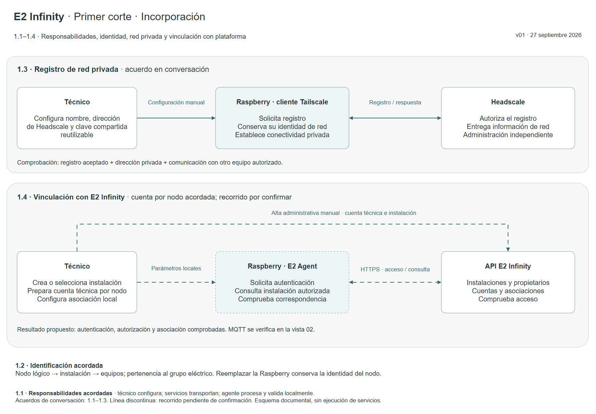
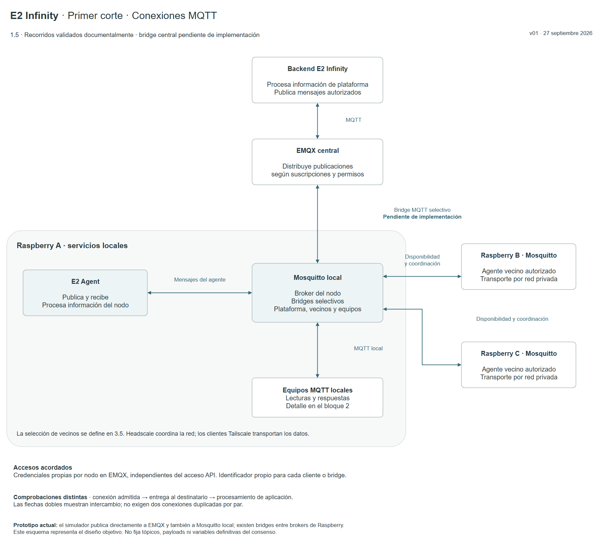
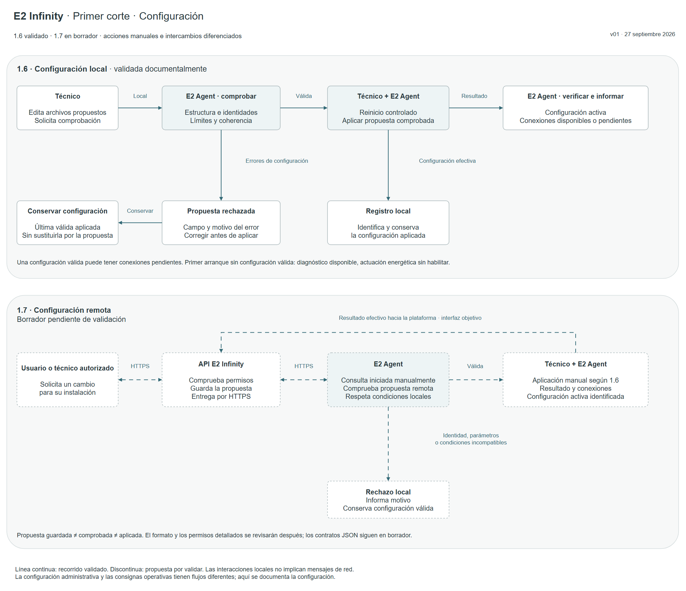

# Diagramas del primer corte — E2 Infinity

Versión visual 0.1 — 27 de septiembre de 2026.

Archivo editable: [Flujos_Primer_Corte_E2_Infinity_v01.drawio](Flujos_Primer_Corte_E2_Infinity_v01.drawio).

Esta entrega representa los recorridos de incorporación y configuración del bloque 1. No implementa servicios, fija endpoints ni convierte los mensajes o esquemas previos en contratos aprobados. El [plan de trabajo](../plan-trabajo-flujos.md) sigue siendo el índice único de estados y dependencias.

## Tres pestañas

| Pestaña | Qué permite revisar | Vista PNG | Exportación SVG |
|---|---|---|---|
| 01 · Incorporación e identidad | Acciones manuales, registro Tailscale–Headscale, vinculación con E2 Infinity y separación de identidades | [Incorporación](Flujos_Primer_Corte_E2_Infinity_v01.png) | [SVG 01](Flujos_Primer_Corte_E2_Infinity_v01.svg) |
| 02 · Conexiones MQTT | Agente–Mosquitto, bridge selectivo con EMQX y brokers vecinos; credenciales y comprobaciones separadas | [MQTT](Flujos_Primer_Corte_E2_Infinity_v01_vista_02.png) | [SVG 02](Flujos_Primer_Corte_E2_Infinity_v01_vista_02.svg) |
| 03 · Configuración local y remota | Edición manual, comprobación, aplicación, rechazo y conservación de configuración válida; consulta remota propuesta | [Configuración](Flujos_Primer_Corte_E2_Infinity_v01_vista_03.png) | [SVG 03](Flujos_Primer_Corte_E2_Infinity_v01_vista_03.svg) |

## Acuerdos y pendientes

- **1.1–1.3:** la vista recoge acuerdos de la conversación. Falta formalizarlos en documentos individuales y registrar su referencia en el plan; esta entrega no altera esas filas.
- **1.4:** se acordó una cuenta técnica por nodo; el recorrido completo de vinculación sigue pendiente de validación.
- **1.5 y 1.6:** cuentan con acuerdos documentales registrados en [Conexión MQTT](../flujos/1.5-conexion-mqtt.md) y [Configuración local](../flujos/1.6-configuracion-local.md).
- **1.7:** se representa la propuesta de [Configuración remota](../flujos/1.7-configuracion-remota.md), todavía en borrador. Guardar una propuesta en la plataforma no significa aplicarla en la Raspberry.

Las líneas discontinuas señalan recorridos aún en borrador. Una línea continua no acredita una implementación: por ejemplo, el bridge Mosquitto–EMQX está acordado como diseño objetivo, pero pendiente de implementación. Los bloques manuales representan acciones del técnico, no mensajes de red.

El consenso solo aparece como destino futuro de la conectividad entre vecinos. Sus variables, activación y convergencia se abordarán en los bloques correspondientes y contra la formulación matemática.

## Edición y comprobación

Abrir el `.drawio` desde **Archivo → Abrir** en Draw.io. Cada bloque, texto y conector es un elemento editable, no una imagen incrustada. Los estilos usan una sola definición por propiedad para permitir cambiar rellenos, bordes y tipografías.

Las tres pestañas se abrieron y exportaron con Draw.io, y sus imágenes se inspeccionaron para comprobar legibilidad y ausencia de recortes. El generador comprueba segmentos horizontales/verticales, entradas y salidas perpendiculares, límites de página, propiedades de estilo únicas y ausencia de cruces o superposiciones entre recorridos y elementos ajenos.

Para regenerar la versión fuente desde la raíz del repositorio:

```bash
python tools/build_corte1_drawio.py
```

El generador vuelve a crear el `.drawio`; no conserva modificaciones manuales posteriores. Tras editar, guardar una nueva versión y actualizar sus exportaciones con Draw.io. Las exportaciones PNG y SVG son vistas de revisión, no el archivo fuente principal.

## Vistas previas

### Incorporación e identidad



### Conexiones MQTT



### Configuración local y remota


