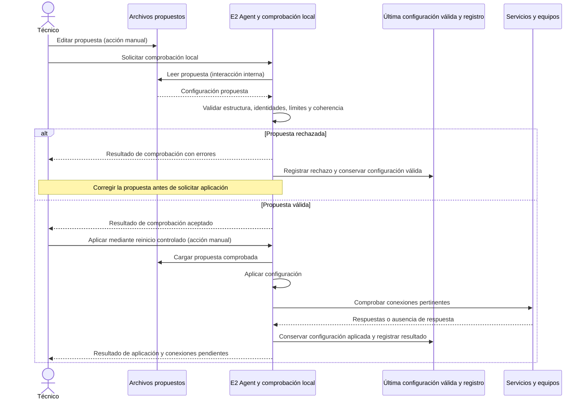

# 1.6 — Configuración local

- Estado documental: **Validado**.
- Dependencias: actores y responsabilidades (1.1), identificación (1.2) y comprobaciones de conexión (1.3–1.5).
- Fecha y referencia del acuerdo: **2026-09-27**, confirmación explícita «me parece bien» después de la propuesta editar → comprobar → reiniciar de forma controlada → aplicar → verificar y registrar.
- Evidencia de implementación o ensayo: revisión del script de instalación y configuración existente; no se implementó ni se ensayó este flujo del E2 Agent.

## 1. Propósito y escenario concreto

Describir cómo el técnico modifica una configuración local y obtiene un resultado de comprobación antes de activarla. La primera etapa utiliza archivos editados manualmente, herramientas de terminal y registros locales.

Se distinguen la configuración propuesta y la última configuración válida aplicada. La propuesta se comprueba antes del reinicio controlado del E2 Agent. Una propuesta rechazada no sustituye la configuración aplicada.

## 2. Participantes y responsabilidades

| Participante | Recibe | Procesa o decide | Envía |
|---|---|---|---|
| Técnico | Resultados de comprobación y aplicación | Edita la propuesta, corrige errores y solicita su activación mediante reinicio controlado | Solicitudes locales de comprobación y aplicación |
| E2 Agent y su función de comprobación local | Propuesta de configuración y solicitud del técnico | Lee, valida, aplica, comprueba conexiones y registra el resultado | Informes de comprobación y aplicación |
| Archivos y registro local | Edición manual, configuración aplicada y resultados | Conservan la propuesta y la referencia válida utilizada por el agente | Datos al ser leídos localmente |
| Servicios y equipos configurados | Solicitudes de conexión o comprobación pertinentes | Admiten, rechazan o no responden a las solicitudes | Estados de conexión y respuestas |

Este es un recorrido local. La edición de archivos y el reinicio son acciones manuales; la lectura, validación y conservación son interacciones internas. Las comprobaciones de API, MQTT y equipos pueden originar mensajes entre servicios, descritos en sus flujos correspondientes.

## 3. Condiciones previas y resultado esperado

- El técnico dispone de los parámetros necesarios y conoce qué configuración desea aplicar.
- El agente puede leer la propuesta y emitir un informe local.
- Si existe una configuración válida aplicada, se conserva como referencia independiente de la propuesta editada.

Resultado esperado: identificar la propuesta evaluada, informar su aceptación o rechazo, identificar la configuración que efectivamente quedó activa y comunicar qué conexiones están disponibles o pendientes.

Los nombres y formatos definitivos de archivos, campos y comandos quedan pendientes de definición. Las configuraciones propias de Mosquitto o Tailscale requieren aplicar los cambios al servicio correspondiente; reiniciar el agente no se considera una aplicación automática de todos esos archivos.

## 4. Secuencia de intercambios

| Paso | Tipo | Origen | Destino | Acción o intercambio | Resultado esperado |
|---|---|---|---|---|---|
| 1 | Manual | Técnico | Archivos propuestos | Editar parámetros | Cambios preparados, todavía inactivos |
| 2 | Manual / interna | Técnico | Función local de comprobación | Solicitar evaluación de la propuesta | Propuesta identificada y leída |
| 3 | Interna | Comprobación local | Técnico y registro | Evaluar estructura, identidades, campos obligatorios, límites y coherencia | Aceptación o rechazo con errores identificables |
| 4 | Manual | Técnico | E2 Agent | Si la propuesta es válida, solicitar activación mediante reinicio controlado | Comienza la aplicación de la propuesta comprobada |
| 5 | Interna | E2 Agent | Configuración local | Cargar y aplicar la configuración comprobada | Configuración activa identificada |
| 6 | Entre servicios / interna | E2 Agent | Servicios y equipos pertinentes | Comprobar conexiones según los parámetros aplicados | Estados de conexión registrados |
| 7 | Interna / local | E2 Agent | Técnico y registro | Conservar la configuración válida aplicada y emitir resultado | Aplicación y conectividad informadas por separado |

El diagrama representa la función de comprobación y el agente como una responsabilidad local; no fija una interfaz HTTP, comando ni canal MQTT para solicitarla. La comprobación de conexiones no convierte en válido un archivo mal formado.

## 5. Mensajes necesarios y contenido mínimo

| Interacción | Emisor | Receptor | Medio inicial | Información mínima |
|---|---|---|---|---|
| Solicitud local de comprobación | Técnico | Función de comprobación del agente | Herramienta de terminal | Identificación de la configuración a evaluar |
| Resultado de comprobación | Función de comprobación | Técnico y registro local | Informe local | Identificación de la propuesta, aceptación o rechazo, errores y sus motivos |
| Solicitud de aplicación | Técnico | E2 Agent | Reinicio controlado | Referencia a la configuración comprobada |
| Resultado de aplicación | E2 Agent | Técnico y registro local | Informe local | Configuración efectivamente activa, resultado y conexiones disponibles o pendientes |

Estas interacciones describen información y propósito, no nuevos contratos de red. Los IDs y campos definitivos se conciliarán con el [catálogo común](../mensajes/catalogo-mensajes.md). La publicación del resultado hacia la plataforma se definirá en su flujo correspondiente. Los esquemas JSON previos conservan su estado de borrador.

## 6. Confirmaciones, errores y recuperación

### Resultados de aplicación acordados

| Resultado | Significado |
|---|---|
| Rechazada | Hay errores de configuración; se informa qué corregir y la propuesta queda sin aplicar |
| Aplicada | La configuración pasó la validación y quedó activa |
| Aplicada con conexiones pendientes | La configuración es válida y activa, pero algún servicio o equipo está temporalmente inaccesible |

Estos son resultados informativos, no la definición de la máquina de estados de control energético.

Si una modificación se rechaza, se conserva la última configuración válida. Si es el primer arranque y no existe configuración válida, el agente permanece disponible para diagnóstico sin habilitar actuaciones energéticas. La capacidad de operación ante conexiones pendientes dependerá de los recursos y reglas locales que se definirán en los bloques correspondientes.

Una comprobación aceptada todavía no confirma aplicación. El informe posterior debe identificar qué configuración quedó activa. Las comprobaciones de conexión se informan por separado de la validez de los parámetros.

## 7. Acuerdos, pendientes y ejemplos de validación

### Acuerdos confirmados

- Edición manual y comprobación local previa a la aplicación.
- Activación inicial mediante reinicio controlado del E2 Agent.
- Distinción entre configuración propuesta y última configuración válida aplicada.
- Informe de rechazo con motivos; configuración rechazada sin aplicar.
- Registro de configuración activa y resultado, diferenciando conectividad.

Referencia: confirmación «me parece bien», 2026-09-27.

### Pendientes para definir con los flujos correspondientes

- Formato y ubicación de archivos y mecanismo exacto de comprobación local.
- Campos y reglas detalladas de coherencia por tipo de equipo y perfil.
- Tratamiento de una edición posterior a la comprobación o una falla durante la aplicación.
- Procedimiento de reinicio cuando exista una actuación energética en curso.
- Publicación del informe hacia la plataforma y relación con cambios remotos en 1.7.

### Ejemplos de comprobación futura

| Escenario | Resultado esperado |
|---|---|
| Propuesta completa y coherente | Aceptación, aplicación controlada y registro de configuración activa |
| Límite eléctrico negativo | Rechazo con campo y motivo; conservar configuración aplicada |
| Archivo incompleto o ilegible | Informar errores sin activar la propuesta |
| Configuración válida y EMQX inaccesible | Configuración aplicada con conexión central pendiente |
| Primer arranque sin configuración válida | Diagnóstico disponible y actuaciones energéticas sin habilitar |

Los ejemplos son criterios documentales; no se realizaron ensayos físicos ni pruebas del agente en esta revisión.
