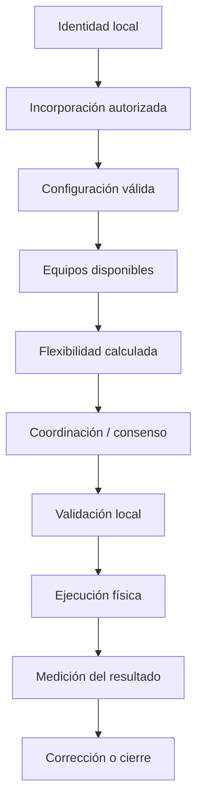

# Flujos de extremo a extremo

El [plan de trabajo](../plan-trabajo-flujos.md) es el índice único de los 34 subpuntos, sus dependencias y estados. La incorporación inicial será manual mediante archivos. Para desarrollar cada punto se utilizará la [plantilla común](plantilla-flujo.md).

## Dependencia general

## Material disponible

- [1.5 — Conexión MQTT](1.5-conexion-mqtt.md): recorridos y responsabilidades validados documentalmente; bridge central pendiente de implementación.
- [1.6 — Configuración local](1.6-configuracion-local.md): comprobación previa, reinicio controlado y registro del resultado validados documentalmente.
- [Flujo conceptual del consenso](consenso.md): antecedente pendiente de revisión contra la formulación matemática.
- [Catálogo de mensajes](../mensajes/catalogo-mensajes.md): propuestas previas.

El diagrama general anterior es conceptual; no obliga a ejecutar siempre una secuencia por eventos ni representa el transporte de cada paso. Los diagramas por subpunto distinguirán acciones manuales, interacciones internas y mensajes entre servicios.

Los documentos específicos se crearán a medida que conversemos cada punto y se enlazarán desde el plan, el mapa general y el catálogo. La próxima revisión es **1.7 — Configuración remota**.
