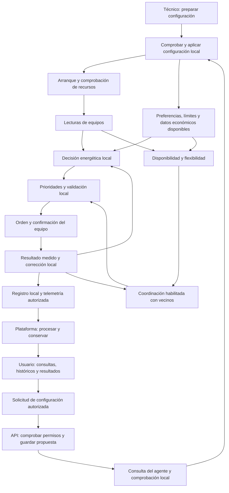

# Flujos de extremo a extremo

El [plan de trabajo](../plan-trabajo-flujos.md) es el índice único de las **46 subfases en ocho cortes**, sus dependencias y estados. La configuración inicial es manual. Cada documento seguirá la [plantilla común](plantilla-flujo.md).

## Recorridos de operación

Este mapa conceptual muestra la gestión local como recorrido independiente. La incorporación central habilita funciones de plataforma y la conectividad entre vecinos habilita la coordinación; ninguna de ellas es un requisito universal para decidir y actuar localmente.

La ruta de configuración remota sigue como borrador en 2.5: la consulta y aplicación inicial propuestas requieren intervención manual. La ruta hacia la plataforma depende de sus conexiones disponibles; el almacenamiento pendiente y la resincronización se acordarán en 8.5. La realimentación a vecinos aplica cuando el nodo participa en coordinación.

El diagrama indica dependencias funcionales. Cada intercambio de red se detallará con emisor, receptor, canal y respuesta, distinguiéndolo de llamadas internas y acciones manuales.

## Material disponible

- [2.3 — Conexiones MQTT](2.3-conexion-mqtt.md): acuerdo conservado del antiguo 1.5; bridge central pendiente de implementación.
- [2.4 — Configuración local](2.4-configuracion-local.md): acuerdo conservado del antiguo 1.6; comprobación y aplicación manual.
- [2.5 — Configuración remota](2.5-configuracion-remota.md): borrador conservado del antiguo 1.7, pendiente de validación.
- [Diagramas Draw.io v01](../diagramas/README.md): vistas históricas y equivalencia de su numeración.
- [Consenso conceptual](consenso.md): antecedente para el corte 7, sujeto a formulación matemática.
- [Catálogo común de mensajes](../mensajes/catalogo-mensajes.md): propuestas que se enlazan a sus flujos.
- [Escenarios de revisión](../validacion/escenarios.md): cobertura de gestión local, plataforma, consenso y recuperación.

Las rutas antiguas de documentos individuales conservan un enlace al documento actual. La próxima conversación es **1.1 — Actores y responsabilidades**, con el alcance ampliado de plataforma y funcionamiento local.
