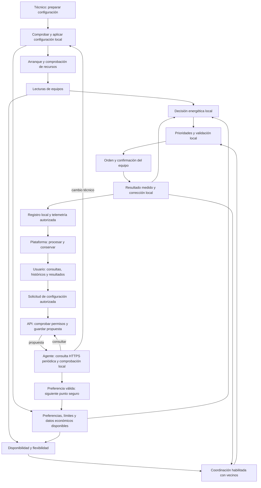

# Flujos de extremo a extremo

El [plan de trabajo](../plan-trabajo-flujos.md) es el índice único de las **46 subfases en ocho cortes**, sus dependencias y estados. La configuración inicial es manual. Las definiciones residen en el [documento maestro](../definiciones-flujos.md); su [plantilla común](../definiciones-flujos.md#plantilla-comun) se aplica a cada subfase.

## Recorridos de operación

Este mapa conceptual muestra la gestión local como recorrido independiente. La incorporación central habilita funciones de plataforma y la conectividad entre vecinos habilita la coordinación; ninguna de ellas es un requisito universal para decidir y actuar localmente.

La ruta de [2.5](../definiciones-flujos.md#flow-2-5) consulta periódicamente por HTTPS: las preferencias válidas se activan sin reinicio en un punto seguro y los cambios técnicos requieren aplicación local conforme a 2.4. La ruta hacia la plataforma depende de sus conexiones disponibles; el almacenamiento pendiente y la resincronización se acordarán en 8.5. La realimentación a vecinos aplica cuando el nodo participa en coordinación.

El diagrama indica dependencias funcionales. Cada intercambio de red se detallará con emisor, receptor, canal y respuesta, distinguiéndolo de llamadas internas y acciones manuales.

## Material disponible

Las definiciones canónicas están en [docs/definiciones-flujos.md](../definiciones-flujos.md).

- [2.3 — Conexiones MQTT](../definiciones-flujos.md#flow-2-3): acuerdo conservado del antiguo 1.5; bridge central pendiente de implementación.
- [2.4 — Configuración local](../definiciones-flujos.md#flow-2-4): acuerdo conservado del antiguo 1.6; comprobación y aplicación manual.
- [2.5 — Configuración remota](../definiciones-flujos.md#flow-2-5): acuerdo validado; preferencias automáticas y propuestas técnicas de aplicación local.
- [2.6 — Coherencia de configuraciones](../definiciones-flujos.md#flow-2-6): conflictos y resolución por parámetro.
- [2.7 — Arranque del nodo](../definiciones-flujos.md#flow-2-7): habilitación por funciones disponibles.
- [3.1 — Inventario y capacidades](../definiciones-flujos.md#flow-3-1): equipos físicos, capacidades declaradas y comprobadas, e identidades conservadas al sustituir la Raspberry.
- [3.2 — Interfaces con los equipos](../definiciones-flujos.md#flow-3-2): rutas locales de cargador, medidor, inversor, BESS y cargas controlables, sujetas a comprobación física.
- [3.3 — Lecturas locales](../definiciones-flujos.md#flow-3-3): procedencia, dos tiempos, unidades normalizadas y aptitud de los datos según cada función.
- [3.4 — Heartbeat y salud de servicios](../definiciones-flujos.md#flow-3-4): presencia observada, diagnóstico por componente y alcance distinto para plataforma y vecinos.
- [3.5 — Alarmas locales](../definiciones-flujos.md#flow-3-5): apertura por impacto o persistencia, registro local, comunicación y cierre por recuperación comprobada.
- [4.1 — Objetivos y preferencias locales](../definiciones-flujos.md#flow-4-1): límites técnicos, objetivos de ahorro/autoconsumo y preferencias protegidas del usuario.
- [Diagramas Draw.io v01](../diagramas/README.md): vistas históricas y equivalencia de su numeración.
- [Consenso conceptual en 7.1](../definiciones-flujos.md#flow-7-1): antecedente para el corte 7, sujeto a formulación matemática.
- [Catálogo común de mensajes](../mensajes/catalogo-mensajes.md): propuestas que se enlazan a sus flujos.
- [Escenarios de revisión](../validacion/escenarios.md): cobertura de gestión local, plataforma, consenso y recuperación.

Las rutas individuales anteriores se conservan como referencias compatibles al documento maestro. La próxima conversación es **4.2 — Tarifas y datos económicos**.
