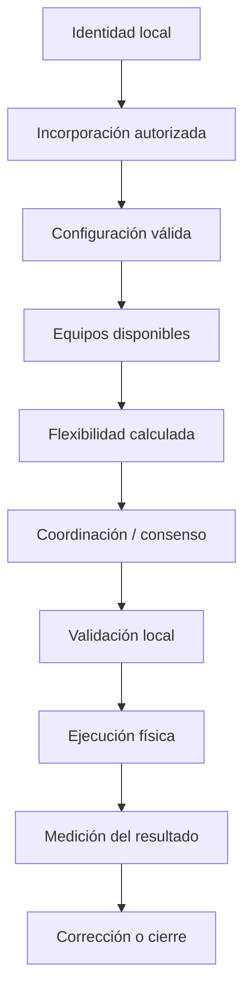

# Flujos de extremo a extremo

## Dependencia general

## Flujos que se documentarán

1. Aprovisionamiento del nodo.
2. Configuración local.
3. Configuración remota.
4. Registro y descubrimiento de equipos.
5. Heartbeat y disponibilidad.
6. Publicación de telemetría.
7. Inicio de coordinación energética.
8. Oferta de flexibilidad.
9. Iteraciones del consenso.
10. Detección de convergencia.
11. Validación y ejecución local.
12. Resultado y corrección del residuo.
13. Pérdida de un vecino.
14. Pérdida de plataforma.
15. Recuperación y resincronización.

