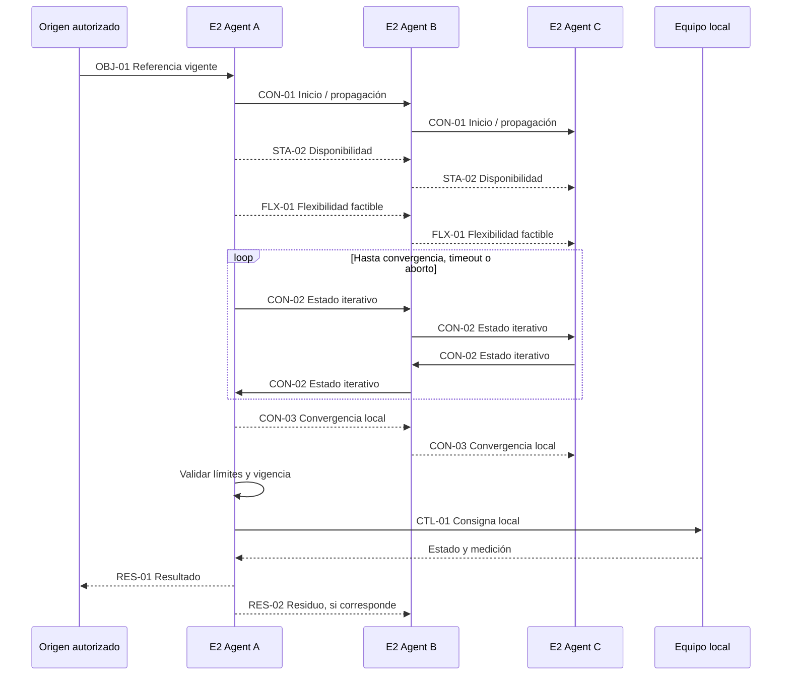

# Flujo de consenso — borrador conceptual

**Antecedente pendiente de revisión individual** conforme al [plan de trabajo](../plan-trabajo-flujos.md). La secuencia por eventos ilustrada aquí no fija la activación ni el funcionamiento definitivo: deberán contrastarse con la formulación matemática validada, junto con las variables y la convergencia.

Este flujo no fija todavía la ecuación de actualización ni las ganancias. Su propósito es identificar dependencias y mensajes que deberán conciliarse con la validación matemática offline.

Este antecedente se revisará en el corte 7. La gestión local se documenta en el corte 4 y puede operar sin ejecutar esta secuencia; la entrega y realimentación del consenso hacia ese control se detallarán en 7.6.

## Precondiciones

- Nodo incorporado y autorizado.
- Configuración local válida.
- Vecinos conocidos y autenticados.
- Equipos disponibles y mediciones recientes.
- Flexibilidad calculada localmente.
- Objetivo o condición de activación vigente.

## Decisiones pendientes

- Origen exacto del inicio.
- Variable intercambiada en cada iteración.
- Ecuación de actualización y pesos.
- Frecuencia, tolerancia y máximo de iteraciones.
- Confirmación global o criterio puramente distribuido.
- Reacción ante pérdida de vecino.
- Redistribución del residuo después de ejecutar.
